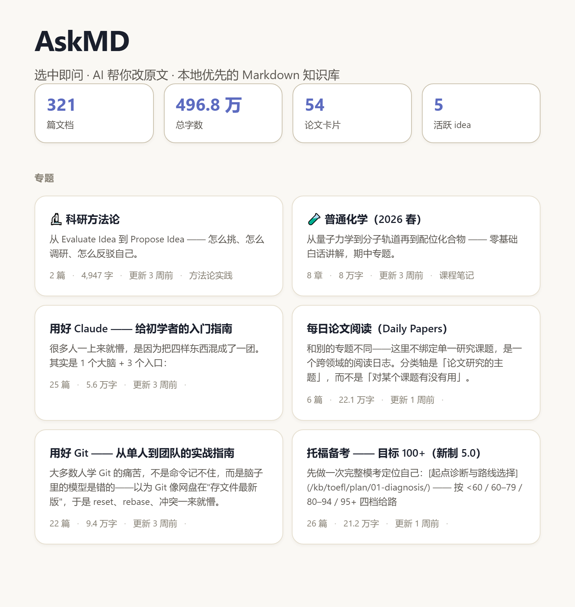
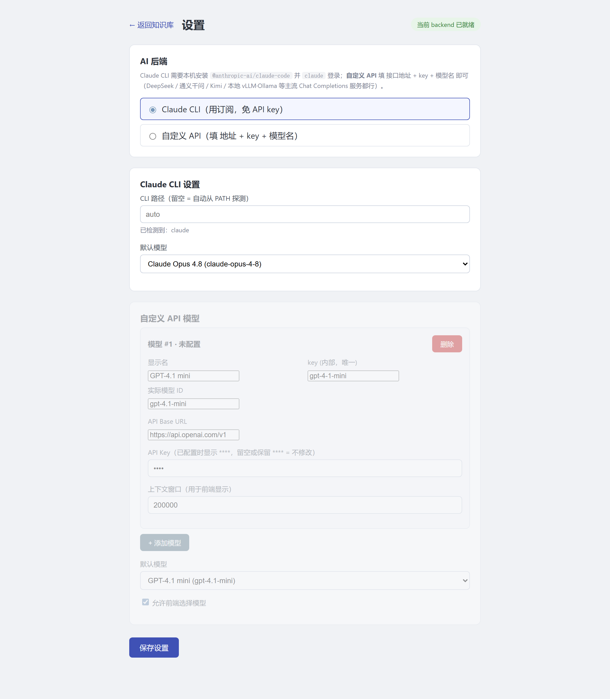

# Welcome to **AskMD**!

> Select to ask · AI edits your source — a local-first, AI-native Markdown knowledge base.

[](https://github.com/JZ-Wu/ai-knowledge-base) [](https://github.com/JZ-Wu/ai-knowledge-base) [](LICENSE) [](https://github.com/JZ-Wu/ai-knowledge-base/commits)

[简体中文](README.md) · English

* * *

## Introduction

**AskMD** is a locally deployed and operated knowledge base system that supports retrieval and intelligent Q&A/editing for any folder containing Markdown, image, and PDF files. During document reading, users can select any text passage and directly invoke an AI model for instant Q&A, while also choosing to have the AI write the generated results back to the original file, enabling continuation, rewriting, content organization, multilingual translation, and more—all without the need for external editing tools or copy-pasting. This project is compatible with Claude CLI, Codex CLI, and OpenAI-compatible API interfaces, supports the use of custom model API keys, and keeps all data and sensitive information stored locally on the user's device.

<div align="center">

</div>

* * *

## Features

- 📚 **Multiple knowledge bases** — Build any directory structure containing Markdown files into a knowledge base with full-text search capabilities. All operations, including knowledge base creation and file uploads, can be completed through a browser-based graphical interface.
- 🤖 **Select to ask** — highlight any passage while reading and ask AI; the answer streams into a side panel.
- ✍️ **AI edits your files** — let AI continue, rewrite, reorganize or translate, and it **edits your Markdown source directly**.
- 🔎 **Search & auto-navigation** — sidebar, TOC, breadcrumbs and "recent updates" are generated for you.
- 🧾 **PDF reading & annotation** — built-in PDF reader: ask AI about a selection, highlight, leave inline comments, track what you've read.
- 🧮 **Math · code · images** — native KaTeX formulas, code highlighting and images.
- 🔌 **Bring your own model** — works with Claude CLI, Codex CLI, and any OpenAI-compatible API, all running locally.
- ⚡ **One command** — `python run.py` builds everything and opens in your browser.

<div align="center">

<br><br>

</div>

* * *

## Quick start

```bash
git clone https://github.com/JZ-Wu/ai-knowledge-base.git
cd ai-knowledge-base
pip install -r server/requirements.txt
python run.py            # → http://localhost:8001
```

**Requirements**: Python 3.11+ · Node.js 18+ (first build only) · one AI backend: a logged-in **Claude CLI**, a logged-in **Codex CLI** (`codex login`, check with `codex doctor`), or any **OpenAI-compatible** API key. Works on Windows, macOS and Linux.

Open `http://localhost:8001` and you're in. To create a new knowledge base, you can either directly create it through the browser interface and then upload the desired files, or manually manage the directory structure—simply place your Markdown files in `knowledge_bases/<name>/` and it will become a new knowledge base.

### Shortcuts

| Keys | Action |
| :--- | :--- |
| `Ctrl+Shift+A` | Toggle the AI side panel |
| `Ctrl+Shift+E` | Toggle the source editor |
| `Ctrl+S` | Save |

* * *

## License

Released under the [MIT License](LICENSE). Issues and PRs are welcome.

If you find **AskMD** useful, please give it a ⭐ Star to show your support for the project!!!
