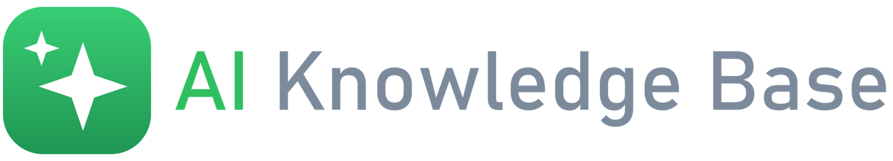
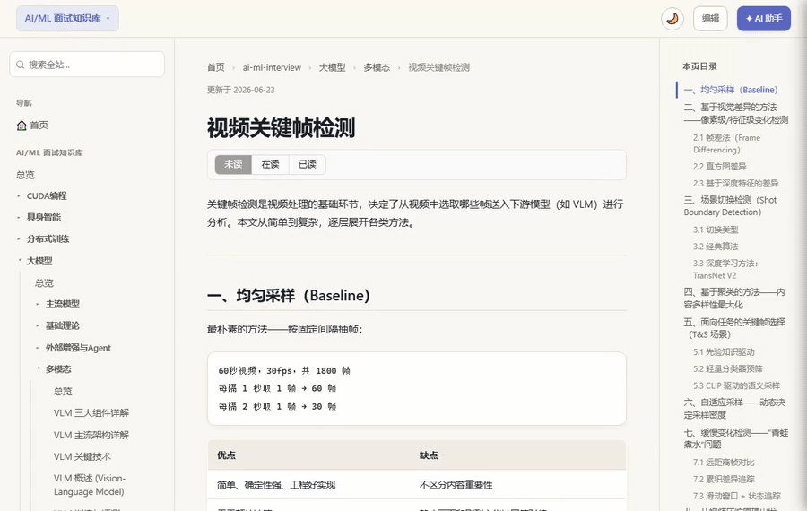
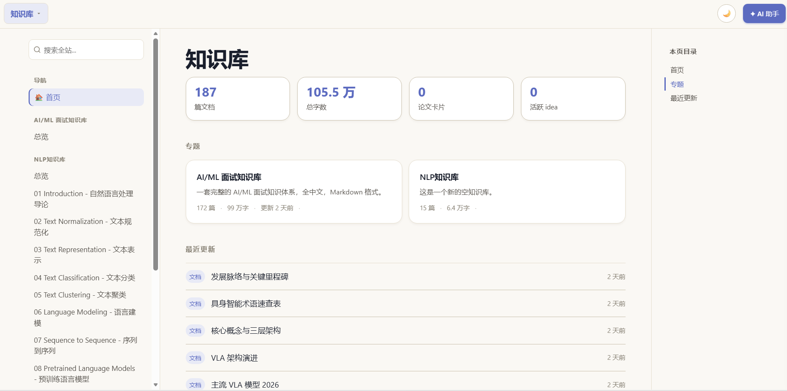
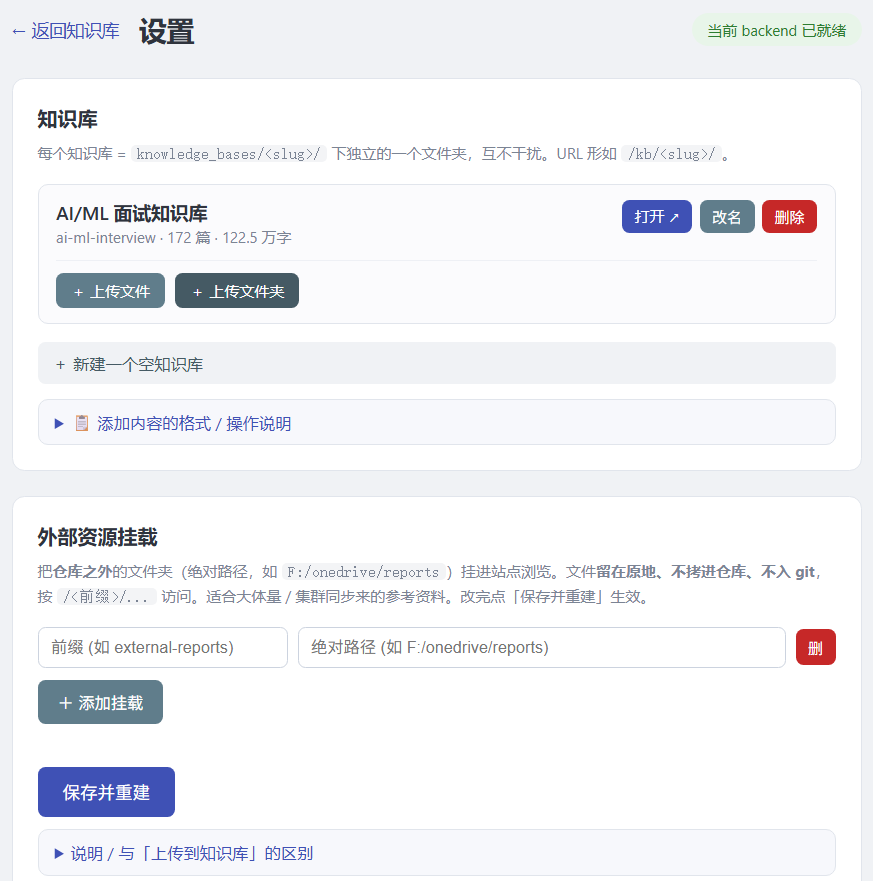

# Welcome to **AI Knowledge Base**!

[](https://github.com/JZ-Wu/ai-knowledge-base) [](https://github.com/JZ-Wu/ai-knowledge-base) [](LICENSE) [](https://github.com/JZ-Wu/ai-knowledge-base/commits)

[简体中文](README.md) · English

* * *

## Introduction

**AI Knowledge Base** turns any folder of Markdown, images and PDFs into a **searchable, AI-powered** local knowledge base.

What makes it special: while reading, **select any passage to ask AI** — and let the assistant **write the answer straight back into your source file** (continue, rewrite, reorganize, translate) with no copy-paste. Everything runs locally with your own Claude or OpenAI-compatible model; your notes never leave your machine. One command and you're up.

<div align="center">

</div>

* * *

## Features

- 📚 **Multiple knowledge bases** — turn any Markdown folder into a searchable, navigable site; create, rename and upload from the UI.
- 🤖 **Select to ask** — highlight any passage while reading and ask AI; the answer streams into a side panel.
- ✍️ **AI edits your files** — let AI continue, rewrite, reorganize or translate, and it **edits your Markdown source directly**.
- 🔎 **Search & auto-navigation** — sidebar, TOC, breadcrumbs and "recent updates" are generated for you.
- 🧾 **PDF reading & annotation** — built-in PDF reader: ask AI about a selection, highlight, leave inline comments, track what you've read.
- 🧮 **Math · code · images** — native KaTeX formulas, code highlighting and images.
- 🔌 **Bring your own model** — works with Claude and any OpenAI-compatible API, all running locally.
- ⚡ **One command** — `python run.py` builds everything and opens in your browser.

<div align="center">

<br><br>

</div>

* * *

## Quick start

```bash
git clone https://github.com/JZ-Wu/ai-knowledge-base.git
cd ai-knowledge-base
pip install -r server/requirements.txt
python run.py            # → http://localhost:8001
```

**Requirements**: Python 3.11+ · Node.js 18+ (first build only) · one AI backend: a logged-in **Claude CLI** or any **OpenAI-compatible** API key. Works on Windows, macOS and Linux.

Open `http://localhost:8001` and you're in. Drop Markdown into `knowledge_bases/<name>/` to add a knowledge base; pick your model, password and more from the in-browser settings page. See [INSTALL.md](INSTALL.md).

### Shortcuts

| Keys | Action |
| :--- | :--- |
| `Ctrl+Shift+A` | Toggle the AI side panel |
| `Ctrl+Shift+E` | Toggle the source editor |
| `Ctrl+S` | Save |

* * *

## License

Released under the [MIT License](LICENSE). Issues and PRs are welcome.

If **AI Knowledge Base** helps you, please consider leaving a ⭐ Star — it's the simplest and most effective way to support the project.
