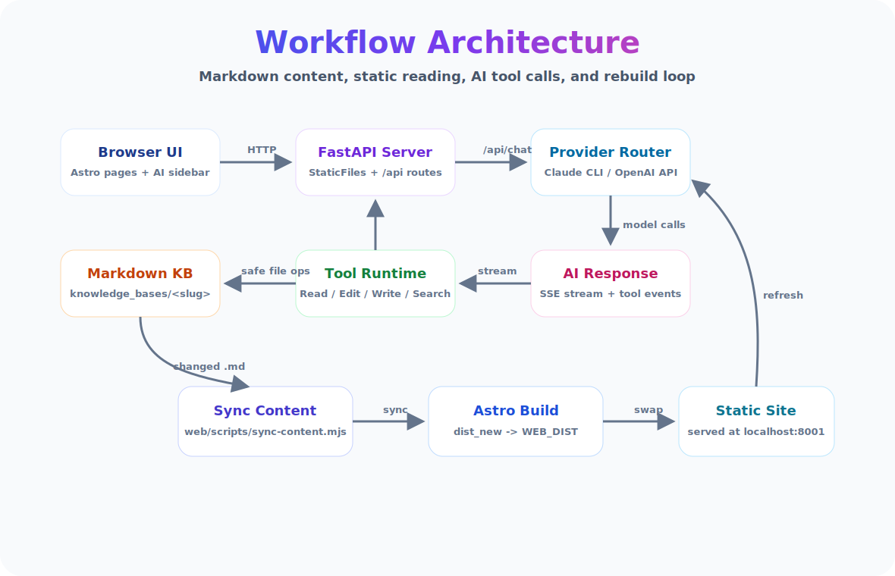

<p align="center">
  
</p>

<h3 align="center">一个面向 Markdown 知识库的 AI 阅读、编辑与构建工作台</h3>

<p align="center">
  <a href="https://github.com/JZ-Wu/ai-knowledge-base/stargazers"></a>
  <a href="https://github.com/JZ-Wu/ai-knowledge-base/network/members"></a>
  
  
  
  
  
</p>

AI Knowledge Base 把一组本地 Markdown 文件变成可阅读、可搜索、可编辑、可被 AI 直接操作的知识库。你可以在浏览器里阅读笔记、选中文本向 AI 提问、让模型通过受控工具修改 `.md` 文件，再由本地构建流程把变更同步回静态站点。

## 界面预览

<p align="center">
  
</p>

<p align="center">
  
</p>

## 为什么需要它

- **Markdown 原生**：内容仍然是普通 `.md` 文件，适合 Git 管理、迁移和长期维护。
- **AI 直接改文件**：Claude CLI 或 OpenAI 兼容 API 可以通过 Read / Edit / Write / Glob / Grep 等受控工具定位与改写笔记。
- **阅读和编辑在同一处**：Astro 负责静态阅读体验，CodeMirror 提供源码编辑，AI 侧栏负责解释、重写、翻译和扩展内容。
- **多知识库管理**：`knowledge_bases/<slug>/` 下的每个目录都是独立知识库，顶部可快速切换。
- **本地优先**：设置、知识库和备份都在本机；对外部署时可加访问密码，并通过路径白名单限制工具调用范围。

## 使用场景

| 场景 | 适合怎么用 |
| --- | --- |
| AI / ML 学习笔记 | 按主题维护大模型、视觉、强化学习、具身智能等材料，随读随问，随问随改。 |
| 面试知识库 | 把算法、模型原理、工程经验组织成可搜索页面，让 AI 帮你补例子、改表述、生成复习提纲。 |
| 论文和 PDF 阅读 | 使用内置 PDF reader 选中文段提问，再把结论沉淀回 Markdown 笔记。 |
| 团队知识沉淀 | 将项目文档、排障手册、设计记录放入独立 KB，用访问密码暴露给局域网或同事。 |
| 内容重构与翻译 | 选中段落后让 AI 直接重写、翻译、扩写或检查公式，变更自动写回源文件。 |

## Workflow Architecture

<p align="center">
  
</p>

核心链路是：浏览器访问 FastAPI 托管的 Astro 静态站点；AI 侧栏通过 `/api/chat` 进入后端；后端根据设置选择 Claude CLI 或 OpenAI 兼容 API；模型需要改内容时只能通过受控工具操作知识库 Markdown；文件变化后触发同步和 Astro 构建，最终刷新静态页面。

## 快速开始

```bash
git clone https://github.com/JZ-Wu/ai-knowledge-base
cd ai-knowledge-base
pip install -r server/requirements.txt
python run.py
```

启动后访问：

```text
http://localhost:8001
```

`run.py` 会在首次启动时自动安装/构建前端依赖，并把构建产物托管到 FastAPI 下。内容更新后会按需重建；需要强制重建时运行：

```bash
python run.py --rebuild
```

> 前端基于 Astro，首次构建需要本机已安装 Node.js。日常使用不需要单独启动 Vite/Astro dev server。

## AI 后端

项目支持两类后端，统一由设置页管理：

- **Claude CLI**：适合已经登录 Claude Code / Claude CLI 的本地环境，不需要在项目里保存 API key。
- **OpenAI 兼容 API**：可配置 OpenAI、DeepSeek、Qwen 或其他兼容接口的 `base_url`、`api_key`、模型 ID 和上下文窗口。

设置入口：

```text
/docs/tools/settings.html
```

设置会保存到 `server/.settings.json`，该文件已被 gitignore。切换后端、修改模型、开启/关闭工具调用后会即时生效。

## 常见用法

### 让 AI 在原文里补内容

打开一篇 Markdown 页面，选中某段文字，打开右下角 AI 侧栏，然后输入：

```text
在这段后面补 3 个具体例子，并保留当前行文风格。
```

后端会把页面上下文、选区和工具权限发送给模型。模型定位到源 `.md` 文件后，通过 Edit / Write 工具写回磁盘，刷新页面即可看到结果。

### 让 AI 重写、翻译或检查

```text
把这段改成更适合初学者阅读的版本。
翻译成英文，保留 Markdown 表格。
检查公式和术语是否准确，错误处直接改。
```

写入前会生成 `.bak` 备份，便于回滚。

### 截图和多模态输入

AI 输入框支持粘贴或拖入截图。图片会保存到临时目录，并随请求传给支持图像输入的模型，适合分析报错截图、架构图或论文图表。

### 源码编辑

按 `Ctrl+Shift+E` 打开 CodeMirror 源码编辑器，支持 Markdown 高亮、搜索和 `Ctrl+S` 保存。适合精修格式、公式和表格。

## 多知识库

目录结构约定如下：

```text
knowledge_bases/
├── ai-ml-interview/          -> /kb/ai-ml-interview/
│   ├── 大模型/
│   ├── 机器学习基础/
│   └── ...
└── research-notes/           -> /kb/research-notes/
```

顶部 `KB` 下拉框可切换知识库。设置页支持新建、改名、删除和上传知识库目录。删除操作会移动到 `_trash/`，不会直接永久删除。

项目自带的 `ai-ml-interview` 是一套 AI/ML 面试知识体系，覆盖大模型、机器学习基础、强化学习、视觉、具身智能、CUDA、分布式训练和行业动态等主题。

## 项目结构

```text
ai-knowledge-base/
├── run.py                     # 启动脚本：自动构建前端并启动 FastAPI
├── server/
│   ├── main.py                # FastAPI app，托管静态站点和 API
│   ├── routes/                # /api/chat、/api/kbs、/api/settings 等路由
│   ├── services/              # KB、设置、重建、阅读状态等服务
│   └── backends/              # Claude CLI 和 OpenAI API 后端
├── web/                       # Astro 前端源码
├── docs/                      # 前端公共资源、AI 侧栏、编辑器、PDF reader
└── knowledge_bases/<slug>/    # Markdown 知识库内容
```

更详细的部署、安全和外部目录挂载说明见 [INSTALL.md](INSTALL.md)。

## 快捷键

| 快捷键 | 功能 |
| --- | --- |
| `Ctrl+Shift+A` | 打开 / 关闭 AI 侧栏 |
| `Ctrl+Shift+E` | 打开 / 关闭源码编辑器 |
| `Ctrl+S` | 在编辑器中保存 |
| `Ctrl+F` | 在编辑器中搜索 |
| `Esc` | 关闭当前面板 |

## 安全边界

- 对外访问前请在设置页配置访问密码。
- 不要把 `server/.settings.json`、`server/.auth_secret`、知识库备份或密钥文件提交到 Git。
- 反向代理时不要暴露 `/server/`、`/knowledge_bases/`、`/_trash/`、`/_backup/`、`/.git/` 等内部路径。
- 工具调用受路径白名单限制：默认只允许操作知识库内的 Markdown 文件，并拒绝明显包含 secret、key、token、credential、password 等敏感命名的路径。

## 技术栈

Astro · FastAPI · Claude CLI / OpenAI Compatible API · CodeMirror 5 · KaTeX · PDF.js · Python stdlib scrypt

## License

MIT
