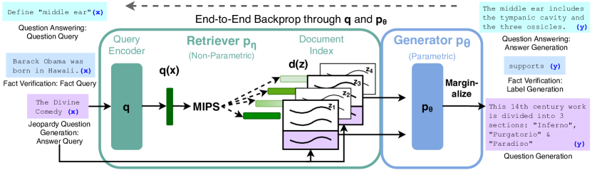

# RAG 详解 (Retrieval-Augmented Generation)

检索增强生成——让 LLM 在回答时能够**查阅外部知识**，而非只靠"记忆"。

## 一、为什么需要 RAG？

LLM 的固有缺陷：

| 问题 | 说明 |
|------|------|
| **知识过时** | 训练数据有截止日期，不知道最新信息 |
| **幻觉** | 一本正经胡说八道，编造不存在的事实 |
| **无法访问私有数据** | 不知道你的公司文档、个人笔记等 |
| **知识不可控** | 无法精确控制模型使用哪些知识来源 |
| **更新成本高** | 重新训练/微调代价大，RAG 只需更新知识库 |

RAG 的核心思路：**不改模型，改输入**——把相关知识检索出来塞进 prompt，让模型"开卷考试"。

```
无 RAG:
  用户: "公司的退款政策是什么？"
  LLM:  (瞎编一个)

有 RAG:
  用户: "公司的退款政策是什么？"
  系统: [检索到: 退款政策文档第3条...]
  LLM:  (基于检索到的文档准确回答)
```

## 二、RAG 完整流程



> 图源: *Retrieval-Augmented Generation for Knowledge-Intensive NLP Tasks*, Figure 1. 左侧 Query Encoder 将问题编码为向量，从 Document Index 中检索相关文档；右侧 Generator (seq2seq) 基于检索结果生成回答。

**实际工程流程**:

- **离线阶段 (Indexing)**: 文档库 → 分块 (Chunking) → Embedding Model → 向量数据库
- **在线阶段 (Retrieval + Generation)**: 用户 Query → Embedding → 向量检索 Top-K → (可选) Reranker 重排序 → 构造 Prompt → LLM 生成回答

## 三、核心组件详解

### 3.1 文档解析与分块 (Chunking)

把原始文档切成适合检索的小块。

#### 为什么要分块？

- LLM 的 context window 有限，不能把整个文档塞进去
- 整篇文档的 embedding 太粗糙，检索精度差
- 小块更容易精确匹配用户的具体问题

#### 分块策略

| 策略 | 做法 | 优缺点 |
|------|------|--------|
| **固定长度** | 按字符数/token 数切（如 512 token） | 简单，但可能切断句子 |
| **按句/段切** | 按自然段落或句子分割 | 语义完整，但长度不均 |
| **递归分割** | 先按段落切，太长再按句子切，再按字符切 | LangChain 默认方式，效果好 |
| **语义分块** | 用 embedding 相似度判断语义边界 | 效果最好，计算量大 |
| **按文档结构** | 利用标题/章节结构切 | 适合结构化文档 |

#### 重叠 (Overlap)

相邻 chunk 之间保留一定重叠（如 20%），避免关键信息恰好在切割边界：

```
Chunk 1: [=============================]
Chunk 2:                    [=============================]
Chunk 3:                                       [=============================]
                            ↑ overlap区域
```

#### 典型参数

| 参数 | 典型值 |
|------|--------|
| chunk_size | 256~1024 token |
| chunk_overlap | 50~200 token |
| 分割方式 | RecursiveCharacterTextSplitter |

### 3.2 Embedding 模型

将文本转化为稠密向量，使得语义相似的文本在向量空间中距离近。

#### 主流模型

| 模型 | 维度 | 说明 |
|------|------|------|
| **BGE 系列** (BAAI) | 768/1024 | 中文最强开源 Embedding |
| **GTE 系列** (阿里) | 768/1024 | 多语言，效果好 |
| **E5-Mistral** | 4096 | 基于 LLM 的 Embedding，效果强 |
| **text-embedding-3** (OpenAI) | 256~3072 | 商用，可变维度 |
| **Cohere embed v3** | 1024 | 商用，支持多语言 |
| **Jina Embeddings** | 768 | 开源，支持长文本 |

#### Embedding 的工作原理

```
"什么是梯度下降？" → Embedding Model → [0.12, -0.34, 0.56, ..., 0.78]
                                          ↑ 768 或 1024 维向量

相似度计算:
  cos_sim("什么是梯度下降", "梯度下降算法介绍") = 0.92  (高，相关)
  cos_sim("什么是梯度下降", "今天天气怎么样")   = 0.15  (低，不相关)
```

#### Query 和 Document 的不对称性

用户查询（短句）和文档块（长段落）的形态不同。好的 Embedding 模型会区分两者：

```
# BGE 推荐给 query 加前缀
query:    "Represent this sentence for searching: 什么是梯度下降"
document: "梯度下降是一种迭代优化算法，通过沿梯度负方向更新参数..."
```

### 3.3 向量数据库

存储 embedding 向量，支持高效的近似最近邻 (ANN) 检索。

| 数据库 | 特点 | 适用场景 |
|--------|------|---------|
| **FAISS** (Meta) | 库而非数据库，纯内存，速度极快 | 原型验证、小规模 |
| **Chroma** | 轻量级，嵌入式，API 简单 | 个人项目、快速开发 |
| **Milvus** | 分布式，生产级，支持万亿级向量 | 企业生产环境 |
| **Qdrant** | Rust 实现，过滤能力强 | 需要元数据过滤的场景 |
| **Pinecone** | 全托管云服务 | 不想运维 |
| **Weaviate** | 支持混合搜索（向量+关键词） | 需要混合检索 |
| **pgvector** | PostgreSQL 扩展 | 已有 PG 基础设施 |

#### 检索过程

```
1. 用户 query → Embedding → query 向量 q
2. 在向量数据库中找到与 q 最相似的 Top-K 个向量
3. 返回对应的文档块

相似度度量:
  - 余弦相似度 (最常用)
  - 内积 (IP)
  - L2 距离 (欧氏距离)
```

#### ANN 索引算法

精确搜索在百万级以上太慢，使用近似最近邻算法：

| 算法 | 原理 | 特点 |
|------|------|------|
| **HNSW** | 构建多层图，贪心搜索 | 最常用，精度高，内存大 |
| **IVF** | 先聚类，只在相关聚类中搜索 | 速度快，精度略低 |
| **PQ** | 向量压缩后搜索 | 省内存，精度损失 |
| **IVF-PQ** | IVF + PQ 组合 | 大规模场景常用 |

### 3.4 Reranker（重排序）

检索出的 Top-K 结果可能有噪声。Reranker 用更精确（但更慢）的模型重新排序。

```
检索 Top-20（快但粗糙，基于 Embedding 余弦相似度）
       │
       ▼
Reranker 精排 → 选出 Top-3~5（慢但精确，基于交叉注意力）
       │
       ▼
送入 LLM 生成回答
```

#### Bi-Encoder vs Cross-Encoder：架构本质区别

这是理解 RAG 检索链路的核心。两者的区别不只是"精度高低"，而是**模型架构根本不同**。

**Bi-Encoder（双编码器）—— Embedding 检索阶段使用**

Query 和 Document 分别独立通过同一个编码器，各自得到一个向量，然后算余弦相似度。关键点是两者**互不知道对方的存在**，编码时没有任何交互：

```
Query:    "什么是梯度下降"  → Encoder → q_vec ─┐
                                                 ├→ cos_sim(q_vec, d_vec) = 0.87
Document: "梯度下降是一种..."  → Encoder → d_vec ─┘

两次编码完全独立，没有任何 cross-attention
```

这就是为什么它快——文档向量可以**预先算好存起来**，查询时只需编码 query 再做向量检索。

**Cross-Encoder（交叉编码器）—— Reranker 阶段使用**

把 query 和 document 拼成一个序列 `[CLS] query [SEP] document [SEP]`，一起送进 Transformer。在每一层 self-attention 中，query 的 token 和 document 的 token 都能**互相看到、互相关注**，做深层语义交互。最后从 `[CLS]` 位置输出一个相关性分数：

```
输入:  [CLS] 什么是梯度下降 [SEP] 梯度下降是一种迭代优化算法... [SEP]
                    ↕ 每层 self-attention 中 query 和 doc 的 token 深度交互
输出:  [CLS] → Linear → score = 0.95

精度高，但没法预计算——每来一个新 query，都得和每个候选文档重新跑一遍模型
```

| 对比 | Bi-Encoder | Cross-Encoder |
|------|-----------|---------------|
| 输入方式 | query、doc 分别编码 | query + doc 拼接后联合编码 |
| 交互深度 | 无交互，只在最后算相似度 | 每层 self-attention 都交互 |
| 是否可预计算 doc 向量 | ✅ 可以，这是它快的原因 | ❌ 不行，必须和 query 一起跑 |
| 速度 | 快（毫秒级检索百万文档） | 慢（只能对几十个候选打分） |
| 精度 | 较好 | 更好 |
| 典型用途 | 召回阶段（粗筛） | 精排阶段（重排序） |

#### 常用 Reranker

| 模型 | 说明 |
|------|------|
| **BGE-Reranker** | 开源，中英文效果好 |
| **Cohere Rerank** | 商用 API |
| **Jina Reranker** | 开源 |
| 用 LLM 做 Rerank | 用 GPT-4 等对结果打分排序（贵但有效） |

### 3.5 向量库与模型的依赖关系

理解各组件之间的绑定关系，是 RAG 工程选型的关键。

#### 核心结论

> **向量库和 Embedding 模型是强绑定的；Reranker 和向量库完全无关。**

向量库里存的每一条向量，都是用某个特定的 Embedding 模型编码出来的。不同模型产出的向量空间完全不同——维度可能不同（768 vs 1024），即使维度相同，语义空间的分布也不一样。因此：

- **换 Embedding 模型 = 必须重建向量库**（对所有文档重新编码），文档量大时是很重的操作
- **换 Reranker 模型 = 零成本**，Reranker 不产出向量，只接收文本对并打分，随意替换不需要动向量库

#### 完整依赖关系图

```
建库阶段:
  Documents → [Embedding 模型 A] → 向量 → 存入向量库
                    ↑
                    │ 强绑定：模型和库必须匹配
                    ↓
查询阶段:
  Query → [同一个 Embedding 模型 A] → query向量 → 向量库检索 Top-K
                                                        │
                                                        ↓
                                              [Reranker 模型（任意）] ← 独立，随意替换
                                                        │
                                                        ↓
                                                  精排 Top-N → LLM 生成
```

#### 选型策略

| 组件 | 替换成本 | 选型建议 |
|------|---------|---------|
| **Embedding 模型** | 高（需重建向量库） | 慎重选、早期定好，充分评测后再定型 |
| **向量数据库** | 中（需数据迁移） | 根据规模和运维能力选择 |
| **Reranker** | 低（即插即用） | 可以灵活实验和替换，持续调优 |
| **LLM** | 低（改 API 调用） | 根据效果和成本灵活切换 |

## 四、混合检索 (Hybrid Search)

纯向量检索对**关键词精确匹配**较弱（如型号、编号、人名），结合传统关键词检索效果更好。

```
用户 Query
  │
  ├──→ 向量检索 (语义相似) → 结果集 A
  │
  └──→ 关键词检索 (BM25)  → 结果集 B
                                │
                  ┌─────────────▼─────────────┐
                  │  融合排序 (RRF / 加权融合)   │
                  └─────────────┬─────────────┘
                                │
                          最终 Top-K 结果
```

**RRF (Reciprocal Rank Fusion)**：

$$\text{score}(d) = \sum_{r \in \text{rankings}} \frac{1}{k + \text{rank}_r(d)}$$

简单有效，不需要训练。

## 五、高级 RAG 技巧

### 5.1 Query 改写

用户的原始问题可能不适合直接检索，先改写：

| 技巧 | 做法 |
|------|------|
| **HyDE** | 先让 LLM 生成一个假想回答，用回答去检索（回答和文档更相似） |
| **Query Expansion** | 把一个问题拆成多个子问题，分别检索 |
| **Step-back** | 把具体问题抽象化（"LLaMA 3 用了多少数据？" → "大模型预训练数据规模"） |

### 5.2 多轮对话中的 RAG

多轮对话中，当前问题可能依赖上文：

```
用户: "DeepSeek 用了什么训练方法？"
助手: "DeepSeek-R1 使用了 GRPO..."
用户: "那它的效果怎么样？"  ← "它"指代 DeepSeek-R1

需要先做指代消解/query 重写:
  "那它的效果怎么样？" → "DeepSeek-R1 的效果和性能如何？"
```

### 5.3 Self-RAG

让模型自己决定是否需要检索、检索结果是否有用：

```
LLM 生成过程中:
1. 判断：这个问题需要检索吗？ → [需要/不需要]
2. 如果需要：检索 → 判断结果是否相关 → [相关/不相关]
3. 基于相关结果生成回答
4. 判断：回答是否有检索结果支持 → [有/无]
```

### 5.4 GraphRAG

用知识图谱增强 RAG，解决**多跳推理**问题：

```
传统 RAG: "A 公司的 CEO 毕业于哪所大学？"
  → 检索到 "A 公司的 CEO 是张三" 和 "张三毕业于清华"
  → 但这两个 chunk 可能无法被同时检索到

GraphRAG: 构建知识图谱
  A公司 --CEO--> 张三 --毕业于--> 清华大学
  → 通过图遍历轻松回答多跳问题
```

## 六、RAG 评估

| 维度 | 指标 | 说明 |
|------|------|------|
| **检索质量** | Recall@K, MRR, NDCG | 检索到的文档是否包含答案 |
| **生成质量** | Faithfulness | 回答是否忠于检索到的内容（不编造） |
| **生成质量** | Relevancy | 回答是否切题 |
| **端到端** | Answer Correctness | 最终答案是否正确 |

常用评估框架：**RAGAS**、**TruLens**

## 七、RAG vs 微调 vs 长上下文

| 方法 | 适用场景 | 优点 | 缺点 |
|------|---------|------|------|
| **RAG** | 知识常更新、数据量大 | 灵活、可溯源、不改模型 | 检索可能不准、延迟增加 |
| **微调 (SFT)** | 改变模型行为/风格 | 深度学习知识 | 成本高、可能遗忘 |
| **长上下文** | 少量文档全文理解 | 简单直接 | token 成本高、文档多了放不下 |

> **实践中常组合使用**：RAG 检索 + 长上下文放入 + 微调过的模型生成。

---

**相关文档**：
- [工具调用与MCP](工具调用与MCP.md) — LLM 如何调用外部工具
- [Agent框架详解](Agent框架详解.md) — Agent 如何编排 RAG 和工具调用
- [预训练与后训练](../训练与微调/预训练与后训练.md)
- [对比学习与CLIP详解](../../视觉/对比学习与CLIP详解.md) — Embedding 的对比学习原理

[返回上级](README.md) | [返回总目录](../../README.md)
