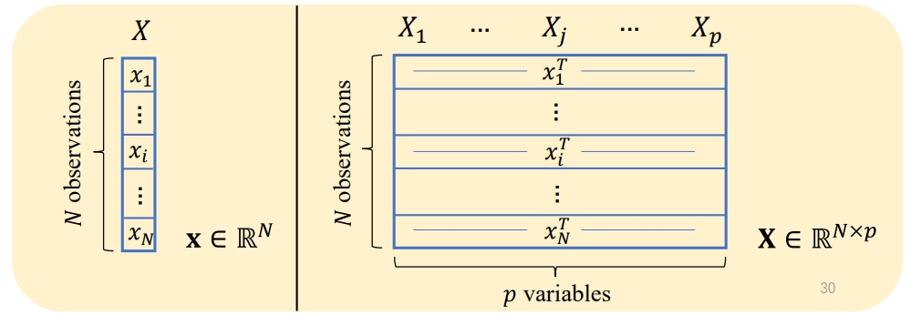
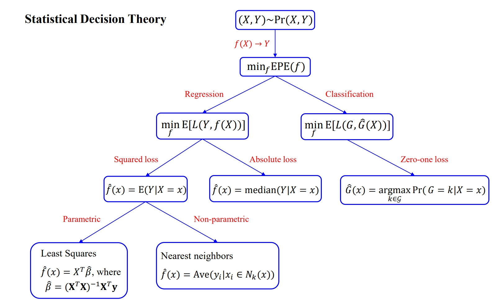
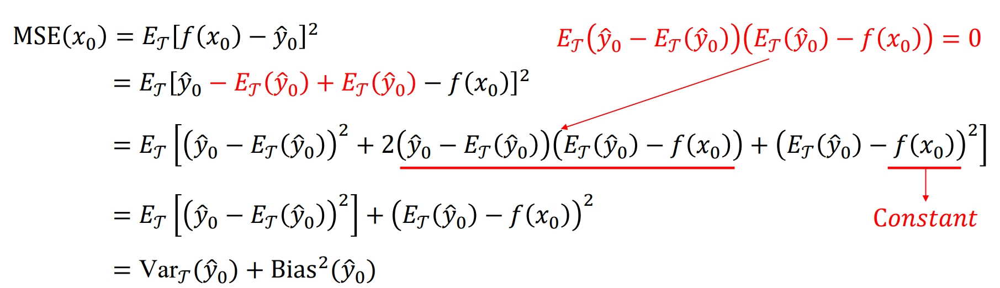

# Overview of Supervised Learning

## Variable Types and Terminology

对于输入，我们通常用 $X$ 来表示。如果 $X$ 是一个向量（他有很多维度的特征），那么我们用 $X_j$ 来表示它的第 $j$ 个特征（element or variable），用 $x_i$ 来表示观测值（observation），即每个第 $i$ 个样本的特征的具体数值。

表现为图像：

对于机器处理的模型，我们通常用一个函数$f_{\theta}(\cdot)$来表示，其中 $\theta$ 是函数的参数或权重集。函数中的 “$\cdot$”  是一个占位符，通常用来表示函数的输入或变量，不特定于任何特定输入表示时使用。

换言之，$f_{\theta}(\cdot)$ 可以理解为“以 $\theta$ 为参数的函数”，通常表示一个模型或算法，并且该模型有一些参数 $\theta$，我们使用这些参数来进行预测或计算。

这个函数的输出结果可以是一个分类的结果，也可以是一个回归的结果。取决于我们想要得到什么。

**机器学习课程最主要想要解决的问题**：Given the value of an input vector $X$, make a good prediction $\hat Y$ of the output $Y$.

## Least Squares

给出输入 $X^T=(X_1,X_2,\cdots,X_p)$，预测输出 $\hat Y$。

我们通过以下模型进行预测：

$$
\hat Y=\hat \beta_0+\sum_{j=1}^pX_j\hat \beta_j
$$

其中，$\hat \beta_0$ 表示偏差或截距。

通常情况下，对于一个输入 $X$ 的多个特征信息，我们得到一个输出 $\hat Y$，这时候 $\hat Y$ 是标量。但是在多变量回归过程中，如果输出 $\hat Y$ 是一个矩阵，那么 $\hat \beta$ 就是一个 $p\times K$ 的矩阵。

---

多重输出的线性回归（也称为多变量回归）是线性回归的扩展，它可以同时预测多个输出变量。

* **模型表示**:
   - 在标准的线性回归中，我们有以下形式的模型：

     $\hat{Y} = \beta_0 + \beta_1 X_1 + \beta_2 X_2 + ... + \beta_p X_p$

   - 在多重输出的线性回归中，我们有多个这样的方程，每个方程对应一个输出。形式上，如果我们有 $K$ 个输出，我们可以表示模型为：

     $\hat{Y}_1 = \beta_{10} + \beta_{11} X_1 + ... + \beta_{1p} X_p$

     $\hat{Y}_2 = \beta_{20} + \beta_{21} X_1 + ... + \beta_{2p} X_p$

     $...$

     $\hat{Y}_K = \beta_{K0} + \beta_{K1} X_1 + ... + \beta_{Kp} X_p$

* **系数矩阵**:
   - 为了更紧凑地表示这些方程，我们可以使用系数矩阵。这是一个 $p \times K$ 的矩阵，其中 $p$ 是特征的数量，$K$ 是输出的数量。每一列都代表与一个特定输出相关的系数。

* **为什么使用多变量回归**:
   - 在某些应用中，我们可能对多个相关的输出变量感兴趣。例如，预测一个地区的未来天气时，我们可能想要同时预测温度、湿度和风速。
   - 多变量回归允许我们考虑输出之间的相关性，并在单一模型中共同预测它们。

* **训练**:
   - 多变量回归的训练通常与单一输出的线性回归类似。目标是最小化所有输出的预测误差的总和。

---

对于 $p$ 个参数，我们会有 $p+1$ 个维度（有一个维度是截距），与此同时 $(X,\hat Y)$ 则代表了这个 $p+1$ 个维度空间中的一个超平面。我们可以将截距合并到 $f$ 函数中，于是得到 $f(X)=X_T\beta$，这个新的函数有个很好的性质就是过原点，并且显得简洁。

对这个新函数求导，我们可以得到：

$$
f'(X)=\beta
$$

得到的 $\beta$ 是函数在某一点的最陡峭上升方向。

那么接下来的问题是，我们是怎么得到 $\beta$ 参数的？这将引出训练的过程。

我们定义一个代价函数，名字叫做残差平方和（residual sum of suqare, RSS）：

$$
\text{RSS}(\beta)=\sum_{i=1}^N(y_i-x_i^T\beta)^2
$$

这个函数也可以写成：

$$
\text{RSS}(\beta)=||\mathbf{y-X}\beta||_2^2
$$

这个函数总会有一个全局最小值（但不唯一），因为它是一个凸函数。不唯一的原因是因为可能会有两个特征线性相关。

下面，我们尝试得到关于 $\beta$ 的 正规方程（normal equations）。这一步的目的是找到最小化残差平方和（RSS）。为了找到这个最小值，我们需要对上面这个 RSS 函数求导并令其等于 $0$

这里的求导涉及到了**矩阵的求导**。下面先介绍矩阵求导法则。

### The derivative of matrix

[矩阵求导的本质与分子布局、分母布局的本质（矩阵求导——本质篇）](https://zhuanlan.zhihu.com/p/263777564)

[矩阵求导公式的数学推导（矩阵求导——基础篇）](https://zhuanlan.zhihu.com/p/273729929)

**标量对向量的导数**:
如果 $f$ 是一个关于向量 $\mathbf{x}$ 的标量函数，那么 $f$ 对 $\mathbf{x}$ 的导数是一个向量，表示为梯度 $\nabla f$。

$$
\nabla f = \begin{bmatrix} \frac{\partial f}{\partial x_1} \\ \frac{\partial f}{\partial x_2} \\ \vdots \\ \frac{\partial f}{\partial x_n} \end{bmatrix}
$$

**线性函数的导数**: 对于形如 $\mathbf{a}^T \mathbf{x}$ 的线性函数，其导数是：

$$
\frac{\partial (\mathbf{a}^T \mathbf{x})}{\partial \mathbf{x}} =\frac{\partial (\mathbf{x}^T \mathbf{a})}{\partial \mathbf{x}}= \mathbf{a}
$$

**二次函数的导数**: 对于形如 $\mathbf{x}^T \mathbf{A} \mathbf{x}$ 的二次函数，其导数是：

$$
\frac{\partial (\mathbf{x}^T \mathbf{A} \mathbf{x})}{\partial \mathbf{x}} = ( \mathbf{A} + \mathbf{A}^T ) \mathbf{x}
$$

如果 $\mathbf{A}$ 是对称的，那么导数是：

$$
\frac{\partial (\mathbf{x}^T \mathbf{A} \mathbf{x})}{\partial \mathbf{x}} = 2 \mathbf{A} \mathbf{x}
$$

---

根据上面得到规则，我们可以对 RSS 函数进行求导，于是我们得到：

$$
\mathbf X^T(\mathbf y-\mathbf X\beta)=0
$$

如果此时 $\mathbf X^T\mathbf X$ 非奇异，那么我们得到 $\hat \beta$ 的唯一解：

$$
\hat \beta=(\mathbf X^T \mathbf X)^{-1} \mathbf X^T \mathbf y
$$

**拟合值**：

一旦我们有了 $\beta$ 的估计值 $\hat{\beta}$，我们就可以用它来预测任何输入 $x_0$ 的输出。预测值是：

$$
\hat{y}(x_0) = x_0^T \hat{\beta}
$$

- 这里的 $x_0^T \hat{\beta}$ 是一个标量，代表输入 $x_0$ 的预测输出。

在多维特征空间中，整个拟合模型可以看作是一个超平面，它是由 $\hat{\beta}$ 完全确定的。这个超平面表示了所有可能的输入和相应的预测输出之间的关系。

## Nearest Neighbors

在 K-NN算法中，给定一个点，我们对这个点周围临近的 $k$ 个点的值的情况进行平均，然后对这个点的值进行预测。下面这个公式是用于k-最近邻（k-NN）算法的预测模型。

$$
\hat{Y}(x) = \frac{1}{k} \sum_{x_i \in N_k(x)} y_i
$$

各个部分的意义：

- $\hat{Y}(x)$：模型对于输入 $x$ 的预测输出。

- $N_k(x)$：训练集中与输入 $x$ 最接近的 $k$ 个样本点的集合。

- $y_i$： $N_k(x)$ 中每个样本点 $x_i$ 的真实输出值。

- $\frac{1}{k} \sum_{x_i \in N_k(x)} y_i$：计算 $N_k(x)$ 中所有 $y_i$ 值的平均。

> 对于距离，我们有欧氏距离和曼哈顿距离。

## Statistical Decision Theory

统计决策理论在回归分析中的应用。

通常，对于预测，我们给定一个随机输入向量 $X \in \mathbb{R}^p$ 和一个随机输出变量 $Y \in \mathbb{R}$，以及它们的联合分布 $\text{Pr}(X, Y)$，目标是找到一个函数 $f(X)$，用于预测 $Y$ 的值。

---

**联合分布是什么？**

联合分布（Joint Distribution）描述了两个或多个随机变量同时出现的概率分布。在这里，联合分布 $\text{Pr}(X, Y)$ 描述了输入向量 $X$ 和输出变量 $Y$ 同时取某一特定值组合的概率。

尽管在这里 $Y$ 是通过 $X$ 得到的（即 $Y$ 是 $X$ 的函数或 $Y$ 依赖于 $X$），但联合分布能够全面地描述 $X$ 和 $Y$ 的关系，包括它们的相关性、依赖性等。具体来说，如果你知道 $\text{Pr}(X, Y)$，你可以推导出 $X$ 的边缘分布、$Y$ 的边缘分布，以及 $Y$ 关于 $X$ 的条件分布 $\text{Pr}(Y | X)$，反之亦然。

在回归分析中，我们通常更关心 $Y$ 关于 $X$ 的条件分布 $\text{Pr}(Y | X)$，因为我们的目标是：给定 $X$ 的值，预测 $Y$ 的值。

---

为了量化预测错误，我们需要引入损失函数 $L(Y, f(X))$。我们使用平方误差损失函数 $L(Y, f(X)) = (Y - f(X))^2$。

期望预测误差（EPE, Expected Prediction Error）定义为 

$$
EPE(f) = \mathbb{E}((Y - f(X))^2)=\int(y-f(x))^2Pr(dx,dy)
$$

它是 $(Y - f(X))^2$ 的期望值。

注意到上面这个式子右侧的推导。我们考虑两个连续随机变量 $X$ 和 $Y$ 以及它们的联合概率密度函数 $f(x, y)$。对于函数 $g(X, Y)$，其期望 $\mathbb{E}[g(X, Y)]$ 定义为：

$$
\mathbb{E}[g(X, Y)] = \iint g(x, y) \cdot f(x, y) \, dx \, dy
$$

在这个问题里，$g(X, Y) = (Y - f(X))^2$，所以：

$$
\mathbb{E}[(Y - f(X))^2] = \iint (y - f(x))^2 \cdot f(x, y) \, dx \, dy
$$

由于 $f(x, y) \, dx \, dy$ 就是 $(X, Y)$ 的联合概率密度在 $dx$ 和 $dy$ 之间的值，它可以用 $\text{Pr}(dx, dy)$ 表示。因此，我们有：

$$
\mathbb{E}[(Y - f(X))^2] = \iint (y - f(x))^2 \, \text{Pr}(dx, dy)
$$

对于这个式子，我们想要求它的最小值。这个预期预测误差可以进一步分解为条件期望（因为 $Pr(X,Y)=Pr(Y|X)Pr(X)$）

$$
EPE(f) = \mathbb{E}_X \mathbb{E}_{Y|X} ((Y - f(X))^2 | X)
$$

这一步基于期望的条件期望规则（Law of Iterated Expectations）以及联合和条件概率之间的关系。

首先，给定 $X$，对 $Y$ 的条件概率密度我们记为 $f(y | x)$。同样地，$X$ 的边缘概率密度函数记为 $f(x)$。

联合概率密度 $f(x, y)$ 可以分解为条件概率密度和边缘概率密度的乘积：

$$
f(x, y) = f(y | x) \cdot f(x)
$$

于是，预期预测误差（EPE）可以重写为：

$$
\begin{aligned}
EPE(f) &= \iint (y - f(x))^2 \, f(x, y) \, dx \, dy \\
&= \iint (y - f(x))^2 \, f(y | x) \cdot f(x) \, dx \, dy
\end{aligned}
$$

然后，可以把上面的积分重排为两个嵌套的积分，第一个是关于 $x$ 的积分，第二个是关于 $y$ 且条件于 $x$ 的积分：

$$
EPE(f) = \int \left[ \int (y - f(x))^2 \, f(y | x) \, dy \right] \cdot f(x) \, dx
$$

这里，括号内的部分实际上就是给定 $X = x$ 时 $(Y - f(X))^2$ 的条件期望 $\mathbb{E}_{Y|X}((Y - f(X))^2 | X = x)$。

因此，整个表达式可以看作是这个条件期望在 $x$ 上的期望（或平均），即：

$$
EPE(f) = \mathbb{E}_X \mathbb{E}_{Y|X} ((Y - f(X))^2 | X)
$$

$$
f(x)=\text{argmin}_cE_{Y|X}([Y-c]^2|X=x)
$$

最后，为了最小化预期预测误差(EPE)，可以针对每一个具体的 $x$ 找到使 $\mathbb{E}_{Y|X}([Y - c]^2 | X = x)$ 最小化的 $c$，这个 $c$ 就是 $f(x)$。对于回归问题，这个 $f(x)$ 其实就是条件期望 $\mathbb{E}(Y | X = x)$。(也可以写成$f(X)=E(Y|X)$，这里我们让 $E(Y|X)=c=f(x)$ 得到结果，通过这种方式尝试得到期望的最小的情况)

**总结**：在上面的情况下，当我们采用平方损失函数 $L(Y, f(X)) = (Y - f(X))^2$ 并且目标是最小化预期预测误差 $EPE(f)$，那么最优的 $f(x)$ 就是条件期望 $\mathbb{E}(Y | X = x)$。

---

### Nearest neighbor methods applicaiton

根据上面的结论，我们来看 Nearest neighbor methods 采用的方法。

Nearest neighbor methods 尝试直接实现这个下面这个式子：

$$
\hat f(x)=\text{Ave}(y_i|x_i \in N_k(x))
$$

这里我们使用了**两种近似**：

- **期望的近似**：真正的条件期望是通过在整个分布上对 $y$ 进行平均来得到的，而这里使用有限样本数据的平均值作为近似。

- **条件的近似**：理论上，我们关心的是在某个特定点 $x$ 上的条件，但由于数据限制，实际上是在 $x$ 的一个邻域（即 $N_k(x)$）上进行条件操作。

随着样本大小 $N$ 和邻域数 $k$ 向无穷大，以及 $\frac{k}{N}\rightarrow 0$，该方法的估计 $f_\text{approx}(x)$ 将趋于真正的条件期望 $\mathbb{E}(Y | X = x)$。

但通常情况下我们不会有非常大的样本量。因此，通过做出一些假设（例如线性关系），可以显著减少所需的观测数量（通过简化模型）。

这种方法的另外一种问题是**维数灾难**。当特征维度 $p$ 增加时，训练数据集中所需的观测数量 $N$ 会呈指数增长。因此，随着 $p$ 的增加，收敛到真实估计器的速率将下降。

### Linear regression applicaiton

线性回归假设因变量 $Y$ 和自变量 $X$ 之间存在大致线性的关系，即 $f(x) \approx x^T \beta$。

这种先验的假设就被我们叫做“基于模型的方法”（反之叫做非参数方法）。

将上面的这个假设关系代入 EPE，我们可以得到：

$$
EPE(f)=E(Y-f(X))^2=E((Y-X^T\beta)^T(Y-X^T\beta))
$$

对右侧式子内部展开后对 $\beta$ 求导（涉及到之前的矩阵求导）。我们可以得到：

$$
\beta=[E(XX^T)]^{-1}E(XY)
$$

在实际应用中，由于通常没有整个概率分布的信息（只有有限的样本），我们用 **残差平方和 (RSS)** 来作为 **EPE** 的实际估计，并用它来评估模型在特定数据集上的性能：

$$
RSS(\beta)=\sum_{i=1}^N(y_i-x_i^T\beta)^2
$$

$$
\hat \beta=(\mathbf X^T \mathbf X)^{-1} \mathbf X^T \mathbf y
$$

> 总结一下，这种 $\beta$ 解的情况事实上是对 EPE 解法的一个更特别的针对线性关系假设的解。
> 
> **期望预测误差（EPE）的推导**：这个是在一般的设置下进行的，没有做任何关于 $f(x)$ 的形状或类型的假设。你想找到一个 $f(x)$ 使得 $EPE(f)$ 是最小的，而这个 $f(x)$ 可能是非线性的、复杂的函数。这里，最优的 $f(x)$ 就是条件期望 $\mathbb{E}(Y|X=x)$，这是一个全局的结论。
>
> **线性回归中 $\beta$ 的推导**：这里是在一个特定的假设下进行的，即 $f(x)$ 是 $X$ 的线性函数 $f(x) = x^T \beta$。在这个特定模型下，想找到 $\beta$ 使得 $EPE(f)$ 最小。通过对 $EPE$ 进行微分和求解，你会找到一个 $\beta$ 作为最优解。
>
> 换句话说，第一个是一个更一般的问题，它的解是 $f(x)=\mathbb{E}(Y|X=x)$，这个解是在没有任何关于 $f(x)$ 形状的假设下得到的。
>
> 而第二个是一个更特定的问题，它假设了 $f(x)$ 必须是 $x$ 的线性函数。在这个假设下，最优的 $f(x)$ 就是 $x^T \beta$，其中 $\beta$ 是通过最小化 $EPE$ 而找到的。
> 
> 简单地说，第一个问题的答案是一个函数 $f(x)$，它是 $Y$ 关于 $X$ 的条件期望；而第二个问题的答案是一个参数 $\beta$，它定义了 $Y$ 和 $X$ 之间的最优线性关系。两者是不同层次的优化问题。

---

当我们用**绝对值损失函数**（absolute loss function）的时候，又会发生什么？

$$
L_1(Y,f(X))=|Y-F(X)|
$$

在这种情况下，我们的目标是最小化期望损失，即：

$$
\text{minimize} \quad E[|Y - f(X)|]
$$

考虑 $f(x)$ 是一个定值，即 $f(x) = c$，这等价于解决：

$$
\text{minimize} \quad E[|Y - c| \mid X=x]
$$

为了找到使得该表达式最小的 $c$，我们需要找到 $Y$ 在 $X=x$ 条件下的中位数。于是

$$
\hat f(x)=\text{median}(Y \mid X=x)
$$

因为这种方法对异常值的敏感性更低，也不会受到极端值的影响，因此鲁棒性更强。但是它不可微分。

目前，最流行的依旧是平方残差和。

---

## categorical problems

接下来是统计决策理论在**分类**问题中的应用。

分类问题的目标是**分类输出变量**，输出变量 $G$ 是一个分类（categorical）变量，其取值范围是 $\mathcal{G}$。

在分类问题中，损失函数量化了模型预测错误的“代价”。最常用的损失函数是**零一损失函数**。

**零一损失函数**：如果预测的标签 $k$ 与真实标签 $l$ 相同，则损失是 $0$；否则损失是 $1$。

$$
\mathbf L(k, l) = 1-\delta_{kl}
$$

> 当 $k=l$ 时，$\delta_{kl}=1$，否则 $\delta_{kl}=0$

然而，在某些应用中，不同类型的错误可能有不同的代价。例如，在医疗诊断中，将健康人误诊为患者可能比将患者误诊为健康人要好。这时，我们可能会使用一个更一般的损失矩阵。

**损失矩阵**：对于 $K$ 个类别，损失矩阵 $L$ 是一个 $K \times K$ 矩阵，其中 $\mathbf L(k, l)$ 表示将一个真实属于第 $k$ 类的样本误分类为第 $l$ 类的代价。对角线上的 $\mathbf L$ 为 $0$。

接下来我们计算分类问题损失函数的 EPE （Expected prediction error）。

在这一部分中，目标是找到一个分类函数 $\hat{G}(X)$，该函数最小化预期预测误差（EPE）。这里的 $G$ 表示真实类别，$\hat{G}(X)$ 是基于输入 $X$ 的预测类别。损失函数 $L$ 定义了预测错误的代价。

预期预测误差（EPE）是损失函数 $L$ 的期望值，该期望值是关于联合概率 $\text{Pr}(G, X)$ 的。

$$
\text{EPE} = \mathbb{E}[L(G, \hat{G}(X))]
$$

**在 $X$ 上条件化**

考虑 $X$ 的值，并将 EPE 在 $X$ 上条件化。

$$
\text{EPE} = \mathbb{E}_X \left[ \sum_{k=1}^{K} L(G_k, \hat{G}(X)) \text{Pr}(G_k|X) \right]
$$

这里 $\mathbb{E}_X$ 表示关于 $X$ 的期望，$K$ 是类别的总数，$G_k$ 是第 $k$ 个类别。

**点逐点最小化**

为了最小化 EPE，我们需要找到每个 $X$ 的最佳预测 $\hat{G}(x)$。

$$
\hat{G}(x) = \arg\min_{g \in G} \left[ \sum_{k=1}^{K} L(G_k, g) \text{Pr}(G_k|X=x) \right]
$$

这里 $g$ 是 $G$ 中的一个可能类别。

**贝叶斯分类器**

在损失函数为零一损失的特殊情况下，上面的式子可以进行简化。

$$
\sum_{k=1}^{K} L(G_k, g) \text{Pr}(G_k|X=x)=\text{Pr}(G_k\neq g | X=x)=1-\text{Pr}(G_k=g|X=x)
$$

于是，最小化之前的求和等于最大化之后的 $G_k=g$ 的发生概率，也就是

$$
\hat{G}(x) = \arg\max_{g \in G} \text{Pr}(g|X=x)
$$

这就是贝叶斯分类器：给定输入 $X=x$，我们选择具有最大后验概率的类别，所有类别中发生概率最大的那一个。

这样，我们就得到了如何推导出在分类问题中最小化预期预测误差（EPE）的模型或决策规则。

**总结统计决策理论**：

---

## Local Methods in High Dimensions

局部方法，例如 k-邻近方法，通常在低维空间中的效果很好，因为低维空间中数据点之间的距离是有意义的。但在高维空间中，由于“维度的诅咒”（Curse of Dimensionality）的影响，点之间的距离变得相对一致，点之间的距离差异变得不那么显著。换句话说，在高维空间中，两点之间的距离可能都会偏向一个相对固定的值，导致在这样的空间中进行近邻搜索变得没有那么有意义。

例如，我们接下来考虑在 $p$-维单位超立方体（unit hypercube）中均匀分布的点。

假设你想要捕获数据的一个比例 $r$（比如 $1\%$），你就需要一个超立方体邻域，其体积是单位超立方体体积的 $r$ 倍。

对于 $p$-维单位超立方体，其体积是 $1^p = 1$。假设我们有一个边长为 $e$ 的 $p$-维超立方体邻域，那么其体积是 $e^p$。我们想要找到一个 $e$ 使得：

$$
e^p = r
$$

于是

$$
e = r^{1/p}
$$

所以在 $10$ 维空间中：

- 为了捕获 $1\%$ 的数据（$r = 0.01$），边长 $e_{10}(0.01) = 0.01^{1/10} \approx 0.63$。
- 为了捕获 $10\%$ 的数据（$r = 0.1$），边长 $e_{10}(0.1) = 0.1^{1/10} \approx 0.80$。
  
在 $10$ 维空间中，为了捕获 $1\%$ 的数据（$r = 0.01$），你需要一个边长为 $0.63$ 的超立方体，这意味着你需要覆盖每个坐标轴范围的 $63\%$。对于 $10\%$ 的数据（$r = 0.1$），这个数字增加到 $80\%$。

---

此外，在高维空间中，所有的样本点更集中在样本空间的边缘而非中心。

现在，假设我们有 $N$ 个数据点均匀分布在 $p$ 维的单位球空间内部。我们想得到的结果是距离原点最近的点的中位数距离 $d(p, N)$，用来验证中位数距离会随着维度增加而变大。

在 $p$-维单位球中，一个点 $x$ 距离原点小于等于 $r$ 的概率是 $r^p$。

$$
\prod_{i=1}^{N}Pr(||x_i||>r)=\frac12
$$

> 只要所有  $N$ 个点同时在距离 $r$ 外的概率大于 $\frac12$，那么我们就可以认为这是中位数距离

$$
(1-r^p)^N=\frac12
$$

$$
d(p,N)=(1-\frac12^{1/N})^{1/p}
$$

于是 $d(10,500)\approx 0.52$ 比一半多。

**采样密度与 $N^{1/p}$ 成正比**：在 $p$-维空间中，如果你有 $N$ 个样本点，那么这些点的密度（即单位体积内的点数）与 $N^{1/p}$ 成正比。这意味着，当维度 $p$ 增加时，为了保持相同的采样密度，你需要指数级增加的样本量。

例如，如果在一维空间里有 $100$ 个样本点被认为是“密集”的，那么在 $10$ 维空间里，我们需要 $100^{10}$ 个样本点才能达到同样的“密度”。

因为在实际应用中通常不可能获得指数级数量的样本，所以在高维空间里，所有可行的训练样本基本上都是在输入空间里稀疏分布的。

---

### MSE

MSE（Mean Squared Error）分解。MSE 代表均方误差，是用来衡量模型预测值与真实值之间差异的一个指标。

$$
\text{MSE}(x_0)=\mathbb E_{\mathcal T}[f(x_0)-\hat y_0]^2
$$

$MSE(x_0)$ 是预测值 $f(x_0)$ 与真实值 $y_0$ 的均方误差，用数学期望 $\mathbb{E}_{\mathcal{T}}$ 来平均所有可能的训练数据集 $\mathcal{T}$。

> $\mathcal T$: 表示 set of training points $x_i$

这个公式可以被分解（the bias-variance decomposition）为：

$$
\text{MSE}(x_0)=\text{Var}_{\mathcal T}(y_0)+\text{Bias}^2(\hat y_0)
$$

$Var_{\mathcal{T}}(y_0)$ 是真实值 $y_0$ 基于不同训练集 $\mathcal{T}$ 的方差。
   
$Bias^2(y_0)$：这是模型预测 $f(x_0)$ 的偏差的平方。偏差衡量了模型预测的平均值与真实值之间的差异。
   
通过这种分解，我们可以更好地理解模型误差来自哪里：

- 如果方差（Var）高，表示模型在不同的训练集上给出了很不一样的输出，即模型过于复杂，容易过拟合。
  
- 如果偏差（Bias）高，表示模型的预测与真实值有很大的系统性差异，即模型过于简单，容易欠拟合。

在实际应用中，通常需要在偏差和方差之间找到一个平衡点，这被称为偏差-方差权衡（Bias-Variance Tradeoff）。

**MSE 和 EPE 有什么区别？**

均方误差（MSE, Mean Squared Error）和期望预测误差（EPE, Expected Prediction Error）是用于衡量模型性能的两个不同的指标。

均方误差是用于衡量模型预测值与真实值之间的平均平方差的：

$$
\text{MSE} = \frac{1}{N} \sum_{i=1}^{N} (y_i - \hat{y}_i)^2
$$

其中，$N$ 是样本数，$y_i$ 是第$i$个样本的真实值，$\hat{y}_i$ 是第$i$个样本的预测值。

期望预测误差是预测值与真实值差异的期望，它通常在理论分析中使用，并且更加全面地考虑了模型的误差：

$$
\text{EPE}(x) = \mathbb{E}[(Y - f(X))^2 | X=x]
$$

这里的 $\mathbb{E}$ 是期望值，$Y$ 是随机变量表示的真实标签，$f(X)$ 是模型预测，$X$ 是输入特征。

**区别：**

- **应用范围方面**， MSE 主要用于**评估**已经训练好的模型在一个特定测试集上的性能，而 EPE 是在模型整个应用范围内（通常是在所有可能的数据分布上）的预测误差。

- MSE 是一个针对特定数据集的具体数值，而 EPE 是一个理论上的期望值，通常用于理论分析。EPE 通常更全面，因为它考虑了所有可能的 $(Y, X)$ 对的期望预测误差，而 MSE 只是计算在一个给定测试集上的误差。

> 假设我们有一个简单的线性模型 $f(x) = 2x + 3$，真实的数据分布是 $y = 2x + 3 + \epsilon$，其中 $\epsilon$ 是高斯噪声。
>
> 对于一个具体的测试集，例如 $(1, 5), (2, 9), (3, 11)$，我们可以计算 MSE：
>
> $\text{MSE} = \frac{(5 - 5)^2 + (9 - 7)^2 + (11 - 9)^2}{3} = \frac{0 + 4 + 4}{3} = \frac{8}{3}$
>
> 而 EPE 会涉及对整个数据分布的 $Y$ 和 $X$ 的期望，通常需要用积分或者高级的数学工具来计算。

> MSE 是用于具体测试集的误差度量， EPE 提供了一个更全面、更理论性的误差度量。

此外，对于局部模型，随着维度增加，模型的偏差（bias）通常会增加。因为在高维空间中，数据点之间的距离变得非常相似。这就导致局部模型很难找到与目标点密切相关的邻居，从而导致预测偏差增大。

---

在前面的研究中，我们对于数据测量都是无误差的（no measurement error）。当有测量误差的时候，会发生什么变化?

在没有测量误差的情况下，期望预测误差（EPE）就是均方误差（MSE）。MSE 可以进一步分解为方差（Variance）和偏差的平方（Bias^2）。

$$
EPE(x_0) = MSE(x_0) = Var_T(y'_0) + Bias^2(y'_0)
$$

在有测量误差（$\sigma^2$）的情况下，EPE 还要加上这个测量误差。

$$
EPE(x_0) = MSE(x_0) + \sigma^2 = Var_T(y'_0) + Bias^2(y'_0) + \sigma^2
$$

**最小二乘法（Least Squares）**

- **线性情况（Linear case）**: 模型是非偏的（non-biased），即偏差是 $0$。对于大样本（large $N$），方差也可以忽略。
  
- **非线性情况（Non-linear case）**: 模型是有偏的（biased），因为最小二乘法假设了数据和模型之间的线性关系，而实际情况可能并非如此。

**最近邻（Nearest Neighbors）**

- **对称于 $x_0$（Symmetric on $x_0$）**: 偏差的平方（$Bias^2(y'_0)$）占主导地位。这通常发生在数据呈对称分布时。

- **单调于 $x_0$（Monotonic on $x_0$）**: 方差（$Var_T(y'_0)$）占主导地位。这通常是因为在 $x_0$ 的不同取值下，模型的预测表现具有一定的单调性。

---

## Statistical Models

这里我们主要关注最大似然估计（maximum likelihood estimation (MLE)）来求解线性回归。

[推荐一个视频](https://www.bilibili.com/video/BV1QM4y167oZ/?vd_source=9470ae57cc3c4cf5b049c428a2fe56e6)

假如你看完了这个视频，你就应该对 MLE 的作用有了清楚的了解。我们的目标是求 $\ell(\theta)$ （对数似然函数）的最大值。它描述了观察到一个特定样本集合的对数概率（log-probability）。

$$
\ell(\theta) = \sum_{i=1}^{N} \log \text{Pr}_\theta(y_i)
$$

> $\text{Pr}_\theta(y_i)$：这是第 $i$ 个观测值 $y_i$ 出现的概率，该概率由模型参数 $\theta$ 决定。

通过最大化这个对数似然函数，我们可以找到一组参数 $\theta$，使得这组观测数据在该模型下最有可能出现。这就是最大似然估计（MLE）方法的基础，从数据中学习模型参数。

现在我们主要关心的问题是，这种方法**和 RSS 有什么区别和联系**？

最大似然估计（MLE）和残差平方和（RSS）都是用于模型参数估计的方法，但MLE更加通用，适用于多种统计模型，而RSS主要用于线性回归中的最小二乘法。在特定条件（如正态分布误差）下，两者可能得出相同的参数估计。

这种特定的关系就是：在正态分布误差的假设下，最小二乘法（通过最小化RSS进行参数估计）和最大似然估计会给出相同的结果。

**加性误差模型（Additive Error Model**: $Y = f_\theta(X) + \epsilon$，其中 $\epsilon$ 服从正态分布 $\mathcal{N}(0, \sigma^2)$。也就是说，对于每一个观测值 $Y$，我们可能会有 $\epsilon$ 的观测误差。

于是给定 $X$之后，$Y$ 的条件概率 $\text{Pr}_\theta(Y|X)$ 也服从正态分布 $\mathcal{N}(f_\theta(X), \sigma^2)$。

这就引出了以下等式：

$$
\text{Pr}_\theta(y|X=x) = \frac{1}{\sqrt{2\pi\sigma^2}} e^{ -\frac{(Y - f_\theta(X))^2}{2\sigma^2}}
$$

这是一个正态分布的密度函数，其中 $\mu = f_\theta(X)$，$\sigma^2$ 是方差。也可以被表示为 $\text{Pr}_\theta(Y|X)=\mathcal N(f_\theta(X),\sigma^2)$。

**对数似然（Log-Likelihood）**: 在这种情况下，数据的对数似然函数 $\ell(\theta)$ 表达为

$$
\ell(\theta) = -\frac{N}{2} \log(2\pi) - N \log \sigma - \frac{1}{2\sigma^2} \sum_{i=1}^{N} (y_i - f_\theta(x_i))^2
$$

这里的最后一项 $\sum_{i=1}^{N} (y_i - f_\theta(x_i))^2$ 实际上就是残差平方和（RSS）。前面两项不依赖于参数 $\theta$。

因此，如果误差 $\epsilon$ 符合正态分布，并且其方差 $\sigma^2$ 是已知的，那么通过最小化残差平方和（即最小二乘法）与通过最大化对数似然函数（即最大似然估计）实质上是等价的。

## Bayesian Methods and Roughness Penalty

这一部分我们主要关注如何将贝叶斯方法和粗糙度惩罚（Roughness Penalty）相结合。

**贝叶斯方法（Bayesian Methods）**

**联合概率（Joint Probability）**: $\text{Pr}(A, B) = \text{Pr}(B|A) \text{Pr}(A) = \text{Pr}(A|B) \text{Pr}(B)$。
    
**贝叶斯定理（Bayes's Theorem）**: 

$$
\text{Pr}(B|A) = \frac{\text{Pr}(A|B) \text{Pr}(B)}{\text{Pr}(A)}
$$

后验概率（Posterior Probability，表示为 $\text{Pr}(B|A)$）是似然（Likelihood，表示为 $\text{Pr}(A|B)$）和先验概率（Prior Probability，表示为 $\text{Pr}(B)$）的乘积，通常与一个归一化因子（Evidence，表示为 $\text{Pr}(A)$）相结合。

**粗糙度惩罚（Roughness Penalty）**

$$
\text{PRSS}(f;\lambda) = \text{RSS}(f)+\lambda J(f)
$$

**惩罚残差平方和（PRSS）**: PRSS（Penalized Residual Sum of Squares）是标准的残差平方和（RSS）和一个粗糙度惩罚项（Roughness Penalty）$\lambda J(f)$ 的和。这里的 $J(f)$ 测量函数 $f(x)$ 的"粗糙度"。
  
> **为什么需要对 RSS 进行粗糙度惩罚？**
>
> 主要是为了防止过拟合（Overfitting）和得到一个更平滑的模型。（也有正则化因素）

在贝叶斯框架中，模型的不确定性和先验知识通常通过概率分布来表示。这里，惩罚项 $J$ 被解释为对数先验分布（Log-Prior）。对数先验分布是先验概率分布取自然对数后的结果，它描述了在看到数据之前，我们对模型参数的信念或偏好。

PRSS 被解释为对数后验分布（Log-Posterior）。对数后验分布是后验概率分布取对数后的结果。后验分布描述了在观察到数据后，我们对模型参数的更新信念。

在贝叶斯统计中，后验分布是先验分布和似然函数的乘积。数学上表示为：

$$
\text{Posterior} \propto \text{Likelihood} \times \text{Prior}
$$

对上面这个式子取对数我们就可以得到加法形式，也就是我们的 PRSS 公式的形式。

$$
\text{log(Posterior)} = \text{log(Likelihood)} + \text{log(Prior)}
$$

$$
\text{PRSS}(f;\lambda) = \text{RSS}(f)+\lambda J(f)
$$

这里，$\lambda$ 是一个超参数，用于平衡拟合度（RSS）和复杂度（$J$）。这样，PRSS 就同时考虑了数据的拟合度和模型复杂度（通过先验），从而达到一种平衡。

这样，我们就用贝叶斯的术语和概念解释了为何和如何通过加入一个与先验知识（或者说，对模型复杂度的信念）有关的惩罚项来正则化模型。这有助于防止过拟合，并提高模型对未见数据的泛化能力。

---

## Model Selection

当我们尝试建立一个机器学习模型时，我们希望让模型既能准确地拟合数据，又不失对未知数据的预测能力。这与参数的平滑度和复杂性有关。这些参数，包括惩罚项的系数、核函数的宽度或者基函数的数量，影响着模型的整体性能和泛化能力。

例如，在 $k$ -近邻方法里，我们有一个基础模型 $Y = f(X) + \epsilon$。假设 $E(\epsilon)=0,\text{Var}(\epsilon)=\sigma^2$

我们可以计算它的 EPE:

$$
\text{EPE}_k(x_0) = E[Y - \hat{f}_k(x_0) \mid X = x_0]
$$

$$
= \sigma^2 + \text{Bias}^2(\hat{f}_k(x_0)) + \text{Var}_{\mathcal{T}}(\hat{f}_k(x_0))
$$

> 这一步参考之前的 MSE 分解公式，两者都是泛化误差拆解方法

$$
= \sigma^2 + \left(f(x_0) - \frac{1}{k} \sum_{\ell=1}^{k} f(x^{(\ell)}) \right)^2 + \frac{\sigma^2}{k}
$$

这里的 $\epsilon$ 是噪声项，不受我们控制，但它的期望和方差对模型的性能产生影响。这个误差是不可避免的。

为了评估模型的好坏，我们会看泛化错误，也就是预期预测误差（EPE）。这个指标包括了偏差、方差，还有与数据噪声相关的不可约错误。偏差告诉我们模型预测平均而言有多远离真实值，方差则描述的是模型预测的不稳定性。通常情况下，一个模型不可能同时具有低偏差和低方差，这就是经典的偏差-方差权衡。

如果模型太简单，比如说我们设置了很高的惩罚系数，那么它可能就不能捕捉到数据中的复杂结构，结果就是高偏差、低方差，也就是欠拟合。反过来，如果模型太复杂，比如核函数的宽度设置得太小，那模型就会变得“敏感”，对每一个数据点都反应过度，这就导致了低偏差但高方差，也就是过拟合。

因此，调整这些平滑和复杂性参数，实际上是在寻找一个最佳平衡点，让模型既能捕捉到数据中的关键信息，又不至于过于复杂或过于简单。这样，当我们用模型去预测未见过的新数据时，就有更大的信心能得到靠谱的结果。