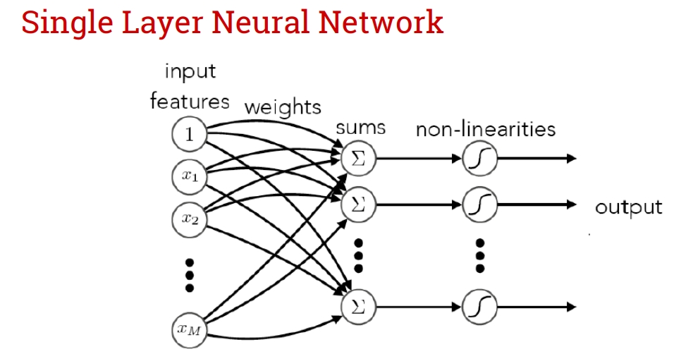
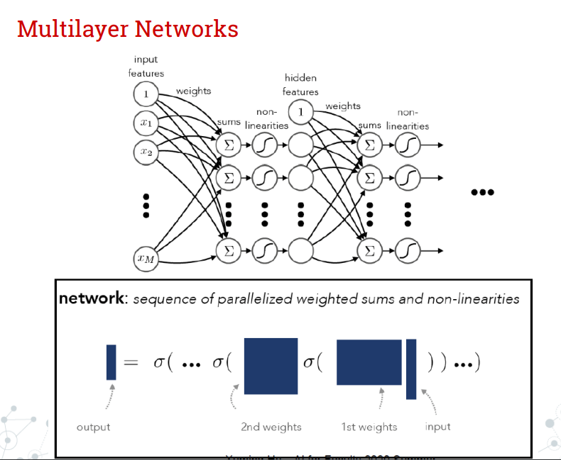
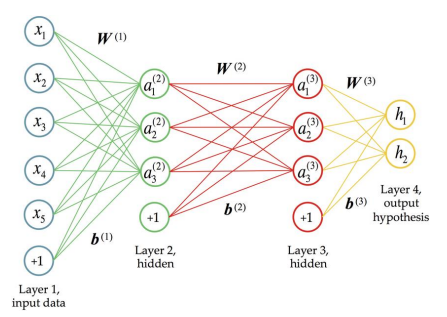
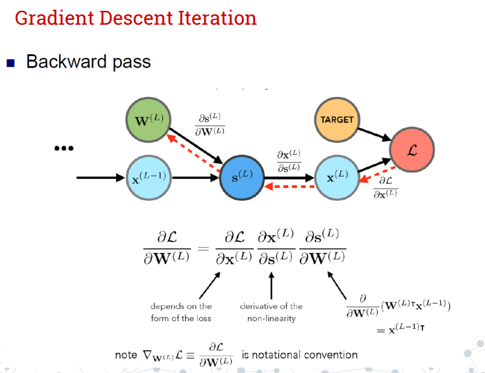

# Neural Networks

## Artificial neuron

在之前所学习的机器学习经典内容中，我们在一些方法中预先假设了数据的分布形式，并选择一个特定的模型进行拟合，因此这些方法有固定的参数数量。在另外一些方法中，参数数量并不确定，模型可能随着数据的增加而增加参数数量，并且模型结构也不是被预先定义的，例如KNN等。这就是参数方法和非参数方法的区别。

人工神经网络（ANN，Artificial Neural Network）就是一种非参数的学习方法。尽管在特定的情况下它会具有固定数量的参数，但它不依赖于特定的参数集，可以从任何形式的数据中学习，并且模型的复杂度可以根据问题的需要进行调整。

人工神经网络由许多的层组成，每一层中都有许多不同的神经元。单个神经元的作用可以类比为生物中的一个神经元，它接收许多输入信号，对这些信号进行处理，然后传递输出单个新的信号。

单个神经元（也被称作感知器）通常执行以下步骤：

1. **接收输入**：神经元接收来自前一层神经元的一系列输入（或者在输入层，直接来自数据）。

2. **加权和**：每个输入信号都会被赋予一个权重（表示该输入的重要性），神经元将这些加权输入求和。

3. **添加偏置**：在加权和的基础上添加一个偏置值，这可以被视为调整神经元激活阈值的方式。

4. **应用激活函数**：对加权和加上偏置后的结果应用一个激活函数。激活函数的作用是引入非线性，使得神经网络能够学习和表示复杂的数据模式。常用的激活函数包括 Sigmoid、ReLU（Rectified Linear Unit）、tanh（双曲正切） 等。

5. **输出结果**：激活函数的输出成为这个神经元的输出，这个输出会传递给下一层神经网络中的神经元，或者作为网络的最终输出。

单个神经元的操作可以表示为对输入信号加权和的形式，这和我们之前在线学习中提到的感知机模型基本一致：

$$
y = f\left(\sum_{i=1}^{n} (w_i \cdot x_i) + b \right)
$$

其中，$x_i$ 是输入值，$w_i$ 是权重，$b$ 是偏置，$f$ 是激活函数，$y$ 是输出值。

在激活函数中，Sigmoid 函数或 tanh 函数都有一个常见的问题，即**梯度消失**（或梯度弥散）现象。梯度消失现象是指在神经网络的训练过程中，权重的梯度（即权重对损失函数的导数）变得非常小，几乎为零。当使用梯度下降法或其变体进行训练时，权重的更新量将取决于梯度的大小。我们再计算反向传播时，将每一层中间层都对参数进行了求导并相乘。如果每一次的梯度都小于 $1$，一系列梯度相乘后权重的更新将会非常小，这将导致学习过程非常缓慢，甚至在实际中停滞不前。因此，我们一般不会在深层的神经网络中使用这些函数，ReLU 由于有恒定的梯度可以缓解梯度消失的问题。

## Single layer neural networks

### Network Structure

当我们把很多个神经元排列成一层的形式时，我们就得到了一个单层的神经网络，接受参数，并输出一系列经过激活函数的值。对于每一个神经元，我们都有：

$$
s_j=w_j^T\mathbf x
$$

于是，我们的单层神经元的输出可以表示为：

$$
\mathbf s=\mathbf W^T\mathbf x
$$

并应用上激活函数（假设这里是 sigmoid 函数）：

$$
h=\sigma(\mathbf s)=\sigma(\mathbf W^T\mathbf x)
$$

对于单层神经网络情况下的激活函数的输出结果，我们会得到一个列向量。对于这个列向量应用 Softmax 函数，我们就可以尝试得到分类问题中每个类别的概率大小。

**Softmax函数**：Softmax 函数将神经元的加权求和转换为概率。对于多分类问题，它可以计算出每个类别的概率。公式如下所示：
   
$$
P(Y = k | X = x_i) = \frac{e^{s_k}}{\sum_{j} e^{s_j}}
$$

其中，$P(Y = k | X = x_i)$ 表示给定输入 $x_i$ 时，输出类别为 $k$ 的条件概率。$s_k$ 是网络对于第 $k$ 类的加权求和的非归一化分数（或对数几率），而分母是所有类的 $e^{s_j}$ 的和，确保所有类别概率的总和为1。

通过使用Softmax函数，网络的输出可以被解释为一个概率分布，这样每个输出神经元的值表示一个特定类别的预测概率。这种方法在处理分类任务时特别有用，因为它提供了一个明确的概率解释，允许我们评估不同类别的相对可能性。

### Parameter Learning

现在我们来考虑如何更新参数 $W$ 矩阵来得到最好的预测结果。和其它所有的机器学习方法类似，神经网络也需要一个损失函数（Loss function）来评估输出结果的好坏。MSE（Mean Square Error）是我们通常情况下最常用的损失函数。

回忆之前的**梯度下降法**，我们希望最小化输出与实际值之间的误差。在初始时，我们有一系列的随机权重参数 $\omega^{(0)}$。接下来每一次更新，我们根据 $\omega^{(t)}$ 的梯度以及一个超参数学习率（Learning Rate）$\eta$ 来一步步调整权重 $\omega^{(t)}$。超参数 $\eta$ 不能过大，否则梯度下降会无法收敛，过小则会导致训练速度较慢。

权重更新公式如下：

$$
\omega^{(t+1)}=\omega^{(t)}-\eta_t \cdot \nabla L (\omega^{(t)})
$$

$$
\nabla L (\omega^{(t)})=\frac1n \sum_i \nabla_w L_i(\omega^{(t)};y_i,x_i) 
$$

这里，$L$ 为损失函数。权重参数 $\omega$ 将会一直更新直到 $||\omega^{(t+1)}-\omega^{(t)}|| \leq \epsilon$ 或 $||\nabla L (\omega^{(t)})|| \leq \epsilon$。（这两个式子基本上是等价的，因为 $\epsilon$ 往往也是自定义的） 

---

举一个手算的具体的例子。在手算时，在多输出单层神经网络的情况下，$\omega_{ij}$ 是连接输入节点 $i$ 和输出节点 $j$ 的权重。如果我们使用均方误差（MSE）作为损失函数，每个权重的梯度可以根据损失函数对该权重的偏导数来计算。损失函数 $L$ 是所有输出误差的平均值，对 $\omega_{ij}$ 的偏导数可以表示为：

$$
\frac{\partial L}{\partial \omega_{ij}} = \frac{1}{n} \sum_{k=1}^{n} (h_{\omega_{j}}(x_k) - y_{kj}) \cdot x_{ki}
$$

其中，$x_{ki}$ 是第 $k$ 个样本的第 $i$ 个特征值，$h_{\omega_{j}}(x_k)$ 是当前权重下第 $j$ 个输出节点对第 $k$ 个样本的预测值，$y_{kj}$ 是第 $k$ 个样本的第 $j$ 个目标值。

接下来通过学习率 $\eta$ 来更新 $\omega_{ij}$：

$$
\omega_{ij}^{(t+1)} = \omega_{ij}^{(t)} - \eta \frac{\partial L}{\partial \omega_{ij}}
$$

这就是每个权重 $\omega_{ij}$ 在梯度下降过程中的更新方式。在矩阵形式中，这个更新可以表示为权重矩阵的更新：

$$
\omega^{(t+1)} = \omega^{(t)} - \eta \cdot \frac{1}{n} X^T (H - Y)
$$

在这里，$X^T (H - Y)$ 是损失函数关于权重矩阵的梯度，其中 $X^T$ 是输入特征矩阵的转置，$(H - Y)$ 是预测输出矩阵和真实输出矩阵的差值。每个 $\omega_{ij}$ 的更新都来自于这个梯度矩阵的对应元素。

---

此外，神经网络也会面临过拟合的情形。我们可以回忆之前在线性回归中使用的正则化方式如 L1 正则化、L2 正则化、弹性网正则化等等，将其应用到损失函数中，来得到更高的泛化性能。也就是说，我们可以改写神经网络的损失函数为：

$$
L(W)=\frac1N\sum_{i=1}^NL_i(x_i,y_i,W)+\lambda R(W)
$$

对于梯度下降法，我们还有一种变体，叫做随机梯度下降法。当样本数量 $N$ 过大时，我们也会通过采用一组小样本的方式（minibatch，32 个 或 64 个样本为一组）来近似更新权重，加速网络的训练。

此外，我们还可以通过添加动量，来越过某些局部最小点。添加动量帮助加速 SGD 在相关方向上的收敛并抑制震荡。动量通过累积之前梯度的一部分来更新参数，类似于物理中的动量，使得参数更新在一定方向上具有惯性。

动量方法的主要思想是在参数更新中引入惯性，即前几步梯度的累积影响，以帮助克服优化中的局部最小值和鞍点，并加速学习过程。通过动量项，每次参数更新不仅考虑当前的梯度，还考虑了之前梯度的方向和大小，这样可以在一定程度上减少更新过程中的震荡，使得参数更新更加平滑。

添加动量（Momentum）的随机梯度下降（SGD）更新规则可以表示为以下两个步骤：

1. **计算动量更新**：

$$
v_t = \beta v_{t-1} + (1 - \beta) \nabla_{W}L(W_t)
$$

其中，$v_t$ 是当前步骤的动量项，$\beta$ 是动量参数（通常接近1，例如0.9或0.99），$\nabla_{W}L(W_t)$ 是当前参数 $W_t$ 下的损失函数梯度。

2. **更新参数**：

$$
W_{t+1} = W_t - \alpha v_t
$$

这里，$W_{t+1}$ 是更新后的参数，$W_t$ 是当前参数，$\alpha$ 是学习率，$v_t$ 是上一步计算得到的动量项。

## Multi-layer neural networks

单层神经网络会面临一个问题，也就是只能解决线性可分的情况，对于更复杂的分类问题，单层神经网络无能为力。多层（大于等于两层）神经网络可以通过多层的非线性变换来解决复杂的问题。事实上，一个具有线性输出单元的单隐藏层神经网络，只要有足够多的隐藏单元，就可以任意好地近似任何连续函数。

如图所示为多层神经网络的架构。与单层神经网络的区别就在于，它多了一个隐藏层（hidden layer）作为中间层。

如果用函数来表示这种形式，我们可以这样写：

$$
f(x)=f^{(3)}f^{(2)}f^{(1)}(x)
$$

或者：

$$
f_L(\omega_L,f_{L-1}(\omega_{L-1},\cdots f_1(\omega_1,x)\cdots))
$$

也就是说，对于输入 $x$ ，会经过一系列隐藏层以及输出层的操作后最后输出结果，每一层都可以类比为一个函数 $f^{(i)}$。每一个隐藏层都会经过权重 $W$ 偏差（bias）$b$ 以及激活函数 $g(z)$ 的操作，确保非线性。如果没有激活函数，多层神经网络将会退化为单层的线性函数。另外，对于大多数的隐藏层，唯一的区别在于激活函数 $g(z)$ 的不同。

和单层神经网络一样，多层神经网络也是通过梯度下降法来更新参数。

我们希望找到权重，使得最小化输出与实际值之间的误差：

$$
\omega^*=\arg\min_w \sum_{n=1}^N \text{loss}(\mathbf o^{(n)},t^{(n)})
$$

> 这里，$\mathbf o=f(\mathbf x;\mathbf w)$ 是多层神经网络的输出。

梯度下降法：

$$
\omega^{t+1}=\omega^t-\eta \frac{\partial E}{\partial \mathbf \omega^t}
$$

> 这里，$E$ 是损失值函数。

对于多层神经网络的梯度下降法，我们需要采用求导的链式法则来更新权重参数。

可以看出，对于每一个要更新的权重 $W^{(L)}$，梯度的计算都需要通过前面相关项的链式法则求导得到，然后再用学习率乘梯度去进行下降。如果权重的子节点（上一层的神经网络）有多个节点，就需要对这些求导项进行求和得到。

$$
\delta_y :=\frac{d\mathcal L}{dy}
$$

$$
\delta_{vN}=1
$$

$$
\text{For i=N-1,} \cdots, 1
$$

$$
\delta_{vi}=\sum_{j\in Ch(v_i)}\delta_{v_j}\frac{\partial v_j}{\partial v_i}
$$

> $Ch(v_i)$ 表示 $v_i$ 节点对应的子节点，也就是 $v_i$ 节点的反向传播时的前一层网络，正向传播时的后一层网络。