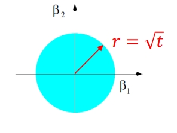
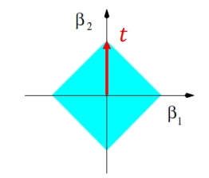
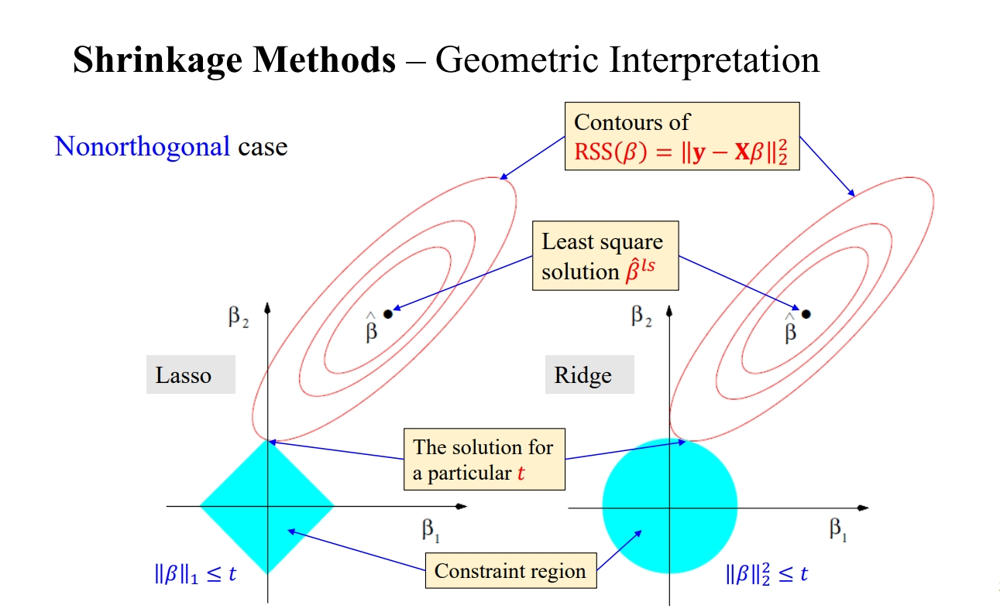
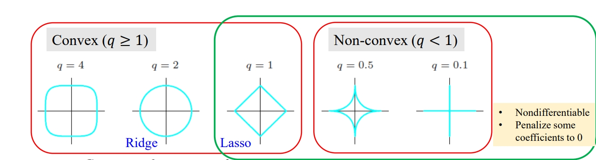

# Linear Methods for Regression

## Multiple Linear Regression

回忆一下多元线性回归方程的 RSS 方程：

残差平方和（RSS）通常表示为

$$
RSS(\beta) = \sum_{i=1}^{N} (y_i - x_i^\top \beta)^2
$$

写成向量形式：

$$
RSS(\beta) = (\mathbf{y} - \mathbf{X}\beta)^\top (\mathbf{y} - \mathbf{X}\beta)
$$

$\beta$ 的最优解：

$$
\mathbf{X}^\top (\mathbf{y} - \mathbf{X}\beta) = 0
$$

当 $\mathbf{X}$ 列满秩时，$\beta$ 的最优解（也称为最小二乘估计）为：

$$
\hat{\beta} = (\mathbf{X}^\top \mathbf{X})^{-1} \mathbf{X}^\top \mathbf{y}
$$

给定一个测试样本 $x_0$，其预测值为：

$$
\hat{f}(x_0) = (1: x_0)^\top \hat{\beta}
$$

> 这里 $(1:x_0)$ 表示一个包含截距项（intercept term）和 $x_0$ 的行向量。第一个元素是 1（对应截距项），后面跟着 $x_0$ 的所有元素。

在训练输入上的拟合值是：

$$
\hat{\mathbf{y}} = \mathbf{X} \hat{\beta} = \mathbf{X} (\mathbf{X}^\top \mathbf{X})^{-1} \mathbf{X}^\top \mathbf{y} = \mathbf{H}\mathbf{y}
$$

这里的 $\mathbf{H}$ 被称为“帽子矩阵（hat matrix）”，因为它作用在 $\mathbf{y}$ 上，得到拟合值 $\hat{\mathbf{y}}$。

**几何解释**： 最优的 $\hat{\beta}$ 会使残差向量 $\mathbf{y} - \hat{\mathbf{y}}$ 与由 $\mathbf{X}$ 的列张成的子空间正交。

现在我们关心 $\hat \beta$ 是否唯一。只有 $\mathbf X^T \mathbf X$ 为非奇异的时候， $\hat \beta$ 的解唯一。 ($\text{rank}(\mathbf X) = p$)

然而，有时候输入矩阵 $\textbf{X}$ 可能会出现“秩不足（rank deficient）”的情况。主要原因有：

- **编码定性输入**（Coding Qualitative Inputs）：当我们对分类变量（如性别、国籍等）进行编码时，比如使用独热编码（One-Hot Encoding），可能会导致 $\textbf{X}$ 的列之间存在多重共线性。例如，如果有一个性别字段被编码为两列：男和女，而每一行的数据只能是其中的一个，这就会导致这两列完全相关。

```lua
| 序号 | 男 | 女 |
|------|----|----|
|  1   | 1  | 0  |
|  2   | 0  | 1  |
|  3   | 1  | 0  |
|  4   | 0  | 1  |
```

- **图像和信号分析**（Image and Signal Analysis）中，特征 $p$ 往往会远多于样本数 $N$（$p > N$）。

那么，如何解决秩不足问题？

我们考虑进行**特征选择（Feature Selection or Dimension Reduction）**: 方法有主成分分析（PCA）、线性判别分析（LDA）等。这些方法可以减少特征数量，从而减轻或解决秩不足的问题。
  
我们也可以考虑使用**正则化（Regularization）**: 常用的正则化方法有 L1（Lasso）和 L2（Ridge）正则化。通过在损失函数中添加正则项，算法会倾向于学习一个“简单”的模型，有助于解决过拟合和秩不足的问题。

通过以上两种方法，我们通常可以有效地解决因为 $\textbf{X}$ 秩不足带来的问题。

## Multiple Output Regression

之前我们推导的RSS方程是单输出，多变量的回归模型。现在我们尝试解决多输出的情况。

对于每个输出 $Y_k$，我们都假设有一个线性模型：

$$
Y_k = \beta_{0k} + \sum_{j=1}^p X_j \beta_{jk} + \epsilon_k = f_k(X) + \epsilon_k
$$

$\beta_{0k}$ 是第 $k$ 个模型的截距项，$\beta_{jk}$ 是第 $k$ 个模型中第 $j$ 个特征的系数，$\epsilon_k$ 是第 $k$ 个模型的误差项。

以上模型可以用矩阵形式更为简洁地表示为：

$$
\mathbf{Y} = \mathbf{X}\mathbf{B} + \mathbf{E}
$$

其中，$\mathbf{Y}$ 是 $N \times K$ 维的输出矩阵，$\mathbf{X}$ 是 $N \times (p+1)$ 维的输入矩阵（包括一个全是1的列以对应截距项），$\mathbf{B}$ 是 $(p+1) \times K$ 维的系数矩阵，$\mathbf{E}$ 是 $N \times K$ 维的误差矩阵。

**多输出的损失函数**

对于多输出的情况，损失函数 RSS 也需要进行相应的推广。

$$
\text{RSS}(\mathbf{B}) = \sum_{k=1}^K \sum_{i=1}^N (y_{ik} - f_k(x_i))^2 = \| \mathbf{Y} - \mathbf{X}\mathbf{B} \|_F^2
$$

这里，$\| \cdot \|_F^2$ 是 Frobenius 范数，它用于度量矩阵的“大小”。Frobenius 范数的定义是：

$$
\| A \|_F^2 = \text{Tr}(A^\top A) = \sum_{ij} a_{ij}^2
$$

我们接下来的目标是找到最小化残差平方和（RSS）的 $\mathbf{B}$。用数学表示法就是：

$$
\hat{\mathbf{B}} = \arg\min_{\mathbf{B}} RSS(\mathbf{B}) = \arg\min_{\mathbf{B}} \| \mathbf{Y} - \mathbf{X}\mathbf{B} \|_F^2
$$

这是一个二次函数，存在全局最小值。

RSS 可以重新写成矩阵和迹（Trace）的形式：

$$
\begin{aligned}
RSS(\mathbf{B}) &= \text{Tr}(\mathbf{Y} - \mathbf{X}\mathbf{B})^\top (\mathbf{Y} - \mathbf{X}\mathbf{B}) \\
&= \text{Tr}(\mathbf{Y}^\top\mathbf{Y} - \mathbf{Y}^\top \mathbf{X}\mathbf{B} - \mathbf{B}^\top \mathbf{X}^\top \mathbf{Y} + \mathbf{B}^\top \mathbf{X}^\top \mathbf{X} \mathbf{B}) \\
&= \text{Tr}(\mathbf{Y}^\top\mathbf{Y}) - 2\text{Tr}(\mathbf{B}^\top \mathbf{X}^\top \mathbf{Y}) + \text{Tr}(\mathbf{B}^\top \mathbf{X}^\top \mathbf{X} \mathbf{B})
\end{aligned}
$$

对 $\mathbf{B}$ 求导，并令导数为0，可以得到：

$$
\frac{\partial RSS(\mathbf{B})}{\partial \mathbf{B}} = -2\mathbf{X}^\top \mathbf{Y} + 2\mathbf{X}^\top \mathbf{X}\mathbf{B}
$$

如果 $\mathbf{X}^\top \mathbf{X}$ 是非奇异矩阵（即可逆），那么解为：

$$
\hat{\mathbf{B}} = (\mathbf{X}^\top \mathbf{X})^{-1}\mathbf{X}^\top \mathbf{Y}
$$

多输出（多个 $Y$）在最小二乘估计中是不会互相影响的。对于每一个输出 $Y_k$，都有：

$$
\hat{\beta_k} = (\mathbf{X}^\top \mathbf{X})^{-1}\mathbf{X}^\top \mathbf{y}_k
$$

这里，$\mathbf{y}_k$ 是 $Y_k$ 的观测值构成的列向量。也就是说，$\mathbf{\hat B}$ 是可以被拆分成一个个单输出的回归的。

## The Gauss-Markov Theorem

Gauss-Markov 定理表明，在线性无偏估计方法中，最小二乘估计（Least Squares Estimator, LSE）具有最小的均方误差（Mean Squared Error, MSE）。

均方误差（MSE）是评价估计量准确性的重要指标，由方差（Var）和偏差（Bias）的平方和组成：

$$
\text{MSE} = \text{Var} + \text{Bias}^2
$$

> 之前已经进行过推导

当一个估计方法是“无偏”的，意味着其预期值等于真实参数值。在这样的无偏方法中，Gauss-Markov 定理告诉我们，最小二乘方法具有最小的 MSE。也就是说，在所有线性**无偏估计**中，最小二乘法的**方差**最小。

然而，在实际应用中，有时稍微增加一点偏差可能会大大减少方差，从而降低整体的 MSE。这就是所谓的“偏差-方差权衡”（Bias-Variance Trade-off）。这种权衡经常在模型选择和正则化（如 Lasso、Ridge 回归等）中出现。

## Subset Selection

之前我们提到，最小二乘法在线性关系中是无偏的，并且具有最小的MSE。

一般来说，最小二乘法往往具有低偏差（Low Bias）和高方差（High Variance）。低偏差意味着模型在训练数据上的表现很好，但高方差意味着模型对未见过的数据（即测试数据）可能表现不佳。

我们对这种问题的解决方案是牺牲一点偏差来降低方差，以提高模型的泛化能力。

此外，当输入特征非常多时，最小二乘法模型很难解释（比如说无法可视化，无法理解特征对输出的影响等等）。一种解决方案是找到一组具有强烈效应的子特征集，以简化模型。

我们接下来将使用 model selection 的方法来解决这些问题。具体方法包括：

- 变量子集选择（Variable Subset Selection）
- 收缩（Shrinkage）
- 维度缩减（Dimension Reduction）

> 需要注意的是，这些方法不仅限于线性模型

---

### Best-subset selection

Best-subset selection（最佳子集选择）是一种用于回归模型特征选择的方法。这种方法旨在找到能最小化残差平方和（RSS, Residual Sum of Squares）的特征子集。具体步骤如下：

1. **枚举所有可能的特征子集**：对于每一个大小为 $s$（$s$ 可以是 $0, 1, ...,p$，其中 $p$ 是全部特征的数量）的特征子集，计算该子集对应的模型。

2. **计算 RSS**：对于每一个这样的模型，都计算其残差平方和（RSS）。$\text{RSS} = \sum_{i=1}^{n} (y_i - \hat{y}_i)^2$，$y_i$ 是实际值，$\hat{y}_i$ 是模型预测值。

3. **选择最佳子集**：对于每一个 $s$，选择 RSS 最小的特征子集作为大小为 $s$ 的“最佳”子集。

4. **评估模型**：最后，通过交叉验证或者某种信息准则（如 AIC、BIC 等）来选择哪一个“最佳”子集能够最好地泛化到新数据。关注的是模型的“泛化能力”——即模型在未见过的数据上的表现如何。

数学上，这里提到的$RSS = ||y - X_s \beta||^2$ 表示在特征子集$X_s$ 下，通过最小二乘估计得到的参数$\beta$ 所对应的残差平方和。

需要注意的是，最佳子集选择算法的计算复杂性是$O(2^p)$，这意味着当$p$（特征数量）非常大时，这个方法会变得非常耗时。

---

### Forward- and Backward-Stepwise Selection 

是一种通过降低维度来改进性能的方法。

前向逐步选择 (Forward-Stepwise Selection)

- **从截距开始**，初始模型仅包含截距项（intercept）。
- 在每一步中，该算法选择一个能够最大程度提高模型性能的特征，并将其添加到模型中。
- **即使 $p \gg N$ 也适用**。当特征数量 $p$ 远大于样本数量 $N$ 时，方法依然可行。

后向逐步选择 (Backward-Stepwise Selection)

- 初始模型包括所有的特征。
- 在每一步中，算法移除一个对模型性能影响最小（或者说最差）的特征。
- **后向逐步选择仅当 $N > p$ 时有用**，因为开始时样本数量小于特征数量，完整模型（包括所有特征）可能会导致过拟合。

它们都是 Greedy Algorithm，由于每一步都是基于当前状态进行最优选择，这种方法不能保证找到全局最优解。

- **受限搜索 (Constrained Search)**: 由于不是所有可能的特征组合都会被考虑，搜索范围受到限制。
- **降低方差，增加偏差 (Lower Variance, More Bias)**: 简化模型通常会降低方差但增加偏差。


这些方法通常用于线性回归，但也可用于其他类型的模型。

**Smart Stepwise**

**一次添加或删除整组 (Add or Drop Whole Groups at a Time)**: 这是对基础前向或后向逐步选择方法的一个扩展，允许你以组为单位进行添加或删除一系列相关的变量组。我们需要提前知道变量间的高度相关性。

---

### K-Fold Cross-Validation

首先，我们需要理解什么是复杂度参数（$\lambda$）。这是一个控制模型复杂性的超参数。具体到不同的模型：

- **子集选择（Subset Selection）**中，$\lambda$ 可能是用于模型的特征数量
- 在 **k-近邻算法**中，复杂度参数通常是需要考虑的邻居数量，即 𝑘。
- **正则化方法（如 Lasso 和 Ridge 回归）** 中，𝜆 是正则化项，用于惩罚可能导致过拟合的模型参数。

K-Fold Cross-Validation 是一种评估模型性能的技术，常用于超参数调优。具体步骤如下：

1. **数据切分**：将训练数据切分成 𝐾 个大致相等的部分（或称为“折”）。𝐾 常常选为 5 或 10。

2. **模型训练与评估**：对于每一个折 𝑘（𝑘 从 1 到 𝐾）:
    - 使用 𝐾-1 个折来训练模型（即除了第 𝑘 个折的所有数据）。
    - 在剩下的那一个折（第 𝑘 个折）上计算误差 $\mathbb E(k)$。误差可以是均方误差（对于回归问题）或者是分类错误率（对于分类问题）。

3. **计算 𝐾-折交叉验证误差**：将所有 K 个折上的误差 $\mathbb E(k)$ 求平均，得到 𝐾-折交叉验证误差。

$$
𝐸(\lambda) = \frac{1}{K} \sum_{k=1}^{K} E_k(\lambda)
$$

对于不同的 $\lambda$ 值，你会得到不同的 𝐾-折交叉验证误差 $\mathbb E(\lambda)$。选择使得 $\mathbb E(\lambda)$ 最小的 $\lambda$ 值。

通过这种方式，我们可以量化模型在新数据上的性能，而不仅仅是依赖于训练数据。这对于模型选择和超参数调优非常有用。

---

## Ridge Regression

我们接下来主要讨论线性回归有偏估计中的基于收缩方法的有偏估计。主要分为 **Ridge Regression** 和 **Lasso Regression**，也就是另外一些说法中的 L1 回归（Lasso 回归）和 L2回归（岭回归）。

岭回归的形式可以通过以下两个公式描述，这两个描述的形式是等价的。

**P1 公式**:

$$
\hat{\beta}_{ridge} = \arg\min_{\beta} \left\{ \sum_{i=1}^{N} (y_i - \beta_0 - \sum_{j=1}^{p} x_{ij}\beta_j)^2 + \lambda \sum_{j=1}^{p} \beta_j^2 \right\}
$$

这个公式定义了岭回归估计量 $\hat{\beta}_{ridge}$。我们通过最小化一个包含两部分的目标函数来求解系数 $\beta$：第一部分是残差平方和，即观察到的值 $y_i$ 与模型预测值（由参数 $\beta_0$（截距）和 $\beta_j$（斜率）组合的线性表达式）之差的平方和；第二部分是惩罚项，它是所有系数（不包括截距 $\beta_0$）的平方和，乘以正则化参数 $\lambda$。

**P2 公式**:

$$
\hat{\beta}_{ridge} = \arg\min_{\beta} \left\{ \sum_{i=1}^{N} (y_i - \beta_0 - \sum_{j=1}^{p} x_{ij}\beta_j)^2 \right\}
$$

$$
\text{subject to} \sum_{j=1}^{p} \beta_j^2 \leq t
$$

P2 提供了一个等价于 P1 的约束优化问题的表述。在这里，我们也是在最小化残差平方和，但是这次是在满足一个额外条件的情况下：所有系数的平方和不能超过某个上限 $t$。这个约束实质上限制了系数的 l2-范数，确保了系数的大小不会变得太大。

> **为什么两个等价**: 对于给定的 $\lambda$ 值，存在一个特定的 $t$ 值，使得 P1 和 P2 的解是相同的。这就建立了它们之间的一对一对应关系。~~数学证明略~~

P2 式子事实上很好揭示了岭回归正则化线性回归的本质。通过限制所有系数的大小，我们可以确保某一部分参数不占据主导地位，减少过拟合的风险。



将系数限制在蓝色的圆（或高维情况下的球体）内部，实际上是施加了一个对系数大小的约束。在岭回归中，这个蓝色的圆代表了系数向量 $\beta$ 的 l2-范数（即所有系数的平方和的平方根）的上限。这种限制带来减少过拟合的好处，主要是基于以下几个原因：

1. **系数值的减小**：当系数的大小被限制时，模型不能过分依赖任何一个变量，尤其是噪声变量。如果没有这种限制，模型可能会学习到数据中的随机噪声，从而导致在训练集上的性能很好，但在未见过的数据上性能下降。

2. **平滑的预测函数**：较小的系数值通常意味着模型的预测函数变化更为平缓，不会对输入数据中的小波动作出剧烈的反应。这种平缓性降低了模型对特定样本点的敏感性，增强了模型对新数据的泛化能力。

3. **复杂性的降低**：通过限制系数的大小，模型的复杂度得到了控制。在统计学中，模型复杂度高通常与过拟合联系在一起。简单的模型（即系数较小或稀疏的模型）倾向于在训练数据以外的数据上表现更好。

4. **偏差-方差权衡**：缩减技术，如岭回归，涉及到偏差-方差权衡的概念。通过约束系数，我们可能会增加偏差（因为模型不能完全捕捉训练数据中的关系），但同时大幅减少方差（因为模型对未知数据的泛化能力更强），在许多实际应用中，这种权衡是有利的。

5. **多重共线性的减轻**：在多重共线性的情况下，即输入变量之间高度相关，普通最小二乘估计的方差会非常大，这使得估计值对于训练数据中的小波动非常敏感。通过限制系数的大小，岭回归稳定了这些估计，减少了因小波动而引起的大的变化。

总之，通过限制系数的大小，岭回归推动模型向着更简单、更稳健的方向发展，这有助于模型在新数据上取得更好的预测效果，从而减少过拟合。

---


在介绍岭回归这一缩减方法时，我们必须考虑几个关键的预处理步骤，以确保模型的效果和稳健性。

首先，我们需要对输入变量进行**标准化**。岭回归，与普通最小二乘回归不同，对输入变量的尺度非常敏感。这是因为岭回归在损失函数中添加了一个惩罚项，即系数的平方和乘以一个惩罚参数 $\lambda$。如果输入变量的尺度不一致，那么它们对损失函数的贡献也会不同，这会影响到系数的估计。为了避免这种尺度依赖性，我们通过标准化来预处理数据。具体地说，每个特征值减去其平均值，然后除以其标准差，公式如下所示：

$$
x' = \frac{x - \bar{x}}{\sigma}
$$

这个转换确保了每个特征都具有零均值和单位方差，从而在岭回归中接受同等的考虑。

接下来是截距项 $\beta_0$ 的处理。在标准化数据之后，我们通常会计算一个截距项来代表输出的平均水平。在岭回归中，我们不会对这个截距项施加任何惩罚，因为它仅仅代表了响应变量的平均值，而与特征的变化无关。因此，截距项 $\beta_0$ 应该从惩罚项中排除。

具体而言，$\beta_0$ 等于响应 $y$ 的均值 $\bar y=\frac1N\sum_{i=1}^N y_i$，此时 $X$ 不再与 $\beta_0$ 相关，于是最小化时忽略 $\beta_0$。

最后，我们假设从现在开始，我们处理的数据都已经标准化了。这意味着我们的设计矩阵 $X$ 将只有 $p$ 列，而不是 $p+1$ 列，因为不再需要额外的一列来表示截距项。

于是我们的岭回归公式可以表示为：

$$
\hat\beta^{ridge}=\arg\min_\beta||\mathbf y -\mathbf X\beta||_2^2+\lambda||\beta||^2_2
$$

这些预处理步骤确保我们的模型能在不同的数据集上给出一致和可解释的结果。

由于线性回归公式是凸函数，我们可以直接对其求导，并令其为 $0$，可以直接解得 $\hat\beta^{ridge}$ 的公式为：

$$
\hat\beta^{ridge}=(X^TX + \lambda I_p)^{-1}X^Ty
$$

我们可以通过 SVD 分解来进一步感受到岭回归的作用。

首先，对于任意一个设计矩阵 $X$，我们可以将其分解为三个矩阵的乘积：

$$X = UDV^T$$

这里：

- $U$ 是一个 $N \times p$ 的矩阵，其列向量 $u_j$ 构成了 $X$ 的列空间。
- $V$ 是一个 $p \times p$ 的矩阵，其列向量 $v_j$ 构成了 $X$ 的行空间。
- $D$ 是一个 $p \times p$ 的对角矩阵，其对角线元素 $d_1, d_2, \ldots, d_p$ 是 $X$ 的奇异值，并按降序排列。

在**普通最小二乘法**中，我们通常寻找一个系数向量 $\beta$，以最小化 $y$ 和 $X\beta$ 之间的残差平方和。使用 SVD，我们可以这样表示最小二乘解 $\hat{\beta}_{ls}$：

$$\hat{\beta}_{ls} = (X^TX)^{-1}X^Ty$$

根据 SVD，这可以进一步展开为：

$$
\hat{\beta}_{ls} = (VDU^TUDV^T)^{-1}VDU^Ty
$$

$$
\hat{\beta}_{ls} = (VD^2V^T)^{-1}VDU^Ty
$$

$$
\hat{\beta}_{ls} = VD^{-2}V^TVDU^Ty
$$

$$
\hat{\beta}_{ls} = VD^{-1}U^Ty
$$

这里 $D^{-1}$ 是 $D$ 的逆矩阵，它由 $D$ 的非零奇异值的倒数构成。

在**岭回归**中，我们引入一个惩罚项 $\lambda$ 以控制系数的大小，从而避免过拟合。岭回归的解可以表示为：

$$\hat{\beta}_{ridge} = (X^TX + \lambda I_p)^{-1}X^Ty$$

通过 SVD，我们可以将这个表达式改写为：

$$
\hat{\beta}_{ridge} = (VDU^TUDV^T + \lambda I_p)^{-1}VDU^Ty
$$

$$
\hat{\beta}_{ridge} = (VD^2V^T + \lambda VV^T)^{-1}VDU^Ty
$$

$$
\hat{\beta}_{ridge} = V(D^2 + \lambda I_p)^{-1}DV^TVDU^Ty
$$

$$
\hat{\beta}_{ridge} = V(D^2 + \lambda I_p)^{-1}DU^Ty
$$

> $D^2 + \lambda I_p$ 是一个对角矩阵，其对角线元素是 $d_j^2 + \lambda$。

在岭回归中，$D^2 + \lambda I_p$ 的逆提供了一个收缩因子，它通过 $\frac{1}{d_j^2 + \lambda}$ 来调节对应的奇异值 $d_j$。当 $d_j$ 较小时，收缩因子 $\frac{1}{d_j^2 + \lambda}$ 会变得很大，从而对应的 $\beta$ 的估计值被大幅度缩减。这就是为什么岭回归在处理多重共线性时特别有用的原因：它能够减少那些与小奇异值相关的系数的影响。

奇异值越大通常意味着数据在某个方向上的分布较为广泛，这个方向上的成分在数据集中扮演着重要角色，反之则可能表示这些数据与噪声相关，需要被大幅度缩减来防止过拟合。

通过这种方式，我们可以使用 SVD 来计算岭回归的解，这种方法不仅可以处理设计矩阵 $X$ 是奇异的情况，还可以通过选择合适的惩罚参数 $\lambda$ 来控制模型的复杂度。

我们最后可以通过交叉验证来得到岭回归所需要的最佳超参数值。

---

## Lasso Regression

Lasso 回归和岭回归在形式上十分类似，唯一的区别是正则化项通过系数绝对值的和来进行表示。

Lasso估计被定义为一组系数，它们最小化残差平方和，同时受到系数绝对值之和小于常数的约束。数学表达式为：

$$
\hat{\beta}_{lasso} = \underset{\beta}{\text{argmin}} \left\{ \frac{1}{2N} \sum_{i=1}^N (y_i - \beta_0 - \sum_{j=1}^p x_{ij}\beta_j)^2 + \lambda \sum_{j=1}^p |\beta_j| \right\}
$$

同样，$\lambda$ 控制着惩罚的力度，即系数的L1范数 $\|\beta\|_1$。

Lasso 和岭回归的主要区别在于，由于 L1 惩罚的几何性质，当调整参数 $\lambda$ 足够大时，Lasso 能够将一些系数准确地设置为零。这个性质使得 Lasso 不仅仅是一个回归算法，还是一个特征选择方法。当我们相信许多特征不相关或者我们需要一个稀疏模型时，它特别有用。

由于绝对值操作，Lasso 回归没有封闭形式的解，这使得损失函数在零点非可微分。这与总是有封闭形式解的岭回归不同。

与岭回归类似，我们依旧可以将 Lasso 回归视为一个约束优化问题。这里的约束是系数绝对值之和必须小于指定的阈值 $t$。这等同于在系数空间内，找到在由 L1 范数定义的菱形区域（当 $p=2$ 时）或多面体区域（当 $p>2$ 时）内的系数估计。这个区域与平方和损失函数相交的点将给出 Lasso 估计。

$$
\hat{\beta}_{lasso} = \underset{\beta}{\text{argmin}} \left\{\sum_{i=1}^N (y_i - \beta_0 - \sum_{j=1}^p x_{ij}\beta_j)^2 \right\}
$$

$$
\text{subject to} \sum_{j=1}^{p} |\beta_j| \leq t
$$



如果阈值 $t$ 大于最小二乘估计的 L1 范数，则 Lasso 估计将与最小二乘估计相同。如果 $t$ 等于最小二乘估计的 L1 范数的一半，则平均而言，Lasso 估计将收缩 50%。

如何直观理解 Lasso 回归会导致参数选择？



这张图展示的是非正交情况下，即特征变量之间存在相关性时，Lasso 和Ridge 回归的几何解释。

在这张图中，我们看到两个不同的区域。第一个代表 Lasso 回归，产生一个有角点的约束区域，即所有系数的绝对值之和小于等于某个常数 $t$。第二个为 Ridge 回归的约束区域。Ridge 回归通过 L2 范数 $\|\beta\|_2 \leq t$ 对系数进行约束，这导致一个圆形的约束区域，即所有系数的平方和小于等于某个常数 $t$。

在这张图中，椭圆等高线代表残差平方和（RSS）相同的点集。

于是，通过将两者相交，我们可以发现在这幅图中最小二乘解 $\hat{\beta}_{LS}$ 是没有任何约束条件下 RSS 最小的点，位于最内层的椭圆中心。但是，当我们添加约束时（如Lasso或Ridge），我们的解必须位于约束区域内。对于Ridge回归，解 $\hat{\beta}$ 是RSS等高线首次接触圆形约束区域的点。对于 Lasso 回归，解是 RSS 等高线首次接触菱形约束区域的点。由于 Lasso 的约束区域有角点，这意味着 RSS 等高线很可能在角点处与约束区域相接触，这导致相应的系数被精确地缩减到零。

这种几何解释表明 Lasso 倾向于产生稀疏解，即它会将一些系数完全缩减为零，也就意味着特征选择。相比之下，Ridge 回归倾向于产生非零但小的系数。这种特性使得 Lasso 可以在模型中进行自动变量选择，而 Ridge 回归则更适合处理那些所有特征都有一定程度重要性的情况。

## Generalization of Ridge and Lasso

**正则化框架的一般化**

$$
\hat{\beta} = \arg\min_{\beta} \left( \sum_{i=1}^{N} (y_i - \beta_0 - \sum_{j=1}^{p} x_{ij}\beta_j)^2 + \lambda \sum_{j=1}^{p} |\beta_j|^q \right)
$$

- 参数 $q$ 决定了对系数 $\beta$ 应用的收缩类型：
- $q = 0$：最佳子集选择，寻找预测变量子集的非凸问题。
- $q = 1$：Lasso回归，通过惩罚系数的L1范数促进稀疏性。
- $q = 2$：岭回归，惩罚系数的L2范数以控制其大小。

我们可以通过调整 $q$ 的值，来得到不同的参数范围选择图像。



对于1和2之间的 $q$ 值，结果惩罚是Lasso与岭回归之间的折衷。

**弹性网正则化**

弹性网是 L1 和 L2 惩罚的线性组合（类似与上述的 $q\in(1,2)$），定义为：

$$
\min_{\beta} \left( \sum_{i=1}^{N} (y_i - \beta_0 - \sum_{j=1}^{p} x_{ij}\beta_j)^2 + \lambda \left( \alpha \beta_j^2 + (1 - \alpha)|\beta_j| \right) \right)
$$

- 参数 $\alpha$ 平衡了L1和L2惩罚的贡献：
    - L2部分（由 $\alpha$ 控制）平滑地缩小了相关预测变量的系数。
    - L1部分（由 $1 - \alpha$ 控制）鼓励稀疏性，从而选择相关预测变量的群组。

弹性网在高维数据环境中特别有用，在这些环境中传统方法可能无法选择真实模型或受到多重共线性的影响。

通过调整 $\alpha$ 和 $\lambda$，弹性网允许在岭回归（系数缩小）到Lasso（倾向于稀疏性）之间提供一系列解决方案。

L1和L2惩罚的结合使弹性网能够继承这两种方法的优点，提供了一种可以根据数据的具体结构定制的灵活解决方案。

