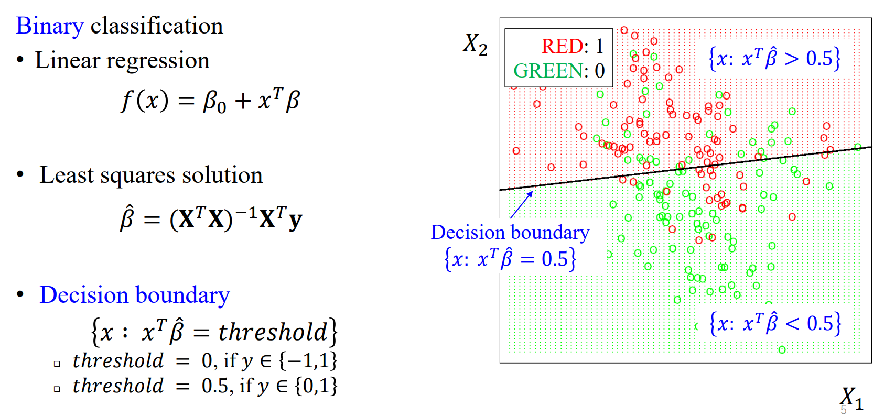
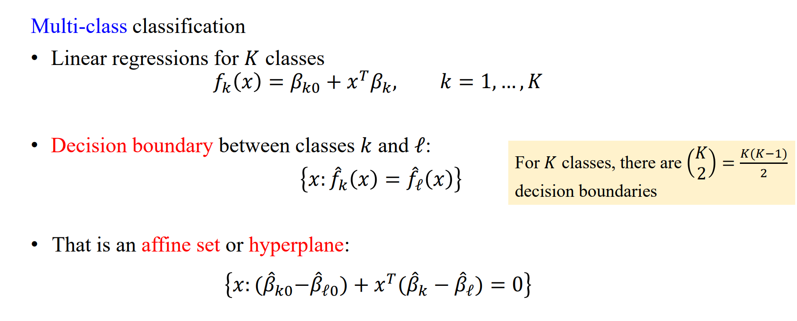
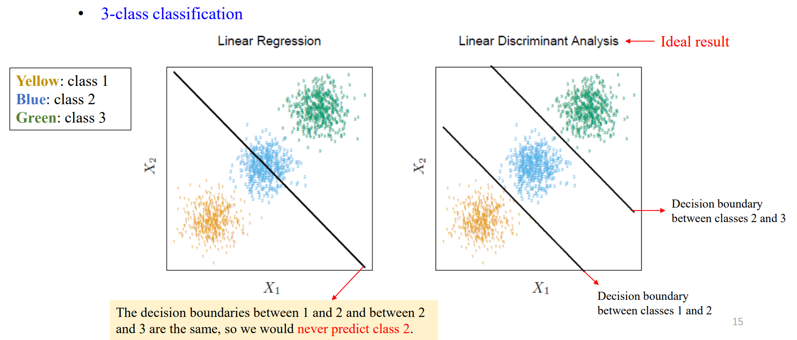
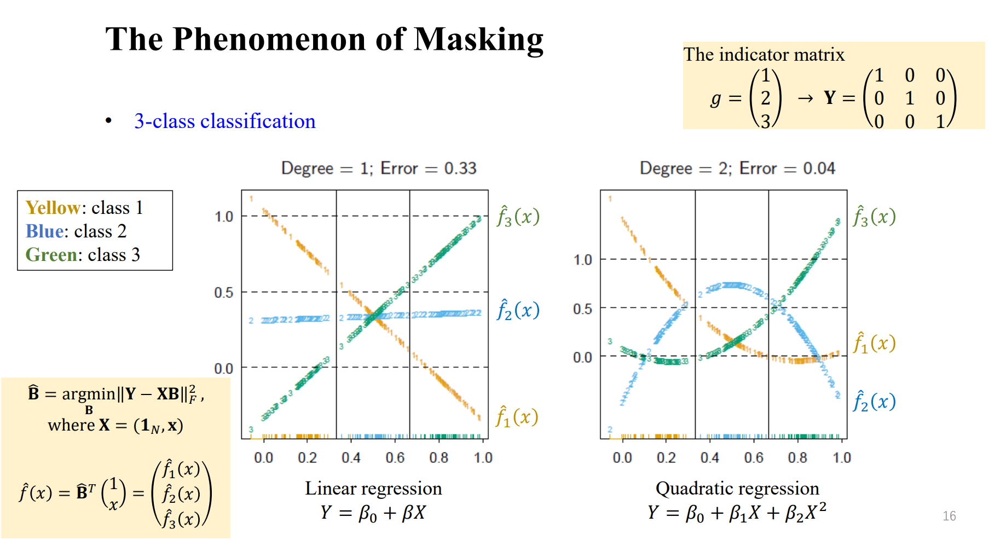

# Linear Methods for Classification

## From Regression to Classification

如何把我们的回归问题转化为分类问题？

我们先来举几个例子。

> 这里的几个例子仅仅是用来引出后续的分类，

一种方法是使用我们之前提到过的多输出的分类问题。

在之前的多输出分类问题中，我们将数据对应到多个输出，假设我们的 $X$ 位于 $p$ 维空间。用方程组形式表现为：

$\hat{Y}_1 = \beta_{10} + \beta_{11} X_1 + ... + \beta_{1p} X_p$

$\hat{Y}_2 = \beta_{20} + \beta_{21} X_1 + ... + \beta_{2p} X_p$

$...$

$\hat{Y}_K = \beta_{K0} + \beta_{K1} X_1 + ... + \beta_{Kp} X_p$

矩阵形式表现为：

$$
\mathbf{Y} = \mathbf{X}\mathbf{B} + \mathbf{E}
$$

我们可以将其理解为，对于每一个数据点，我们提取出了一系列的输出，每个输出对应于一组我们想要投射的类别的维度。

例如，对于手写数字识别，我们将类别按照 “One-hot Coding” 的方式展开成 0-1 矩阵，得到：

| Y1 | Y2 | ... | Y10 |
|----|----|-----|-----|
| 1  | 0  | ... | 0   |
| 0  | 1  | ... | 0   |
| ...| ...| ... | ... |
| 0  | 0  | ... | 1   |

我们希望最终线性回归得到的输出 $\mathbf Y$ 对于 $Y_i$ 为 $1$，其余为 $0$，这样就可以得到我们的分类预测结果。

也就是说，目标为：

$$
\min_\mathbf B ||\mathbf Y-\mathbf X \mathbf B||_F^2
$$

得到

$$
\mathbf{\hat B}=(\mathbf X^T \mathbf X)^{-1}\mathbf X^T\mathbf Y
$$

但是，这样子做会面临许多问题，例如线性不可分以及类别不平衡（某个训练样本过多导致过度拟合该结果）以及不同样本间特征相似的种种问题。

---

我们再来引入一个例子。

对于这里的二元分类，我们可以通过直接引入一个线性回归解决。我们通过对不同数据点 0-1 标签类别的拟合，可以得到一条线性决策边界，也就是说，对所有的数据点 $\mathbf X_i$，如果在这条线性分类器下的输出靠近于 $0$，那就属于绿色这一类，否则属于红色这一类。这个靠近的尺度就是我们的 Dicision Boundary 下的 threshold 来决定。

同样，对于多元分类，我们也尝试用单输出的线性回归来拟合。

可以发现，在这种情况下，如果要清晰判断出类别，我们需要考虑大量的决策边界。并且，这种方法存在一个巨大的问题，那就是只有单个输出，而不是输出一个矩阵。

事实上，如果这里输出是一个向量，我们也会需要大量的决策边界来确保最终得到的类别仅仅为一个。可以理解为对两种不同的类别，如果达到了相同的拟合值，我们就无法判断具体属于哪个类别，这是某个点落在决策边界上时的意义。

---

## Linear regression of an indicator matrix

我们在前面已经提到了，多输出的线性回归方法通过指示矩阵来进行分类，目标为最小化分类误差：

$$
\min_\mathbf B ||\mathbf Y-\mathbf X \mathbf B||_F^2
$$

得到

$$
\mathbf{\hat B}=(\mathbf X^T \mathbf X)^{-1}\mathbf X^T\mathbf Y
$$

$$
\mathbf{\hat Y}=\mathbf X \mathbf{\hat B}=\mathbf H \mathbf Y
$$

计算拟合输出：

$$
\hat{f}(x) = B^T \begin{pmatrix} 1 \\ x \end{pmatrix} = \begin{pmatrix} \hat{f}_1(x) \\ \hat{f}_2(x) \\ \vdots \\ \hat{f}_K(x) \end{pmatrix} \in \mathbb{R}^K
$$

这里 $B$ 是一个参数矩阵，$\hat{f}(x)$ 是一个 $K$ 维向量，每一个分量 $\hat{f}_k(x)$ 对应于类别 $k$ 的线性回归模型的输出。

根据拟合输出对 $x$ 进行分类：

$$
\hat{G}(x) = \text{argmax}_{k \in \mathcal{G}} \hat{f}_k(x)
$$

这表示选择使 $\hat{f}_k(x)$ 最大的类别 $k$。

等价地，也可以通过最小化 $x$ 的拟合输出与目标向量 $t_k$ 之间的欧几里得距离来对 $x$ 进行分类：

$$
\hat{G}(x) = \text{argmin}_{k \in \mathcal{G}} \lVert \hat{f}(x) - t_k \rVert ^2_2
$$

其中 $t_k = (0, \ldots, 0, 1, 0, \ldots, 0)^T$ 是一个 $K$ 维目标向量，其中第 $k$ 个元素为1，其余为0。

[回忆统计决策理论在分类中的应用](https://www.wakenfish.com/engineering/IML/lec1/#categorical-problems)：

我们现在想要知道，从理论上来说，或者从概率上来说，$\hat{G}(x) = \text{argmax}_{k \in \mathcal{G}} \hat{f}_k(x)$ 是不是一个好的确定类别的方式。

统计决策理论告诉我们：

$$
\hat{G}(x) = \arg\max_{g \in G} \text{Pr}(g|X=x)
$$

我们发现，对于我们从回归角度得到的 $\hat G(x)$，它的 $\hat f(x)$ 发生的概率并不总是在 $[0,1]$ 范围内。以及，它将面对一个问题，那就是掩盖的问题。

### The Phenomenon of Masking

我们发现，对于数据类别 2，如果通过线性分类的方法，它容易被掩盖。

我们可以换个视角，将所有数据投影到一维空间中简化问题：

当我们按照之前的方法确定了决策边界后，我们得到了三个函数，分别为这里的 $\hat f_1(x), \hat f_2(x), \hat f_3(x)$。我们发现，在中间区域，通过线性回归得到的三个拟合函数完全无法得到区分。这就是掩盖问题。

---

为了解决上述问题，我们将使用线性判别分析的方法来解决。

## Linear discriminant analysis

线性判别分析 (LDA，Linear discriminant analysis) 帮助我们学习线性判别边界，划分特征区域。

通过前面的讨论，我们发现，这种直接利用线性函数无论是从概率的角度还是实际情况的角度来预测后验概率 $\text{Pr}(G=k∣X=x)$ 的方法都是存在问题的。

线性判别分析（LDA）是一种用于分类的统计技术，它假设不同类别的数据是由不同的高斯分布生成的。LDA旨在找到一个线性组合的特征，这个特征能够将不同类别的数据点最大化地分开。

LDA的数学表达可以从两个方面来描述：判别函数和模型训练。

**判别函数**：

给定一个数据点 $x$，它属于类别 $k$ 的判别函数 $\delta_k(x)$ 是：

$$
\delta_k(x) = x^T \Sigma^{-1} \mu_k - \frac{1}{2} \mu_k^T \Sigma^{-1} \mu_k + \log(\pi_k)
$$

其中：
- $\mu_k$ 是类别 $k$ 的样本均值向量。

- $\Sigma$ 是在所有类别中共享的协方差矩阵，假设每个类别的数据都有相同的协方差结构。

- $\pi_k$ 是类别 $k$ 的先验概率。

对于一个新的观测值 $x$，LDA通过计算每个类别的判别函数值 $\delta_k(x)$ 并将 $x$ 分配到具有最高判别函数值的类别来进行分类。

**模型训练**：

在模型训练阶段，我们首先计

算每个类别的样本均值 $\mu_k$ 和整体的共享协方差矩阵 $\Sigma$。这些参数是这样计算的：

* 计算每个类别的均值向量 $\mu_k$：

$$
\mu_k = \frac{1}{N_k} \sum_{x_i \in \text{class } k} x_i
$$

其中 $N_k$ 是类别 $k$ 中的样本数。

* 计算共享协方差矩阵 $\Sigma$：

$$
\Sigma = \frac{1}{N - K} \sum_{k=1}^K \sum_{x_i \in \text{class } k} (x_i - \mu_k)(x_i - \mu_k)^T
$$

其中 $N$ 是总样本数，$K$ 是类别的数量。

* 计算每个类别的先验概率 $\pi_k$：

$$
\pi_k = \frac{N_k}{N}
$$

在训练完模型后，分类新的观测值 $x$ 时，我们会计算每个类别的判别函数 $\delta_k(x)$，并将 $x$ 分配给最大化判别函数的类别：

$$
\hat{G}(x) = \arg \max_k \delta_k(x)
$$

LDA的目标是最大化类间距离同时最小化类内距离，从而得到一个良好的分类边界。

---

**推导过程**：

LDA 通过假设 + 类别比较的思想得出。

**假设：**

* 每个类的密度被建模为多元高斯分布：

$$
f_k(x) = \frac{1}{(2\pi)^{p/2}|\Sigma_k|^{1/2}} \exp\left(-\frac{1}{2}(x - \mu_k)^T \Sigma_k^{-1} (x - \mu_k)\right)
$$

> 这里 $f_k(x)$ 是第 $k$ 类的概率密度函数，$x$ 是数据点，$\mu_k$ 是第 $k$ 类的均值向量，$\Sigma_k$ 是协方差矩阵，$p$ 是数据的维度。

* 假设所有类别共享一个共同的协方差矩阵 $\Sigma_k = \Sigma$，对所有 $k$ 都成立。

**类别比较：**

对于两个类别 $k$ 和 $\ell$，计算他们对数几率（Logit），也就是他们的后验概率的对数比值：

$$
\text{Logit} = \log\frac{Pr(G = k | X = x)}{Pr(G = \ell | X = x)}
$$

使用贝叶斯定理，这个比值可以用类的先验概率和类的密度函数表示：

$$
\log\frac{Pr(G = k | X = x)}{Pr(G = \ell | X = x)} = \log\frac{f_k(x)}{f_\ell(x)} + \log\frac{\pi_k}{\pi_\ell}
$$

在LDA中，假设 $\Sigma_k = \Sigma$ 对所有类别 $k$ 都成立，因此可以将多元高斯密度函数的对数比值简化为：

$$
\log\frac{f_k(x)}{f_\ell(x)} = \log\exp\left(-\frac{1}{2}(x - \mu_k)^T \Sigma^{-1} (x - \mu_k) + \frac{1}{2}(x - \mu_\ell)^T \Sigma^{-1} (x - \mu_\ell)\right)
$$

由于 $\exp$ 和 $\log$ 是相互逆运算，它们可以相互抵消。接着，由于 $\Sigma$ 对所有类别是常数，不随 $k$ 或 $\ell$ 变化，它前面的二次项 $(x - \mu_k)^T \Sigma^{-1} (x - \mu_k)$ 和 $(x - \mu_\ell)^T \Sigma^{-1} (x - \mu_\ell)$  会在相减后留下线性项。这个减法操作将消除每个类别中的二次项，因为他们都有共同的协方差矩阵。

所以，对数几率（Logit）的公式最终简化为：

$$
\log\frac{\pi_k}{\pi_\ell} - \frac{1}{2}(\mu_k + \mu_\ell)^T \Sigma^{-1} (\mu_k - \mu_\ell) + x^T \Sigma^{-1} (\mu_k - \mu_\ell)
$$

---

通过证明，我们发现 

$$
\delta_k(x) = x^T \Sigma^{-1} \mu_k - \frac{1}{2} \mu_k^T \Sigma^{-1} \mu_k + \log(\pi_k)
$$

与我们最终简化得到的对数几率表达有相同的形式，也就是说，$\log\frac{f_k(x)}{f_\ell(x)} =\delta_k(x)-\delta_l(x)$。

因而，我们可以定义任意两个类别之间的**决策边界**：

* $\delta_k(x)>\delta_l(x)$，则 $x$ 属于类别 $k$

* $\delta_k(x)<\delta_l(x)$，则 $x$ 属于类别 $l$

* $\delta_k(x)=\delta_l(x)$，即为决策边界，$x$ 落在决策边界上。