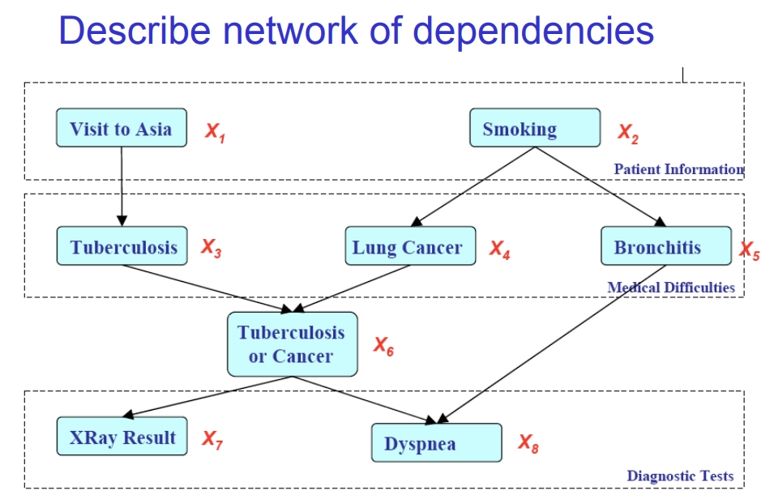
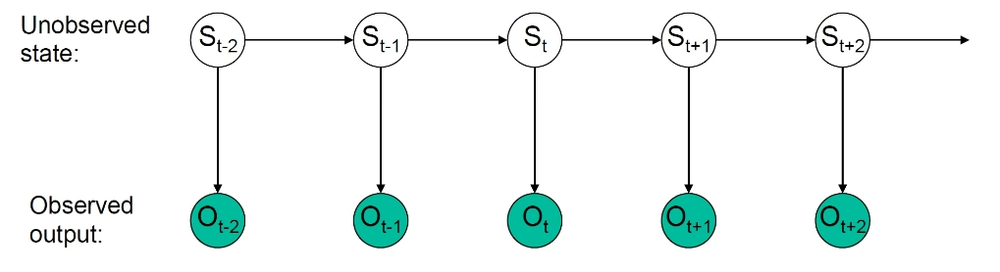
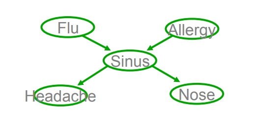
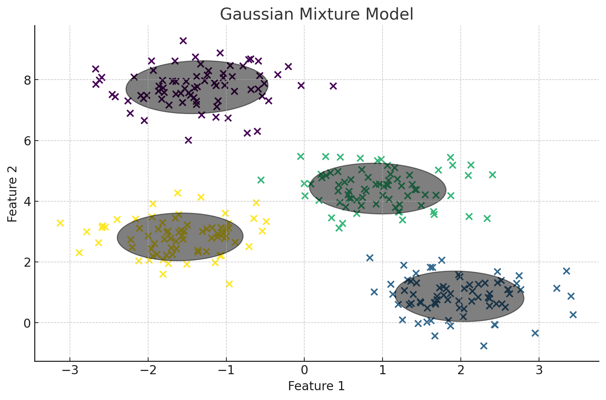

# Graphical Model

在之前的朴素贝叶斯中，我们假设了任意两个变量都是条件独立的。然而，在现实数据条件下，这种假设过于极端。很多时候，几组数据之间都会有一定的相关性。

为了简化我们需要的独立变量估计数量，与此同时保留变量间的相关性，我们将会使用概率图模型来表示我们的数据组之间的条件独立和联合分布关系。

概率图模型是近十年来机器学习最重要的内容之一。它的的好处在于，可以提供先验的变量间的独立关系，也可以提供参数估计时的先验信息。我们还可以从训练集中获取相关性以及变量间的先验知识。

概率图模型可以分为贝叶斯网络(Bayesian Networks) 和 马尔科夫随机场(Markov Random Fields)。它们分别是有向图和无向图。

## Bayes Nets

如图是一个简单的贝叶斯网络。现在，假设我们要求联合分布。在之前的朴素贝叶斯中，我们会假定所有随机变量之间都相互独立。现在，在贝叶斯网络中，我们会认为每个随机变量和它的父亲节点有联系，它的发生条件依赖于父亲节点的发生。

我们可以得到这幅图中的联合概率分布情况：

$$
P(X_1, X_2, X_3, X_4, X_5, X_6, X_7, X_8) = P(X_1) P(X_2) P(X_3 | X_1) P(X_4 | X_2) P(X_5 | X_2) P(X_6 | X_3, X_4) P(X_7 | X_6) P(X_8 | X_5, X_6)
$$

在这个表达式中，每个随机变量 $X_i$ 的概率可以是边际概率或条件概率。条件概率 $P(X_i | X_j)$ 表示在给定 $X_j$ 的条件下 $X_i$ 的概率。联合概率分布表达了所有这些变量同时发生的概率。

严谨的来说，贝叶斯网络的 **联合概率分布** 是通过网络中所有变量的条件概率分布相乘来定义的。公式表示为

$$
P(X_1, \ldots, X_n) = \prod_{i} P(X_i | Pa(X_i))
$$

其中 $Pa(X)$ 表示节点 $X$ 在图中的直接父节点。

贝叶斯网络是一个有向图(无环)，其中的节点表示随机变量，边表示变量之间的概率依赖关系。在贝叶斯网络中，一个节点在给定其直接父节点的条件下，与非后代节点（即那些不是它的子节点或子节点的子节点等）条件独立。换言之，一个节点的概率状态只与它的父节点有关，与其他的非后代节点无关。

> 注：所有父节点都是直接相连的父节点，不包括祖先节点。

对于贝叶斯网络中的每个节点，我们需要有每个节点对应的概率分布。对于一个节点 $X$,它的 CPD 定义了在其父节点取值的条件下， $X$ 取各个值的概率。

## Hidden Markov Model

隐马尔可夫模型是一种特别的贝叶斯网络，用于描述一个序列或时间序列数据中的隐状态转换和可观察事件的概率。HMM假设系统的当前状态只依赖于它的前一个状态（这就是所谓的马尔可夫性质），且每个状态生成一个可观察的输出。

对于 $S_t$，当我们已知 $S_{t-1}$ 的前提下，它与之前的任何状态都相互独立。

## D-separation

在前面的介绍中，我们提到贝叶斯网络中的一个节点在给定其直接父节点的条件下，与非后代节点条件独立。但对于任意两个节点间的条件独立判断，这个结论显得不够有力。

为了完全理解哪些变量之间条件独立，我们需要用到D-分离（D-separation）的概念。D-分离是一种判断给定某些证据时，网络中任意两个节点是否条件独立的方法。

D-separation 考虑三种基本情况，并进行推广。三种情况分别为：

- 链式结构（Serial Connection），Head to Tail：当三个变量形成一条链A -> C -> B 时，给定中间变量 C 的情况下，A 和 B 是条件独立的。也就是说，$p(a,b|c) = p(a|c) \cdot p(b|c)$

- 分叉结构（Diverging Connection），Tail to Tail ：当一个共同父节点导致两个子节点的结构，形如 A <- C -> B 时，给定C时，A和B是条件独立的。也就是说，$p(a,b|c) = p(a|c) \cdot p(b|c)$

- 汇合结构（Converging Connection），Head to Head：当两个变量指向同一个子节点，形成A -> C <- B结构时，如果仅仅知道C的状态， A 和 B 是不独立的。但是，当我们不知道 C 的状态的时候，我们反而有 $P(A,B)=P(A)P(B)$，也就是 A 和 B 独立。

> 上述三个基本情况的证明都可以通过判断 $P(a,b|c)=\frac{P(a,b,c)}{P(c)}$ 是否等于 $p(a|c) \cdot p(b|c)$ 得到。证明时，分子部分 $P(a,b,c)$ 通过贝叶斯网络中联合分布的方式打开后化简。

如何理解Head to Head 中，当我们观测到 $C$ 的时候，反而导致了 A 和 B 条件不独立？

这是因为一旦 C 的状态被确定下来，它就为 A 和 B 之间提供了一个联系或者“解释”，使得我们可以通过 C 来推断 A 和 B 之间的关系。这种现象在概率论和统计学中称为“解释门控”（explaining away）现象。

> 考虑以下例子：A代表“电灯开关打开”，B代表“电灯泡坏了”，而C代表“房间亮”。在不知道房间是否亮的情况下，开关打开（A）与电灯泡是否坏了（B）是独立的。但是，如果我们知道房间亮了（C），那么这两个事件就不再独立了。例如，如果房间亮了，这意味着开关可能是打开的，同时电灯泡也没坏；反之亦然，如果房间没亮，那么开关可能没打开，或者电灯泡可能坏了。

---

**方法总结**：

"D-separation"（依赖分离）是一个图形模型中的关键概念，用于确定在给定一组变量Z的条件下，两组变量X和Y是否条件独立。

1. **路径阻塞**：如果在X和Y之间的所有路径都被阻塞，那么X和Y在给定Z的条件下是条件独立的。

2. **阻塞规则**：路径可以通过以下两种方式中的一种被阻塞：
   - 当路径上的箭头在某节点N处“头对尾”或“尾对尾”相遇，并且该节点N属于集合Z时。
   - 当路径上的箭头在某节点N处“头对头”相遇，且节点N及其后代都不在集合Z中时。

3. **头对尾和尾对尾**：如果一个节点N在路径上，使得路径上的箭头以“头对尾”或“尾对尾”的方式在N处相遇，那么这条路径被阻塞，前提是N是观察集合Z的一部分。

4. **头对头**：如果在路径上的箭头以“头对头”在某节点N处相遇，并且N及其后代都不被观察（即不在Z中），则这条路径被阻塞。

5. **直觉解释**：条件独立性意味着在知道了某些信息后，两个变量间的信息流被断开。例如，考虑到某病的遗传因素（Z），个人的生活方式（X）和患病概率（Y）之间的依赖关系可能会改变。

在实际应用中，D-separation可以帮助我们确定哪些变量需要被包含在概率模型的条件部分，以确保模型正确地反映了变量间的依赖关系。通过分析图形结构，我们可以确定控制哪些变量可以使其他变量之间的关系独立，这对于建立因果推断和数据分析是非常重要的。

## Markov Blanket

马尔可夫毯是概率图模型中的一个概念，它指的是一个节点 $x_i$，能够完全刻画该节点的条件概率分布的所有其他节点的集合。对于任意节点 $x_i$，其马尔可夫毯包括：

1. **父节点（Parents）**：直接指向 $x_i$ 的节点。
2. **子节点（Children）**：$x_i$ 直接指向的节点。
3. **共同父节点（Co-parents）**或**配偶（Spouses）**：与 $x_i$ 共同指向同一个子节点的其他节点。

根据这个概念，给定节点 $x_i$ 的马尔可夫毯中的变量，$x_i$ 与图中其它所有节点都是条件独立的。这意味着，我们可以只通过 $x_i$ 的马尔可夫毯来了解 $x_i$ 的行为，而不需要考虑图中的其他节点。

在图片中展示的图中，红色圈出的节点 $x_i$ 有三个父节点，两个子节点，以及这些子节点的其他父节点。所有这些构成了 $x_i$ 的马尔可夫毯。如果我们想计算 $x_i$ 的条件概率分布，我们只需要考虑这个马尔可夫毯中的变量。

这个概念在机器学习和统计领域的很多方面都非常重要，尤其是在构建贝叶斯网络和进行条件概率推断时。它说明了为了理解一个变量，我们只需要关注其直接关联的变量，而不是整个网络中的所有变量。这在实际应用中可以大大简化计算。

## Forward Sampling

在使用贝叶斯网络进行估计的时候，我们不仅需要考虑精确度，也需要考虑时间的开销。现在假设我们已经有了一个准确的贝叶斯网络模型，其中包括所有变量的边际概率分布和条件概率分布。

如果我们要计算联合概率密度分布，时间开销为线性时间，总体可控。但是如果我们要求一个具体的点的概率分布 如  $P(N=n)$ ，我们就需要对其他点所有的条件情况进行求和 $\sum_{\Theta} P(\Theta=\theta,N=n)$，其中 $\Theta$ 包括了其它所有变量。（注意，贝叶斯网络减少的是我们需要进行的概率分布的估计的数量）这样操作的时间复杂度将会达到指数级别，相当不可控。

为了解决这个问题，我们引入了前向采样。这是一种蒙特卡罗方法。具体步骤为：

1. **初始化计数器**：对于变量 `N` 的每个可能的值，初始化一个计数器。例如，如果 `N` 是一个二元变量，可以取值 `0` 或 `1`，则初始化两个计数器，`count_N_0` 和 `count_N_1`，它们都开始于 `0`。

2. **确定采样次数**：确定你要生成的样本数量。这个数字需要足够大，以确保估计的准确性和稳定性。

3. **前向采样**：从网络的根节点（没有父节点的节点）开始，根据其边际概率分布抽取样本。对于每个后续节点，基于其父节点的样本值和节点的条件概率分布抽取样本。这样，对于每个样本，你将为整个网络的每个变量生成一个值。

4. **记录 `N` 的值**：在每个生成的样本中，记录变量 `N` 的值。每次 `N=n` 时，相应的计数器增加1。

5. **重复采样过程**：重复步骤 3 和 4 直到达到所需的样本数量。

6. **计算边际概率**：对于每个可能的 `N` 的值，其边际概率的估计等于 `N=n` 的计数器值除以总样本数。即：

$$
P(N=n) \approx \frac{\text{count of samples where } N=n}{\text{total number of samples}}
$$

这个过程实际上是利用了大数定律，即随着试验次数的增加，事件发生的频率趋近于其概率。

例如，如果我们生成了 10000 个样本，并且 `N` 取值为 `1` 的样本有 3000 个，那么 `P(N=1)` 的估计就是 `3000/10000 = 0.3`。

需要注意的是，这个方法的准确性取决于样本量的大小。在实际情况中，如果`N`的某些值非常罕见，可能需要生成非常大量的样本才能得到一个准确的估计。

## Markov Random Fields

马尔科夫随机场（Markov Random Fields，MRF）是概率图模型的一种，用于表示变量集合之间的依赖关系。与贝叶斯网络不同的是，MRF通常用无向图表示，其中节点代表随机变量，边表示变量之间的潜在依赖。

在MRF中，一个集合的随机变量满足局部马尔可夫性质：一个变量在给定其邻居的条件下，与图中的非邻居节点条件独立。这意味着，要理解一个节点的行为，我们只需要考虑它直接连接的节点。

MRF的核心概念是马尔科夫性质，它具体表现在两个方面：

1. **成对马尔科夫性质**：如果两个节点在图中不是直接相连的，则它们在条件独立的意义上是独立的，给定它们的所有邻居。

2. **全局马尔科夫性质**：如果从图中移除一组节点可以将图分成两个独立的部分，那么这两个部分在给定这组节点的情况下是条件独立的。

$$
A \perp B | C
$$

> 其它判断方法和 D-separation 一致，但是我们不需要考虑 head to head 的情况。

在如何表示和计算联合概率分布上，马尔科夫随机场（MRF）和贝叶斯网络有所不同。在 MRF 中，联合概率分布不是通过条件概率的链式乘积来表示，而是通过势函数（potential functions）的乘积来表示。

在 MRF 中，每个变量或变量的集合都与一个势函数相关联，该函数赋予每个变量配置一个非负的实数值，这个值反映了配置的相对概率。势函数通常与图的团（clique）相关，团是图中一组两两相连的节点。

联合概率分布的形式通常为：

$$
P(X) = \frac{1}{Z} \prod_{C \in \mathcal{C}} \phi_C(X_C)
$$

其中：
- $X$ 是整个网络中所有变量的集合。
- $\mathcal{C}$ 是网络中所有团的集合。
- $\phi_C(X_C)$ 是与团 $C$ 相关的势函数，它是团中变量 $X_C$ 的一个函数。
- $Z$ 是一个归一化常数，也称为配分函数（partition function），用于确保整个分布加和（或积分，对于连续变量）到1。它的计算是通过对所有可能的变量配置求和（或积分）来完成的：

$$
Z = \sum_X \prod_{C \in \mathcal{C}} \phi_C(X_C)
$$

计算 $Z$ 是计算上非常困难的，因为它涉及到对所有可能的变量配置的求和，其数量是指数级增长的。在实际中，我们通常通过蒙特卡罗方法（如吉布斯采样）来近似计算 $Z$ 和相关概率。

因此，与贝叶斯网络中通过父节点的条件概率来构建模型不同，MRF通过定义局部势函数和全局配分函数来建立整个网络的概率模型。这种方法适用于无向图模型，其中变量之间的依赖关系是对称的，没有方向性。

## Expectation Maximization

### MLE for Bayes Nets with fully observed data

对于上面这个图表示的贝叶斯网络，我们已知了所有参数的分布情况，现在我们想要对 Sinus 进行 MLE 估计。

由贝叶斯网络的性质可以知道，我们想要最大似然估计的参数 $\theta_{s|ij}$ 等价于最大化概率 $P(S=1|F=i,A=j)$( i.e. 在 Flu 和 Allergy 出现/不出现的情况下 Sinus出现的情况，总共有四个 $\theta_{s|ij}$)。

我们知道已有的数据发生的概率可以表示为：

$$
P(data|\theta)=\prod^K_{k=1}P\{f_k,a_k,s_k,h_k,n_k\}
$$

> $k$ 表示第 $k$ 个训练样本。

由贝叶斯网络的独立条件，这个式子可以被展开为：

$$
\log P(data|\theta)=\sum^K_{k=1}\log P(f_k)+\log P(a_k)+\log P(s_k|f_ka_k)+\log P(h_k|s_k)+\log P(n_k|s_k)
$$

我们想要对 $\theta_{s|ij}$ 进行最大化估计，所以在左右两边对其求偏导，可以去掉其它与其无关项，并得到：

$$
\frac{\partial\log P(data|\theta)}{\partial \theta_{s|ij}}=\sum_{k=1}^K \frac{\partial\log P(s_k|f_ka_k)}{\partial \theta_{s|ij}}
$$

我们假设这个贝叶斯网络中的每个节点都是布尔分布，也就是说：

$$
P(s_k|f_ka_k)=\prod_{i,j}\theta_{s|i,j}^{\delta(s=1,F=i,A=j)}(1-\theta_{s|i,j})^{\delta(s=0,F=i,A=j)}
$$

令求导式子左侧为 $0$，最终我们可以解得：

$$
\theta_{s|i,j}=\frac{\sum_{k=1}^K\delta(s_k=1,f_k=i,a_k=j)}{\sum_{k=1}^K\delta(f_k=i,a_k=j)}
$$

### EM

对于上述具有完整数据观测情况的贝叶斯网络，进行 MLE 是简单并且能够直接实现的。但当我们缺少了对 `Sinus` 数据的观测的前提下，我们便无法直接对 $\theta$ 进行 MLE 估计了。

为了解决这样子的问题，我们需要使用 EM (Expectation Maximization) 算法。

回忆之前的 MLE 估计的式子，我们有：

$$
\theta \leftarrow \arg\max_\theta \log \prod_k P(f_k,a_k,s_k,h_k,n_k|\theta)
$$

现在，我们假设 $X$ 为所有已观测的变量，而 $Z$ 表示所有未观测的变量。于是，上式转化为：

$$
\theta \leftarrow \arg\max_\theta \log P(X,Z |\theta)
$$

显然，如果 $Z$ 未知，我们不能直接计算 $\log P(X, Z|\theta)$。这是因为 $Z$ 是隐变量，它的具体值对我们来说是不可见的。于是，我们不再尝试对概率进行最大化估计，而是改为对期望进行最大化估计。这就是我们将要使用的 EM 算法。

EM算法由两个交替的步骤组成：期望步骤（E-step）和最大化步骤（M-step）。这两个步骤反复迭代执行，直到收敛到局部最大似然估计。

#### E-step

在E-step，我们的目标是估计隐变量 $Z$ 的分布。我们使用当前的参数估计 $\theta^{(t-1)}$ 来计算隐变量 $Z$ 的后验概率分布 $P(Z|X, \theta^{(t-1)})$。这个分布反映了在当前参数估计下，隐变量可能取值的概率。

> 我们是假设 Z 的分布是由 $\theta^{(t-1)}$ 得到的，随后进行 MLE 的期望估计

然后，我们计算完全数据对数似然 $\log P(X, Z|\theta)$ 相对于 $Z$ 的期望：

$$
E_{Z|X, \theta^{(t-1)}}[\log P(X, Z|\theta)]
$$

这一步相当于对隐变量 $Z$ 的所有可能值进行积分（或求和），每一个值都用它的后验概率加权。换句话说，我们计算的是在给定观测数据 $X$ 和当前参数估计的情况下，对数似然函数的加权平均值。

#### M-step

在M-step，我们的目标是找到新的参数估计 $\theta^{(t)}$，使得在E-step中计算得到的期望对数似然值最大化：

$$
\theta^{(t)} \leftarrow \arg \max_\theta E_{Z|X, \theta^{(t-1)}}[\log P(X, Z|\theta)]
$$

在这一步，我们实际上是在最大化 $Z$ 的分布的期望下观测数据 $X$ 的对数似然。这通常需要对 $\theta$ 进行数值优化，因为这个最大化问题往往没有封闭形式的解。

---

我们交替执行E-step和M-step，每一次迭代都会基于更新后的 $\theta$ 重新估计 $Z$ 的分布，并以此更新 $\theta$，直到满足收敛条件——也就是参数估计不再发生大的变化，或者对数似然的增长低于预设的阈值。

通过EM算法，我们可以在包含未观测变量的复杂模型中，找到参数 $\theta$ 的有效估计。该算法特别适用于混合模型、隐马尔可夫模型和各种包含潜在变量的其他模型。尽管EM算法通常只能保证找到**局部最优解**，但在实际应用中，它通常能提供非常有用的参数估计。

需要注意的是，EM算法是一个优化框架，并不依赖于具体的概率模型。因此，无论 $Z$ 的真实分布如何，只要我们可以定义 $Z$ 的后验概率 $P(Z|X, \theta)$ 和对数似然函数 $\log P(X, Z|\theta)$，EM算法就可以应用于参数估计。这使得它成为处理含有隐变量的统计问题的一种非常强大的工具。

---

现在，我们就可以对之前的问题进行回答：如何在缺少了对 `Sinus` 数据的观测的前提下，对 $\theta$ 进行 MLE 估计？

在 E-step 中，我们首先计算隐变量 $S$ 的后验概率。这个概率是给定观测数据 $X$ 和当前参数估计 $\theta^{(t-1)}$ 下 $S$ 的条件概率 $P(S_k|f_k,a_k,h_k,n_k,\theta^{(t-1)})$。对于布尔隐变量 $S_k$，我们有两个状态：$S_k=1$ 和 $S_k=0$。所以后验概率可以写作：

$$
P(S_k=1|f_k,a_k,h_k,n_k,\theta^{(t-1)}) \quad \text{和} \quad P(S_k=0|f_k,a_k,h_k,n_k,\theta^{(t-1)})
$$

这两个概率的和为 1。

1. 计算 $S=1$ 的后验概率，记作 $E[s_k]$：

$$
E[s_k] = P(S_k=1|f_k,a_k,h_k,n_k,\theta^{(t-1)})
$$

这个概率通常是基于当前参数 $\theta^{(t-1)}$ 通过贝叶斯规则计算的。

2. 利用 E-step 中得到的 $E[s_k]$，我们来更新 $\theta_{s|ij}$：

在 MLE 中，我们有：

$$
\theta_{s|ij} = \frac{\sum_{k=1}^K \delta(f_k=i, a_k=j, s_k=1)}{\sum_{k=1}^K \delta(f_k=i, a_k=j)}
$$

在 EM 算法中，我们用 $E[s_k]$ 替代 $\delta(s_k=1)$，因为我们不知道 $S_k$ 的实际值，但是我们有它的期望值。所以，更新公式变成：

$$
\theta_{s|ij}^{(t)} = \frac{\sum_{k=1}^K \delta(f_k=i, a_k=j) E[s_k]}{\sum_{k=1}^K \delta(f_k=i, a_k=j)}
$$

其中，

- 分子是在 $F=i$ 和 $A=j$ 的条件下 $S_k=1$ 的期望出现次数的总和，即 $E[s_k]$ 在 $f_k=i$ 和 $a_k=j$ 时的加权和。
- 分母是 $F=i$ 和 $A=j$ 发生的次数的总和。

这样我们就得到了 $\theta_{s|ij}$ 的更新公式，它在 EM 算法的每一轮中都会根据 E-step 中计算出的 $E[s_k]$ 来更新。

通过迭代执行 E-step 和 M-step 直到收敛，我们可以在包含未观测数据的情况下得到 $\theta_{s|ij}$ 的估计。

## Gaussian Mixture Model

高斯混合模型（Gaussian Mixture Model, GMM）的概率密度函数公式如下：

$$
P(X|C) = \sum_{k=1}^{K} \pi_k \mathcal{N}(X | \mu_k, \Sigma_k)
$$

这里，$P(X|C)$ 表示在给定某些条件 $C$ 的情况下数据点 $X$ 的概率密度。高斯混合模型是一个由 $K$ 个高斯分布混合而成的模型，其中每个高斯分布都被称为一个组件（component），并且每个组件贡献了数据点 $X$ 的一部分概率密度。

- $K$ 是高斯分布的数量。
- $\pi_k$ 是第 $k$ 个高斯分布的混合权重，它满足 $0 \leq \pi_k \leq 1$ 和 $\sum_{k=1}^{K} \pi_k = 1$。
- $\mathcal{N}(X | \mu_k, \Sigma_k)$ 是参数为 $\mu_k$（均值向量）和 $\Sigma_k$（协方差矩阵）的第 $k$ 个高斯分布的概率密度函数。

高斯混合模型可以用来做聚类分析或者作为复杂分布的近似。每个高斯分布可以被看作是数据中的一个“簇”，而混合权重表示相应簇的比例大小。

> 可以理解为在多维情况下，有数个峰的高斯分布的表示

例如，如果我们有一组数据点，我们不确定它们属于几个不同的群集，我们可以用GMM来模拟这些数据。通过调整 $\pi_k$，$\mu_k$，和 $\Sigma_k$，我们可以让模型学习数据的内在结构，每个高斯分布可以捕捉到数据中的一个群集。这个模型特别适用于那些群集本身就呈高斯分布的情况。

## EM for Mixture of Gaussian Clustering

高斯混合模型可以用多个高斯分布成分的加权和表示：

$$
p(\mathbf{x})=\sum_{k=1}^K \pi_k \mathcal{N}\left(\mathbf{x} \mid \mathbf{\mu}_k, \mathbf{\Sigma}_k\right) .
$$

当我们对高斯混合模型进行估计的时候，我们实际上的目标是找到一组最优的参数 $\pi_k$、$\mathbf{\mu}_k$ 和 $\mathbf{\Sigma}_k$，它们能够最大化观测数据集 $\mathbf{X}$ 的对数似然函数。然而，直接对他们进行 MLE 估计是困难的，因为对他们的 MLE 估计涉及到每个数据集中的数据属于哪一个高斯分布，这在我们的条件中是未知的。

这就是我们接下来要进行 EM 运算的原因。为了得到每个数据集中的数据属于哪一个高斯分布，我们需要引入一个 $K$ 维的隐变量 $\mathbf{z}$。对于每一个数据点 $\mathbf x$，我们都希望有一个对应的隐变量 $\mathbf z$，描述了 $\mathbf x$ 属于具体某一类高斯分布的概率为多少。

### E-step

我们采用一个 $K$-维的二元随机变量 $z$，它在 $1$ 到 $K$ 维中只有一个维度值为 $1$，其余为 $0$ 。于是我们有 $z_k\in \{0,1\}$ 并且 $\sum_k z_k=1$，并且 $z$ 总共有 $K$ 种不同的情况。在接下来的计算中，我们还会需要用到联合分布 $p(\mathbf{x}, \mathbf{z})$，这可以通过边缘分布 $p(\mathbf{z})$ 和条件分布 $p(\mathbf{x} \mid \mathbf{z})$ 相乘得到。边缘分布 $\mathbf{z}$ 可以通过 $\pi_k$ 得到（因为 $\pi_k$ 表示了每个高斯分布占总体的权重比）：

$$
p\left(z_k=1\right)=\pi_k
$$

$\left\{\pi_k\right\}$ 需要满足

$$
0 \leqslant \pi_k \leqslant 1
$$

以及

$$
\sum_{k=1}^K \pi_k=1
$$

由于 $\mathbf{z}$ 满足 "one to K"，我们可以对分布进行重写：

$$
p(\mathbf{z})=\prod_{k=1}^K \pi_k^{z_k} .
$$

类似的，我们可以写出 $\mathbf{x}$ 在给定分类后的高斯分布形式：

$$
p\left(\mathbf{x} \mid z_k=1\right)=\mathcal{N}\left(\mathbf{x} \mid \mathbf{\mu}_k, \mathbf{\Sigma}_k\right)
$$

并可以将其改写为：

$$
p(\mathbf{x} \mid \mathbf{z})=\prod_{k=1}^K \mathcal{N}\left(\mathbf{x} \mid \mathbf{\mu}_k, \mathbf{\Sigma}_k\right)^{z_k} .
$$

通过联合分布 $p(\mathbf{z}) p(\mathbf{x} \mid \mathbf{z})$ 并对 $\mathbf{z}$ 进行求和，我们可以得到 $\mathbf x$ 的边缘分布：

$$
p(\mathbf{x})=\sum_{\mathbf{z}} p(\mathbf{z}) p(\mathbf{x} \mid \mathbf{z})=\sum_{k=1}^K \pi_k \mathcal{N}\left(\mathbf{x} \mid \mathbf{\mu}_k, \mathbf{\Sigma}_k\right).
$$

通过上面的步骤，我们成功实现了在预先设定的 $\mathbf{z}$ 的情况下表示出了 $\mathbf x$ 的边缘分布。如果我们有很多观测到的数据 $\mathbf{x}_1, \ldots, \mathbf{x}_N$，那么我们就可以得到很多组相互对应的  $\mathbf{x}_n$ 和 $\mathbf{z}_n$.

我们使用 $\gamma\left(z_k\right)$ 来表示 $p\left(z_k=1 \mid \mathbf{x}\right)$，通过贝叶斯定理来计算：

$$
\begin{aligned}
\gamma\left(z_k\right) \equiv p\left(z_k=1 \mid \mathbf{x}\right) & =\frac{p\left(z_k=1\right) p\left(\mathbf{x} \mid z_k=1\right)}{\sum_{j=1}^K p\left(z_j=1\right) p\left(\mathbf{x} \mid z_j=1\right)} \\
& =\frac{\pi_k \mathcal{N}\left(\mathbf{x} \mid \mathbf{\mu}_k, \mathbf{\Sigma}_k\right)}{\sum_{j=1}^K \pi_j \mathcal{N}\left(\mathbf{x} \mid \mathbf{\mu}_j, \mathbf{\Sigma}_j\right)}
\end{aligned}
$$

这个表达式表示给定观测数据 $\mathbf x$ 时，它由第 $k$ 个高斯成分生成的后验概率。（这个概率可以用来估计每个数据点对不同高斯成分的贡献程度，也就是 EM 算法中 E-step 要得到的期望值。）

于是对于高斯混合模型，完全数据对数似然包括对所有数据点和所有高斯成分的求和，可以表示为：

$$
Q(\theta|\theta^{(t-1)}) = E_{Z|X,\theta^{(t-1)}}[\log P(X, Z|\theta)] 
$$

$$
= \sum_{i=1}^{N}\sum_{k=1}^{K} \gamma(z_{ik}) \left( \log \pi_k + \log \mathcal{N}(x_i | \mu_k, \Sigma_k) \right) 
$$

---

### M-step

回到开头，我们想要估计的是给定数据情况下高斯混合模型的各个参数。对于每个 $\mathbf x$ 发生的概率表示为：

$$
p(\mathbf{x})=\sum_{k=1}^K \pi_k \mathcal{N}\left(\mathbf{x} \mid \mathbf{\mu}_k, \mathbf{\Sigma}_k\right) .
$$

当我们有 $n$ 个 $\mathbf x$ 后，我们可以联合求最大似然。取 log 可以得到：

$$
\log p(\mathbf{X}\mid \mathbf{\pi}, \mathbf{\mu}, \mathbf{\Sigma}) = \sum_{n=1}^N \log \left\{ \sum^{K}_{k=1} \pi_k \mathcal{N}(\mathbf{x}_n|\mathbf{\mu}_k, \mathbf{\Sigma}_k) \right\}.
$$

将上式对 $\mathbf{\mu}_k$ 求导并令其为 $0$，我们得到：

$$
0=-\sum_{n=1}^N \underbrace{\frac{\pi_k \mathcal{N}\left(\mathbf{x}_n \mid \mathbf{\mu}_k, \mathbf{\Sigma}_k\right)}{\sum_j \pi_j \mathcal{N}\left(\mathbf{x}_n \mid \mathbf{\mu}_j, \mathbf{\Sigma}_j\right)}}_{\gamma\left(z_{n k}\right)} \mathbf{\Sigma}_k\left(\mathbf{x}_n-\mathbf{\mu}_k\right)
$$

两边同乘 $\mathbf{\Sigma}_k^{-1}$ 并进行化简得到：

$$
\sum_{n=1}^N \gamma(z_{nk}) \mathbf{x}_n = \mathbf{\mu}_k \sum_{n=1}^N \gamma(z_{nk})
$$

如果我们假设：

$$
N_k=\sum_{n=1}^N \gamma\left(z_{n k}\right)
$$

>  $\gamma(z_{nk})$ 是基于当前参数为条件下观测数据 $\mathbf{x}_n$ 来自第 $k$ 个高斯成分的概率。因此，$N_k$ 可以被看作是第 $k$ 个成分对应的**所有观测数据**的期望值的总和，而不是单个观测数据的期望值。

那么我们可以得到：

$$
\mathbf{\mu}_k=\frac{1}{N_k} \sum_{n=1}^N \gamma\left(z_{n k}\right) \mathbf{x}_n
$$

上面这部分也可以通过 EM 步骤的公式化来完成。我们实际上 就是想要求得：

$$
\arg\max_\theta E_{Z|X,\theta^{(t-1)}}[\log P(X, Z|\theta)] 
$$

对这个式子求导为 $0$ 我们同样可以得到$\mu_k$。

$$
E_{Z|X,\theta^{(t-1)}}[\log P(X, Z|\theta)]= \sum_{i=1}^{N}\sum_{k=1}^{K} \gamma(z_{ik}) \left( \log \pi_k + \log \mathcal{N}(x_i | \mu_k, \Sigma_k) \right) 
$$

我们同样可以得到包含 $\gamma(z_{nk})$ 的 $\mathbf{\Sigma}_k$ 的表达式：

$$
\mathbf{\Sigma}_k=\frac{1}{N_k} \sum_{n=1}^N \gamma\left(z_{n k}\right)\left(\mathbf{x}_n-\mathbf{\mu}_k\right)\left(\mathbf{x}_n-\mathbf{\mu}_k\right)^{\mathrm{T}}
$$

最后，我们考虑对 $\pi_k$ 的最大似然估计。我们这里需要考虑到 $\pi_k$ 的约束条件，这可以通过使用拉格朗日乘子并最大化以下式子的值来实现： 

$$
\ln p(\mathbf{X} \mid \mathbf{\pi}, \mathbf{\mu}, \mathbf{\Sigma})+\lambda\left(\sum_{k=1}^K \pi_k-1\right)
$$

化简得到：

$$
0=\sum_{n=1}^N \frac{\mathcal{N}\left(\mathbf{x}_n \mid \mathbf{\mu}_k, \mathbf{\Sigma}_k\right)}{\sum_j \pi_j \mathcal{N}\left(\mathbf{x}_n \mid \mathbf{\mu}_j, \mathbf{\Sigma}_j\right)}+\lambda
$$

这里又出现了 $\gamma(z_{nk})$ 的形式。如果我们同乘 $\pi_k$ 并关于 $k$ 求和，我们可以得到 $\lambda=-N$. 代入 $\gamma$ 和 $\lambda$ 我们可以得到：

$$
\pi_k=\frac{N_k}{N}
$$

第 $k$ 个成分的混合系数由该成分解释数据点的平均责任给出。

---

根据上述步骤，我们实现了 EM 算法的一次迭代。通过不断更新这样的迭代，我们可以最终收敛得到估计参数的局部最优解。