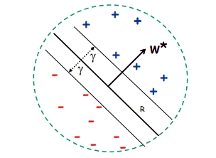

# Ensemble Learning

> [Boosting 和 Bagging 算法的区别](https://blog.csdn.net/qq_31267769/article/details/108311743)

## Adaboost

Boosting 算法是一种用于优化任意给定学习算法的正确率的算法，通常通过使用一系列划分后的数据集以及一系列小的学习模型结合得到。即使一个小的学习模型的表现结果不佳，我们也可以在最后得到的组合结果中得到很好的表现。

在 boosting 算法中，我们主要想要解决以下两点：

- 选择每次训练的数据情况：选择之前的学习中经常犯错的数据

- 组合每一个小的学习器：对每一个小学习器的分类结果进行加权求和

通常，我们认为一个 Weak Learning 满足：

$$
Pr[\text{err(h)}\geq \epsilon ] \leq \delta
$$

$$
\forall \epsilon > \frac12-\gamma, \gamma>0
$$

也就是说，每一个 Weak Learning 都比随机猜测要显得更好一些。

我们可以通过 boosting 算法，得到一个优秀的结果： Weak Learning =Strong (PAC) Learning

---

Adaboost (Adaptive Boosting) 是一种在线学习方法，是 Boosting 算法中非常优秀的一种。

1. **弱学习算法**：AdaBoost 使用一个基本的学习算法（通常是一个弱学习器，比如决策树），这个弱学习器只需比随机猜测稍好。

2. **迭代过程**：在初始过程中，我们假设数据是均匀分布的。接下来，算法将通过 $T$ 次迭代进行，每一次迭代都会基于当前数据分布生成一个新的模型 $h_t$。

3. **权重分布 $D_t$**：每一次迭代都会使用一个样本权重分布 $D_t$，这个分布决定了每个样本在训练弱学习器时的重要性。初始权重 $D_1$ 是均匀分布，意味着每个样本开始时都同等重要。

4. **更新权重**：在每次迭代后，样本权重会根据弱学习器 $h_t$ 的性能进行更新。如果一个样本被正确分类，其权重会减少；如果被错误分类，其权重会增加。这通过一个指数函数完成，其中 $\alpha_t$ 是基于当前学习器准确率的权重。

5. **权重更新的公式**：如果弱学习器 $h_t$ 正确分类了样本 $x_i$，那么该样本的权重会乘以 $e^{-\alpha_t}$；如果分类错误，权重会乘以 $e^{\alpha_t}$。所有的权重都会通过一个归一化因子 $Z_t$ 进行归一化，以确保它们的总和为 $1$。$Z_t=2\sqrt{\epsilon_t(1-\epsilon_t)}$

6. **计算 $\alpha_t$**：每个学习器的在最终整体决策的权重 $\alpha_t$ 是根据其错误率 $\epsilon_t$ 计算，具体公式是 $\alpha_t = \frac{1}{2} \ln(\frac{1 - \epsilon_t}{\epsilon_t})$。这个值反映了学习器的准确性，误差率低的学习器会有更高的权重。

7. **最终假设**：AdaBoost 的最终模型是所有弱学习器的加权投票或加权平均，其中权重就是 $\alpha_t$。公式为 $H_{final}(x) = \text{sign}(\sum_{t=1}^{T} \alpha_t h_t(x))$。

---

**$Z_t$ 和 $\alpha$ 的推导过程**：

首先，我们有更新后的权重 $D_{t+1}(i)$，它定义为：

$$
D_{t+1}(i) = \frac{D_t(i) e^{-\alpha_t y_i h_t(x_i)}}{Z_t}
$$

其中 $D_t(i)$ 是第 $t$ 轮的权重，$\alpha_t$ 是该轮中选定弱分类器的权重，$y_i$ 是真实标签，$h_t(x_i)$ 是弱分类器的预测。

为了确保 $D_{t+1}$ 的总和为 $1$，我们设置 $Z_t$ 为所有更新权重的总和，即：

$$
Z_t = \sum_{i=1}^{N} D_t(i) e^{-\alpha_t y_i h_t(x_i)}
$$

为了进一步简化 $Z_t$，我们考虑两种情况：$y_i = h_t(x_i)$（分类正确）和 $y_i \neq h_t(x_i)$（分类错误）。我们将这两种情况分别用 $e^{-\alpha_t}$ 和 $e^{\alpha_t}$ 替换，并记错误率为 $\epsilon_t$。因此，$Z_t$ 可以被分解为两部分：

$$
Z_t = \sum_{y_i = h_t(x_i)} D_t(i) e^{-\alpha_t} + \sum_{y_i \neq h_t(x_i)} D_t(i) e^{\alpha_t}
$$

$$
Z_t = (1 - \epsilon_t) e^{-\alpha_t} + \epsilon_t e^{\alpha_t}
$$

根据AdaBoost，$\alpha_t$ 被定义为：

$$
\alpha=\arg\min_\alpha \{(1-\epsilon_t)e^{-\alpha}+\epsilon_t e^{\alpha}\}
$$

> 这一部分的定义需要参考 adaboost 训练误差上限的证明

我们可以将其对 $\alpha_t$ 求导得到：

$$
\alpha_t = \frac{1}{2} \ln\left(\frac{1 - \epsilon_t}{\epsilon_t}\right)
$$

将 $\alpha_t$ 带入 $Z_t$ 的表达式，我们得到：

$$
Z_t = (1 - \epsilon_t) e^{-\frac{1}{2} \ln\left(\frac{1 - \epsilon_t}{\epsilon_t}\right)} + \epsilon_t e^{\frac{1}{2} \ln\left(\frac{1 - \epsilon_t}{\epsilon_t}\right)}
$$

通过简化上述表达式，我们可以得到 $Z_t$ 的最终形式，它表达了正则化因子与错误率的关系。

---

### Analyzing Adaboost Training Error

我们想要证明对于任意 $\epsilon_t=\frac12-\gamma_t$，也就是一系列错误率小于 $\frac12-\gamma_t$ 的独立学习器，它们经过组合 (Adaboost) 后的训练误差会满足小于一个上限，并且这个上限指数级减小：

$$
\text{err}_s(H_{final})\leq \text{exp} [-2\sum_t\gamma_t^2]
$$

我们首先将最终分布的 $D_{T+1}(i)$ 展开表示。我们知道：$D_1(i)=\frac1m$ 以及 $D_{t+1}(i)=D_t(i)\frac{\text{exp}(-y_i\alpha_th_t(x_i))}{Z_t}$

于是，$D_{T+1}(i)$ 可以被展开表示为：

$$
D_{t+1}(i)=\frac{\text{exp}(-y_i\alpha_th_t(x_i))}{Z_t} \times D_T(i)
$$

$$
=D_{t+1}(i)=\frac{\text{exp}(-y_i\alpha_th_t(x_i))}{Z_t} \times \cdots \times \frac{\text{exp}(-y_i\alpha_1 h_1(x_i))}{Z_1} \frac1m
$$

$$
=\frac1m \frac{\text{exp}(-y_i(\alpha_1h_1(x_i)+\cdots+\alpha_Th_T(x_T)))}{Z1\cdots Z_T}
$$

$$
=\frac1m\frac{\text{exp}(-y_if(x_i))}{\prod_tZ_t}
$$

这里，$f(x_i)=\sum_t\alpha_th_t(x_i)$

接下来，我们分析误差上限

$$
\text{err}_S(H_{\text{final}}) = \frac{1}{m} \sum_{i} 1_{y_i \neq H_{\text{final}}(x_i)}
$$

$$
= \frac{1}{m} \sum_{i} 1_{y_i f(x_i) \leq 0}
$$

在这里，0/1 loss可以用 exp下降表示而不改变整体性质

$$
\leq \frac{1}{m} \sum_{i} \exp(-y_i f(x_i))
$$

代入上一步得到的 $D_{T+1}(i)$ 的形式，我们得到：

$$
= \sum_{i} D_{T+1}(i) \prod_{t} Z_t = \prod_{t} Z_t
$$

于是，我们得到了训练误差的关于 $Z_t$ 的上限表现形式，需要最小化训练误差就可以等价于最小化 $Z_t$。这也是前面 $\alpha$ 形式的由来。

将 $Z_t$ 用 $\epsilon_t$ 代入，并使用不等式技巧 $1-x\leq e^{-x}$，我们最终可以得到：

$$
\prod_{t} Z_t\leq e^{-2\sum_t\gamma_t^2}
$$

$$
\text{err}_s(H_{final})\leq \text{exp} [-2\sum_t\gamma_t^2]
$$

于是我们最终得到了 Adaboost 的训练误差上限的表现形式。这意味着 Adaboost 的训练误差会随着训练次数的增加而指数下降，效率十分优秀。

## Margin

**分类和分类边界**

当我们谈论机器学习，尤其是分类任务时，我们通常会遇到一个称为“弱假设（weak hypotheses）”的概念。我们用 $H$ 来表示这些弱假设的集合。在Boosting算法中，我们目的是结合这些弱假设，构建一个强大的最终假设 $H_f$。

**弱假设的凸包（Convex Hull）**

- 我们定义 $H$ 的凸包 $co(H)$ 为所有可能的弱假设 $h_t$ 的线性组合，这些组合中的权重 $\alpha_t$ 是非负的，且所有权重之和为1。

- 形式上，我们可以这样表示：$co(H) = \{ f = \sum_{t=1}^{T} \alpha_t h_t \mid \alpha_t \geq 0, \sum_{t=1}^{T} \alpha_t = 1, h_t \in H \}$。

**最终假设的多数投票规则**

- 我们通过 $f$ 的符号来定义最终的假设 $H_f$，即 $H_f = \text{sign}(f(x))$。
- 当我们的模型 $f$ 在某个样本 $(x, y)$ 上预测错误时，满足 $yf(x) \leq 0$。

**分类边界的定义**

- 对于一个给定的样本 $(x, y)$，我们定义 $H_f$ 或 $f$ 在 $(x, y)$ 上的分类边界为 $yf(x)$。
- 这个边界可以进一步展开为权重和的差：

$$
yf(x) = y \sum_{t=1}^{T} \alpha_t h_t(x) = \sum_{t: y = h_t(x)} \alpha_t - \sum_{t: y \neq h_t(x)} \alpha_t
$$

**分类边界的意义**

- 分类边界的正负反映了分类的正确性。当 $y = H_f(x)$ 时，边界是正的。
- $|yf(x)|$ 的大小表达了我们对投票结果的信心或强度。一个大的正边界意味着我们对正确分类的信心很高，而一个大的负边界则表示我们对错误分类的信心很高。

现在，让我们用一种更直观的方式来理解这个边界的概念。想象有一个刻度尺，它的中点标记为 $0$，表示没有信心；刻度尺的左端是 $-1$，代表我们对错误分类非常有信心；刻度尺的右端是 $+1$，代表我们对正确分类非常有信心。那么，分类边界就是这个刻度尺上的一个点，它告诉我们我们对当前预测的信心水平。

分类边界不仅是一个衡量分类正确性的度量，而且它还体现了分类器对其预测的信心程度。我们将探讨如何通过优化这些边界来提高我们模型的性能。

**定理**：假设 $H$ 的VC维（Vapnik-Chervonenkis dimension）是 $d$，则对于所有 $f$ 在 $H$ 的凸包 $co(H)$ 中，以及所有的 $\theta > 0$，我们有：

$$
\text{Pr}_D[yf(x) \leq 0] \leq \text{Pr}_S[yf(x) \leq \theta] + O\left( \frac{1}{\sqrt{m}} \sqrt{\frac{d \ln^2(m/d)}{\theta^2} + \ln\frac{1}{\delta}} \right)
$$

- 这里 $\text{Pr}_D$ 和 $\text{Pr}_S$ 分别代表在分布 $D$ 和样本 $S$ 上的概率。
- $m$ 是训练样本的数量，$\delta$ 是与概率相关的置信水平参数。

**含义**：

- 如果所有训练样本都有大的边界，则我们可以用一个更小的分类器来近似最终的分类器。

- 这个定理可以用来证明，更好的边界（即更大的 $yf(x)$ 值）意味着更小的测试误差，这一点不受弱分类器数量的影响。

- 定理还表明，Boosting倾向于通过集中处理边界最小的训练样本来增加边界。

- 尽管最终的分类器在随着时间增加而变得更加复杂，但是由于边界在增大，所以最终的分类器实际上是在趋近于一个更简单的分类器，这导致了测试误差的下降。

在Boosting方法中，通过适当的调整，即使是弱分类器也能达到很高的分类准确度，并且通过增大分类边界，可以有效地减少测试误差，提高模型的泛化能力。

---

## Online Learning Model

在线学习模型通过每次提供单个数据样本，根据模型对样本分类的正确与否来对模型进行更新。

之所以要使用在线学习模型，是因为在许多实际应用中，数据是动态生成的，例如股票市场的价格、社交媒体的内容流、或是传感器的实时读数。在线学习允许模型适应这些数据的最新状态，提供时效性强的预测。在线学习模型可以快速适应新数据，使得模型能够实时更新其参数以反映新的数据趋势和模式，这在变化迅速的环境中至关重要。

此外，在线学习不需要我们提前对数据的分布作出假设。我们的目标只是希望找到最佳模型，来最小化犯错的次数。

### Linear Separators

我们通过线性分类器来具体化表示在线学习模型。

我们假设空间中的数据是线性可分的，于是线性分类器最终希望得到的目标是找到一条线（在高维空间中是一个超平面），来划分开两种数据。

我们的线性分类器模型可以被表示为：

$$
h(x)=w\cdot x+w_0
$$

当 $h(x)\geq0$ 时，我们的数据 $x$ 被标记为 + 类，否则标记为 - 类。

在一开始时，我们设定 $w=0$

> 事实上，$w_0$ 可以通过在数据 $x$ 中增加一个常数项维度来去掉。
>
> $x=(x_1,\cdots,x_d)\rightarrow \tilde x=(x_1,\cdots,x_d,1)$
>
> $w\cdot x+w_0\geq0$ iff $(w_1,\cdots,w_d,w_0)\cdot \tilde x \geq 0$

接下来，在每一次输入数据时，如果我们对一个正类别的样本做出了错误的预测，即将其预测为负类别，那么我们会更新权重向量 $w_{t+1} \leftarrow w_t+x$。同样，当我们错误预测为正类别时，我们进行如下更新：$w_{t+1} \leftarrow w_t-x$。

最终，我们的 $w$ 将表示为：

$$
w_t=a_{i_1}x_{i_1}+\cdots+a_{i_k}x_{i_k}
$$

我们可以直观将其理解为，当分类错误时，我们需要向正确方向移动（通过加上数据点方向实现），以此来增大分类正确的可能性。

### Geometric Margin

**定义：** 对于线性分隔器 $w$，样本 $x$ 的边界是 $x$ 到平面 $w·x = 0$ 的距离（如果在错误的一侧则为负值）。

**定义：** 对于一组样本 $S$，在线性分隔器 $w$ 下，$\gamma_w$ 是指在 $S$ 中所有点 $x$ 上的最小边界。

**定义：** 对于一组样本 $S$，边界 $\gamma$ 是在所有线性分隔器 $w$ 上的最大 $\gamma_w$。

简单来说，几何边界度量了数据点到决策边界的最小距离，这有助于在分类任务中找到最优的分隔平面。

### Perceptron: Mistake Bound

**感知机错误界限定理**

**定理**：如果数据集具有边界 $\gamma$ 并且所有数据点都位于半径为 $R$ 的球内，则感知机算法最多会犯 $(R/\gamma)^2$ 次错误。

我们通过分析权重向量 $\mathbf{w}_t$ 与假设的最优权重向量 $\mathbf{w}^*$ 的关系来进行证明，其中 $\mathbf{w}^*$ 是最大边界分隔器，并假设 $\|\mathbf{w}^*\| = 1$。

**证明**

1. **权重向量的更新规则**：
   - 对于正类错误：$\mathbf{w}_{t+1} = \mathbf{w}_t + \mathbf{x}$
   - 对于负类错误：$\mathbf{w}_{t+1} = \mathbf{w}_t - \mathbf{x}$

2. **权重向量和最优权重向量的点积增加**（声明 1）：

$$
\mathbf{w}_{t+1} \cdot \mathbf{w}^* \geq \mathbf{w}_t \cdot \mathbf{w}^* + \gamma
$$

这一步是因为对于任何错误分类的点 $\mathbf{x}$，它与 $\mathbf{w}^*$ 的点积至少为 $\gamma$。

3. **权重向量长度的增加有限**（声明 2）：

$$
\|\mathbf{w}_{t+1}\|^2 \leq \|\mathbf{w}_t\|^2 + R^2
$$

   根据毕达哥拉斯定理，权重向量的长度平方增加最多为 $R^2$，因为每个数据点 $\mathbf{x}$ 都在半径为 $R$ 的球内。

4. **经过 $M$ 次错误后**：
   - 点积累积增加（使用声明 1）：
     $\mathbf{w}_{M+1} \cdot \mathbf{w}^* \geq M\gamma$
   - 权重向量长度的累积增加有限（使用声明 2）：
     $\|\mathbf{w}_{M+1}\| \leq R\sqrt{M}$

5. **结合以上两点**：
   $M\gamma \leq R\sqrt{M}$
   因为 $\mathbf{w}^*$ 是单位长度，所以 $\mathbf{w}_{M+1} \cdot \mathbf{w}^*$ 小于等于 $\|\mathbf{w}_{M+1}\|$。

6. **解不等式得到错误上限**：
   $\gamma^2M^2 \leq R^2M \Rightarrow M \leq \left(\frac{R}{\gamma}\right)^2$

根据上述证明，我们可以得出结论：在给定数据集具有足够边界 $\gamma$ 和数据点位于半径为 $R$ 的球体内的前提下，感知机算法的错误次数受到 $(R/\gamma)^2$ 的上限约束。这个理论结果为感知机算法的性能提供了一个保证，并且更大的 margin 能带来更小的复杂度，同时也强调了数据预处理（如特征缩放）对于算法性能的重要性。

**几何边界值的计算**：

根据上面这张图，我们还可以得到根据所有数据点得到间隔 $\gamma$ 的计算方式。

对于在分界线 $\omega$ 上的点 $x_0$ ，我们满足 $\omega \cdot x_0=0$

并且，$\gamma$ 值可以通过向量点之间的差值在法向量上的投影计算：$\gamma_i=(x_i-x_0)\cdot \frac{\omega}{\left|| \omega \right||}$

考虑到正负，我们最终可以解得 $\gamma_i$ 的值为：

$$
\gamma_i=\frac{\omega}{|| \omega ||} \cdot y \cdot x
$$

对所有 $\gamma_i$ 求最小值，我们就可以得到  $\gamma$ 的值。

---

感知机算法的几种扩展：

1. **一致分隔器的寻找**：
   可以通过循环遍历数据点来使用感知机找到一致分隔器（consistent separator），即在数据集上可以完美分隔两类的超平面。

2. **错误界限保证的转换**：
   错误界限保证可以转化为分布保证。这意味着如果数据点 $x_i$ 来自固定分布，我们可以基于这个分布提供一个错误界限的保证。

3. **适应非完美分隔情况**：
   当数据无法被完美分隔时，感知机算法可以进行调整。所谓的铰链损失（hinge loss）即是当没有完美的分隔器存在时，需要移动点以便正确分类所需的总距离很小时，感知机仍然能找到一个较好的解。

4. **核化方法**：
   感知机算法可以通过核方法（kernelization）来处理非线性决策边界。核化是一种技术，能够使算法在原始特征空间中通过隐式映射来学习非线性模型，从而处理那些线性模型无法处理的问题。

总的来说，这些扩展增强了感知机算法的适用性，使其不仅能处理线性可分的情况，也能处理一些线性不可分的情况以及复杂的分布情况。这些改进使得感知机能够在现实世界中的机器学习任务中发挥更大的作用。