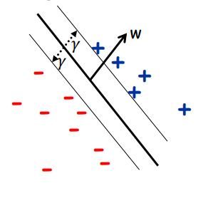
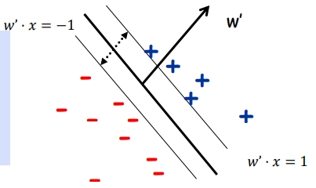
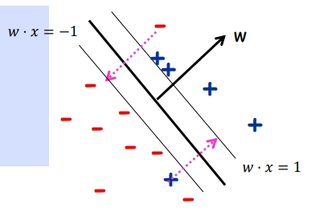

# Kernel Method and SVM

之前我们提到了的感知机是一个简单的在线算法，它用于学习线性分隔器，并且提供了一个很好的保证，这个保证仅依赖于数据的几何边距（也被称作 $L_2$ 或欧几里得边距）。

感知机可以通过核方法扩展来处理非线性决策边界。核方法能够在特征空间中引入非线性。

尽管算法结构简单，但它在诸如分支预测等应用中非常有用，并且还有许多有趣的扩展到结构化预测。

然而，感知机并不能找到最好的 margin。我们需要通过 SVM 来获得最优 margin。并且，感知机无法处理线性不可分的问题。

## Kernel Methods

我们首先来解决线性不可分的问题。核方法（Kernel Methods）主要用于处理感知机无法处理的线性不可分问题。Kernel Methods 的大致思路是将数据从原始空间的维度投影到更高维度上，在更高维度下或许就可以线性分割，于是我们可以用传统方法来解决分割问题。

核函数通过替换原始空间中的点积运算，来使得原始空间的点的维度被隐式的提升到了更高维度甚至无限维度的空间中，进而实现分割。

$$
\mathcal K(\mathbf x_i,\mathbf x_j)=<\phi(\mathbf x_i),\phi(\mathbf x_j)>=\phi(\mathbf x_i)^T\phi(\mathbf x_j)
$$

这个式子就将 $\mathbf x_i,\mathbf x_j$ 分别隐式映射到了 $\phi(\mathbf x_i),\phi(\mathbf x_j)$ 空间中，进而可以在更高空间中解决分割问题。通常，我们不需要考虑 $\phi$ 空间具体是什么，而只需要隐式考虑 $\phi$ 即可。

常见的核函数有：

1. **线性核函数（Linear Kernel）**: $K(x, z) = x \cdot z$
   这是最简单的核函数，它实际上不进行任何映射，因为它只是计算两个向量的点积。在使用线性核时，原始特征空间中的线性关系保持不变。

2. **多项式核函数（Polynomial Kernel）**: $K(x, z) = (x \cdot z)^d$ 或 $K(x, z) = (1 + x \cdot z)^d$
   多项式核通过对原始特征进行多项式组合，允许在高维空间中表示原始空间的特征间的交互。这里的 $d$ 代表多项式的度数。增加 $1$ 通常用于包含原始特征空间的线性组合。

3. **高斯核函数（Gaussian Kernel）** 或 **径向基函数（RBF）**: $K(x, z) = \exp\left(-\frac{\|x-z\|^2}{2\sigma^2}\right)$
   高斯核也称为径向基核函数，它通过计算两个样本点之间的欧氏距离的指数函数，将数据映射到无限维空间。参数 $\sigma$ 控制着函数的宽度，决定了样本间的相似度随距离变化的速度。

4. **拉普拉斯核函数（Laplace Kernel）**: $K(x, z) = \exp\left(-\frac{\|x-z\|}{2\sigma^2}\right)$
   拉普拉斯核类似于高斯核，但是它使用的是 $L1$ 范数（即向量元素绝对值的和），而非 $L2$ 范数（即欧氏距离）。这使得它对离群点更加敏感。

5. **非向量数据的核函数**: 这指的是那些用于测量序列或其他非向量数据相似性的核函数，例如，用于文本数据或生物序列的字符串核。

核函数的选择取决于数据的特性以及问题的需求。不同的核函数能够捕捉数据在原始特征空间中可能不存在的复杂结构和模式。

### Mercer's Theorem

梅塞尔定理（Mercer's Theorem）描述了一个函数何时可以作为支持向量机（SVM）等核方法中的核函数。梅塞尔定理有：

- 核函数 $K$ 必须是对称的，即对于所有的 $x_i, x_j$，都有 $K(x_i, x_j) = K(x_j, x_i)$。

- 当对于任意的训练数据点 $x_1, x_2, \ldots, x_m$ 和任意的实数 $a_1, a_2, \ldots, a_m$ 时，核函数的加权求和 $\sum_{i,j} a_i a_j K(x_i, x_j)$ 总是非负的，即 $\geq 0$。这意味着由核函数 $K$ 生成的矩阵 $K$ 是半正定的（positive semi-definite）。

公式 $a^T K a \geq 0$ 表示的是核矩阵 $K$ 的二次型，其中 $a$ 是系数向量，$a^T$ 是它的转置，$K$ 是由核函数 $K(x_i, x_j)$ 形成的矩阵。这个二次型的非负性是判定 $K$ 是不是一个有效核函数的条件之一。

换句话说，梅塞尔定理保证了如果一个函数 $K$ 满足上述条件，那么它就可以安全地用作核方法中的核函数，这样的核函数可以有效地将数据映射到一个高维空间，在这个空间中，原本不可分的数据可能变得线性可分。这个定理是支持向量机使用核函数处理非线性问题的数学基础。

> 有一个奇怪的点，就是梅塞尔定理的验证形式对每组不同的训练数据点都会得到不一样的验证中间过程。这也就是说，我们通过这个定理只能验证在当前数据集下的核函数是否有效，而不能确定在其它数据集下该核函数依旧有效。通常，我们常用的核函数都是经过大量经验积累和实验验证得到的。

---

核函数允许我们在不改变算法整体结构的情况下，通过更换核函数来适应不同的数据集和任务。这种模块化的方式非常方便，并且核函数的选择和学习算法的选择是独立的。当我们发现某个核函数对于当前数据特别有效，我们可以保持核函数不变，而尝试不同的学习算法。

核函数之间还会有运算性质。我们可以通过不同核函数之间的组合来创造新的核函数。我们有如下定理：

如果 $K_1$ 和 $K_2$ 是核函数，并且 $c_1, c_2 \geq 0$，那么核函数的线性组合也是核函数，具体如下：

$$
K(x,z) = c_1 K_1(x,z) + c_2 K_2(x,z)
$$

这里的关键想法是将对应于 $K_1$ 和 $K_2$ 的特征空间映射 $\phi_1$ 和 $\phi_2$ 合并。新的特征映射 $\phi$ 为：

$$
\phi(x) = (\sqrt{c_1} \phi_1(x), \sqrt{c_2} \phi_2(x))
$$

因此，新的核函数 $K$ 可以表示为：

$$
K(x,z) = \phi(x) \cdot \phi(z) = c_1 \phi_1(x) \cdot \phi_1(z) + c_2 \phi_2(x) \cdot \phi_2(z) = c_1 K_1(x,z) + c_2 K_2(x,z)
$$

如果 $K_1$ 和 $K_2$ 是核函数，那么它们的乘积也是核函数，具体如下：

$$
K(x,z) = K_1(x,z) K_2(x,z)
$$

这里的关键想法是对特征映射 $\phi_1$ 和 $\phi_2$ 进行逐元素乘积，得到新的特征映射 $\phi$，表示为：

$$
\phi(x) = (\phi_{1,1}(x) \phi_{2,1}(x), \phi_{1,2}(x) \phi_{2,2}(x), \ldots, \phi_{1,n}(x) \phi_{2,m}(x))
$$

其中 $n$ 和 $m$ 分别是 $\phi_1$ 和 $\phi_2$ 的维数。

那么核函数 $K$ 的点积可以表示为：

$$
\begin{align*}
\phi(x) \cdot \phi(z) &= \sum_{i=1}^{n} \sum_{j=1}^{m} \phi_{1,i}(x) \phi_{2,j}(x) \phi_{1,i}(z) \phi_{2,j}(z) \\
&= \sum_{i=1}^{n} \phi_{1,i}(x) \phi_{1,i}(z) \sum_{j=1}^{m} \phi_{2,j}(x) \phi_{2,j}(z) \\
&= K_1(x,z) K_2(x,z)
\end{align*}
$$

因此，$K(x,z)$ 确实是两个核函数 $K_1$ 和 $K_2$ 的乘积，也是一个核函数。

通过上面的运算性质，我们可以使用 $\mathcal K=c_1\mathcal K_1+c_2\mathcal K_2+c_3\mathcal K_3$，然后通过交叉验证确定超参数 $c_i$ 的值。

---

解下来我们通过一个例子来展示核函数的应用。我们在岭回归中应用核函数。

岭回归的公式表现为：

$$
\hat{\beta}_{ridge} = \arg\min_{\beta} \left\{ \sum_{i=1}^{N} (y_i - \beta_0 - \sum_{j=1}^{p} x_{ij}\beta_j)^2 + \lambda \sum_{j=1}^{p} \beta_j^2 \right\}
$$

我们通过求导为 $0$ 可以得到：

$$
\hat\beta^{ridge}=(X^TX + \lambda I_p)^{-1}X^Ty
$$

我们接下来用 $w$ 来表示岭回归得到的平面的参数。

$w = (X^T X + \lambda I)^{-1} X^T y$

在核方法中，我们使用核函数 $K(x_i, x_j)$ 来代替 $X^T X$。核函数通常用来计算数据点间的相似性，这允许我们在高维空间中处理数据，而无需显式地计算这个空间。

设 $K = X X^T$ 是核矩阵，每个元素 $K_{ij} = K(x_i, x_j)$。

**求解拉格朗日乘子**

对偶问题中，我们不直接求解 $w$，而是求解拉格朗日乘子 $a$。从上面的 $w$ 的解可以得到 $a$：

$w=X^Ta$

$a = (X^T X + \lambda I)^{-1} y$

由于 $K = X X^T$，所以：

$a = (K + \lambda I)^{-1} y$

预测新数据点 $x_*$ 的目标值 $\hat{y}$：

$\hat{y} = x_*^T w$

$\hat{y} = x_*^T X^T a$

由于 $X^T a$ 是通过核矩阵 $K$ 和 $y$ 计算的，我们可以用 $K$ 替换 $X^T a$：

$\hat{y} = k(x_*, X) a$

$\hat{y} = k(x_*, X) (K + \lambda I)^{-1} y$

其中，$k(x_*, X)$ 是新数据点 $x_*$ 与训练数据集中每个点的核函数值的向量。

通过在岭回归中引入核方法，我们允许模型在原始输入空间中捕捉非线性关系，可以视为在高维空间中找到一个线性决策平面或曲面。当我们将这个决策平面或曲面映射回原始空间时，它可能表现为一条曲线（对于一维问题）或者更复杂的曲面（对于多维问题）。

## Lagrange duality

关于拉格朗日乘子法，对偶问题，KKT条件等，欢迎参照下面视频进行清晰了解。

> [“拉格朗日对偶问题”如何直观理解？“KKT条件” “Slater条件” “凸优化”打包理解](https://www.bilibili.com/video/BV1HP4y1Y79e/?vd_source=9470ae57cc3c4cf5b049c428a2fe56e6)

---

在对一个凸函数求极值的问题中，我们经常会遇到极值的取值存在条件限制。这就需要我们通过拉格朗日函数将取值条件和原函数结合到一起，形成一个新的函数，将原问题等价于这个整体函数的最优。此外，限制条件的引入有些时候会使得问题变成一个非凸的问题，这时候就需要想一些别的办法来解决问题，比如利用拉格朗日对偶性将原问题转化为对偶问题进行求解。将原问题转化为转化为对偶问题，我们可以保证在对偶问题中一定能得到一个凸优化问题并求得对偶问题下的解。然而，对偶问题的解并不总是等于原问题，KKT 条件就是为了确保对偶问题的解和原问题的解相同，满足 KKT 条件的被称为强对偶问题。

接下来让我们具体看看拉格朗日对偶的各项概念。

### Primal problem

在凸优化问题中，原始最优化问题通过如下形式表示：（注：一般来说，我们会假设 $f_0(x)$ 已经是一个凸函数，这对于后续求解拉格朗日对偶函数很重要）

$$
\min_{x} f_0(x) \\
\text{s.t.} \quad f_i(x) \leq 0, \quad i = 1, 2, \ldots, m \\
h_j(x) = 0, \quad j = 1, 2, \ldots, p
$$

原始问题不一定是凸问题，约束条件 $f$ 和 $h$ 都是一般函数而非凸函数。

### Lagrangian function

即使原始问题中的$f_0$ 是凸函数，原始问题因为有限制条件，也并不好直接解得。拉格朗日函数将限制条件 $f_i$, $h_j$ 添加到了 $f_0$ 函数中，使得原始问题有一个更加清晰的表现形式并且在凸函数情况下可以直接求解得到最优解。

原始问题的拉格朗日函数可以表示为：

$$
L(x, \lambda, v) = f_0(x) + \sum_{i=1}^{m} \lambda_i f_i(x) + \sum_{j=1}^{p} v_j h_j(x)
$$

其中 $x \in \mathbb{R}^n$, $\lambda \in \mathbb{R}^m$, $v \in \mathbb{R}^p$。

可以看到，拉格朗日函数 $L$ 相对于原始问题引入了两个新变量（向量） $\lambda$, $v$ ，称为拉格朗日乘子。

于是，我们的原问题可以表示为：

$$
\min_{x}\max_{\lambda,v} L(x,\lambda,v) \\
\text{s.t.} \lambda \geq 0
$$

因为我们要找到整体的最小值，而 $f_i$, $h_j$ 都是小于等于 $0$ 的，因而我们需要找到最大的 $\lambda,v$。对于 $\max_{\lambda,v} L(x,\lambda,v)$ 这一部分，我们可以把 $\lambda, v$ 看作是关于 $x$ 的可行域边界。当 $x$ 在可行域内时，我们有 

$$
\max_{\lambda,v} L(x,\lambda,v)=f_0(x)+0+0=f_0(x)
$$

而当 $x$ 落在可行域外时，$\max_{\lambda,v} L(x,\lambda,v)=+\infty$ 并不对最终结果产生影响，因为 $\min_{x}\max_{\lambda,v} L(x,\lambda,v)=min_x\{f_0(x),\infty\}$ 结果始终为 $f_0(x)$。

### Lagrange dual problem

通过拉格朗日对偶，我们可以得到一些很好的性质来帮助前面问题的求解。

接下来我们定义原问题的**对偶函数**：

$$
g(\lambda,v)=\inf_x L(x,\lambda,v)
$$

其中，$\inf$ 表示取下确界。

$$
\nabla_x L(x, \lambda, v) = 0
$$

通过求梯度，我们可以得到使得对偶函数取下确界的 $x^*$ 的值，于是我们有：

$$
g(\lambda,v)=f_0(x^*)+\sum\lambda_if_i(x^*)+\sum v_ih_i(x^*)
$$

对于求得对偶函数最小的 $x^*$，我们发现对偶函数 $g(\lambda,v)$ 是一个关于 $\lambda_i,h_i$ 的线性函数，显然是一个凸函数。

将原问题转化为**对偶问题**，形式表现为：

$$
\max_{\lambda,v} g(\lambda,v)=\max_{\lambda,v} \inf_x L(x,\lambda,v) \\
\text{s.t.} \lambda \geq 0
$$

---

转化为对偶问题后，我们可以得到对偶问题对应的解函数值的最小值。我们可以证明，对偶问题的解一定小于原问题的解。证明如下：

$$
L(x, \lambda, v) = f_0(x) + \sum_{i} \lambda_i f_i(x) + \sum_{j} v_j h_j(x)
$$

$$
\max_{\lambda, v} L(x, \lambda, v) \geq L(x, \lambda, v) \geq \min_{x} L(x, \lambda, v)
$$

$$
A(x) = \max_{\lambda, v} L(x, \lambda, v) \geq L(x, \lambda, v) \geq \min_{x} L(x, \lambda, v) = l(\lambda, v)
$$

$$
A(x) \geq l(\lambda, v) \quad \text{恒成立}
$$

$$
A(x) \geq \min_{x} A(x) \geq \max_{\lambda, v} l(\lambda, v) \geq l(\lambda, v)
$$

$$
P^* = \min_{x} A(x) \geq \max_{\lambda, v} l(\lambda, v) = D^*
$$

> 如果$L$ 关于 $x$ 是非凸问题，对偶问题的功能就十分有限，此时还需要通过梯度下降等方式尝试找局部最优和全局最优，并且通常只能保证弱对偶性，即对偶问题的最优值是原始问题最优值的一个下界，但不一定相等。

### KKT conditions & Slater conditions

我们已经证明了转化为对偶问题后  $P^*  \geq D^*$。当 $P^* = D^*$时，我们将这种对偶关系称为强对偶关系。一般来说，我们都希望对偶关系是强对偶关系，这样原问题能直接得到等价转换。

在凸优化问题中，原问题和对偶问题之间的强对偶性关系如下：

- **KKT 条件**：对于原问题的任何最优解，KKT 条件是必要条件。在凸优化问题中，如果一个解满足KKT条件，那么这个解是全局最优的。如果优化问题是凸的，并且满足一定的约束规范性条件（如Slater条件），那么KKT条件也是充分的。

- **Slater 条件**：在凸优化问题中，Slater 条件是强对偶成立的一个充分条件。如果Slater条件被满足，那么可以保证存在一个对偶解使得原问题和对偶问题的解相等（即 $P^* = D^*$），这意味着强对偶性成立。

**KKT 条件**

KKT 条件包括以下几个部分：

1. **梯度为零（Stationarity）**：

$$
\nabla_x L(x, \lambda, v) = \nabla f_0(x) + \sum_{i=1}^{m} \lambda_i \nabla f_i(x) + \sum_{j=1}^{p} v_j \nabla h_j(x) = 0
$$

2. **原始可行性（Primal Feasibility）**：

$$
f_i(x) \leq 0, \quad i=1, \ldots, m \\
h_j(x) = 0, \quad j=1, \ldots, p
$$

3. **对偶可行性（Dual Feasibility）**：

$$
\lambda_i \geq 0, \quad i=1, \ldots, m
$$

4. **互补松弛性（Complementary Slackness）**：

$$
\lambda_i f_i(x) = 0, \quad i=1, \ldots, m
$$

当一个解 $x$ 同时满足以上所有KKT条件时，它是原始问题的最优解，而相应的 $\lambda$ 和 $v$ 是对偶问题的最优解。

**Slater 条件**

对于凸优化问题，即当 $f_0(x)$ 和 $f_i(x)$ 都是凸函数，$h_j(x)$ 是仿射函数时，Slater 条件提供了一种验证强对偶成立的方法。Slater 条件表明，如果存在一个点 $x$，使得所有不等式约束都是严格成立的（即对于所有 $i$，有 $f_i(x) < 0$），并且等式约束满足（即对于所有 $j$，有 $h_j(x) = 0$），那么强对偶性 $P^* = D^*$ 成立。

$$
\exists x \in \text{relint}(D), \text{ s.t. } f_i(x) < 0, \quad i=1, \ldots, m \text{ and } h_j(x) = 0, \quad j=1, \ldots, p
$$

其中 $\text{relint}(D)$ 表示可行域的相对内部。

## Support Vector Machines

回忆我们之前提到的几何间隔(Margin)，我们知道对于线性分类器，我们可以将截距项 $b$ 添加到权重向量 $w$ 中，从而简化公式。因此，对于任意点 $x$，它到线性分类器的间隔 Margin 可以通过如下方式计算：

$$
\gamma_i=\frac{\omega}{|| \omega ||} \cdot y \cdot x
$$

其中 $y$ 表示对应的正负。如果只考虑距离大小，并且 $||w||^2=1$，我们可以得到 $x$ 点对应的 Margin 的值为 $|x\cdot \omega|$。

在支持向量机中，落在与最优分割超平面平行且距离皆为 $\gamma$ 的两个平面上的点，我们将其称为支持向量。只有这些点会影响超平面的位置和方向。

如图是一个支持向量机模型。

对于支持向量，我们有：

$$
\gamma=|\omega \cdot x|
$$

支持向量机试图找到一组最优的参数 $\omega$ 并且使得能最大化间隔 $\gamma$，对于所有的输入点$(x_i,y_i)$，满足：

* $||\omega||^2=1$

* For all i, $y_i \omega \cdot x_i \geq \gamma$

也就是说，输入是一组标记的训练样本集合 $S = \{ (x_1, y_1), ..., (x_m, y_m) \}$，其中 $x_i$ 是特征向量，$y_i$ 是相应的标签，可以是 $+1$ 或 $-1$（代表两个类别）。目标是在权重向量的长度 $\|w\|$ 被约束为 $1$ 的条件下，最大化间隔 $\gamma$。这个间隔 $\gamma$ 是指任意样本 $x_i$ 到决策边界的最小距离，它需要满足对所有的 $i$，$y_i (w \cdot x_i) \ge \gamma$。

我们可以发现，这里支持向量机的原始优化问题是一个约束优化问题，我们在约束条件下使得 $\gamma$ 最大化。然而，这里的 $||\omega^2||=1$ 并不是一个凸优化问题，我们希望问题能被转化为一个凸优化问题的形式，这样可以方便我们找到最优的情况并且通过对偶问题优化求解。

为了简化问题，我们将权重向量 $w$ 除以间隔 $\gamma$ 得到新的权重向量 $w'$，使得最大化 $\gamma$ 等价于最小化 $\|w'\|^2$（因为 $\|w'\|^2 = 1/\gamma^2$）。于是我们可以将约束条件改写为关于新的权重向量 $w'$ 的形式，得到 $w' \cdot x = -1$ 和 $w' \cdot x = 1$ 作为新的约束条件。

于是，问题从最大化问题被简化为了一个最小化问题：最小化 $\|w'\|^2$，在此约束条件下：对所有的 $i$，$y_i (w' \cdot x_i) \ge 1$。

$$
\arg\min_\omega ||\omega||^2 \ \text{s.t.:} \\
\text{For all i}, y_i\omega \cdot x_i \geq 1
$$

至此，一个支持向量机被转化为了一个凸优化问题，并且所有的约束条件都是线性的。

### hinge loss

然而很多时候我们的数据并不一定是完全线性可分的，数据中很有可能会出现噪声点。尽管我们知道核函数能在无限维中线性分割数据，我们也需要考虑泛化能力以及异常值可能带来的巨大偏差。因此，允许一定程度的误分类非常重要。这也是为什么即使有核方法可以在高维下进行精准线性分割，我们仍需要引入 hinge loss 来容忍一些错误分类。

为了最大化间隔并且最小化错误分类个数，我们将之前的 SVM 问题转化为最小化：

$$
\text{minimize} \ ||\omega||^2+C \cdot \text{num\{misclassifications\}}
$$

其中 $C$ 是一个超参数。

通过数学化语言描述，并且我们希望所有错误分类点的移动距离最小，我们可以将问题改写为：

$\arg\min_{\omega,\xi_1,\cdots,\xi_m}||\omega||^2+C\sum_i\xi_i$， $\text{s.t.}$

For all $i$，$y_i\omega\cdot x_i \geq 1-\xi_i$，$\xi_i \geq 0$

从这张图可以看出 $\xi_i$ 表示了分类错误点的移动距离。$\xi_i$ 是松弛变量（slack variables），它们允许数据点违反最初的边界 $y_i(w \cdot x_i) \geq 1$。每个 $\xi_i$ 表示第 $i$ 个数据点违反间隔的程度。如果一个数据点被正确分类，并且在间隔边界的正确一侧，那么 $\xi_i = 0$；如果数据点在边界上或者被错误分类，那么 $\xi_i$ 是正的。

$C$ 的作用可以这样理解：

* **当 $C$ 很大时**：模型会对违反间隔的数据点施加较大的惩罚。这意味着模型会努力减少违反间隔的数据点数量，导致更小的间隔并尝试减少训练误差，这可能会使模型过拟合，特别是当数据中存在噪声时。

* **当 $C$ 较小时**：模型对于违反间隔的数据点的惩罚减小，允许更多的违反情况，从而可能有一个更宽的间隔。这样的模型对训练数据的小错误和异常值不那么敏感，可能有更好的泛化能力，但可能会增加训练误差。

因而，$C$ 控制着模型对误差的容忍程度。通过调整 $C$，我们可以尝试找到最优的模型复杂度，以在新的、未见过的数据上实现最佳性能。

### SVM Dual Ploblem

我们已经知道，在支持向量机中，原始问题（Primal Problem）可以表示为以下的优化问题：

$$
\min_{w, b, \xi} \left( \frac{1}{2} \|w\|^2 + C \sum_{i=1}^{m} \xi_i \right)
$$

$$
\text{subject to } y_i (w \cdot x_i + b) \geq 1 - \xi_i, \quad \xi_i \geq 0, \quad \forall i \in \{1, \ldots, m\}
$$

这里，$w$ 是超平面的法向量，$b$ 是偏置项，$\xi_i$ 是松弛变量，$C$ 是正则化参数。

对偶问题（Dual Problem）可以从原始问题通过构建拉格朗日函数（Lagrangian）并应用拉格朗日对偶性来得到。拉格朗日函数 $\mathcal{L}$ 是原始问题中的目标函数和约束条件的线性组合：

$$
\mathcal{L}(w, b, \xi, \alpha, r) = \frac{1}{2} \|w\|^2 + C \sum_{i=1}^{m} \xi_i - \sum_{i=1}^{m} \alpha_i [y_i (w \cdot x_i + b) - 1 + \xi_i] - \sum_{i=1}^{m} r_i \xi_i
$$

这里，$\alpha_i$ 是每个约束 $y_i (w \cdot x_i + b) \geq 1 - \xi_i$ 对应的拉格朗日乘子，而 $r_i$ 是松弛变量 $\xi_i \geq 0$ 的拉格朗日乘子。

对偶问题的目标函数和约束条件可以通过对 $\mathcal{L}$ 对 $w$, $b$, 和 $\xi$ 的偏导数设置为0并解出 $w$ 和 $b$ 来得到：

$$
\frac{\partial \mathcal{L}}{\partial w} = 0 \Rightarrow w = \sum_{i=1}^{m} \alpha_i y_i x_i
$$

$$
\frac{\partial \mathcal{L}}{\partial b} = 0 \Rightarrow \sum_{i=1}^{m} \alpha_i y_i = 0
$$

$$
\frac{\partial \mathcal{L}}{\partial \xi_i} = 0 \Rightarrow \alpha_i = C - r_i
$$

将 $w$ 和 $b$ 的解代入 $\mathcal{L}$ 并消去 $\xi$ 和 $r$，我们得到对偶问题：

$$
\max_{\alpha} \left( \sum_{i=1}^{m} \alpha_i - \frac{1}{2} \sum_{i,j=1}^{m} y_i y_j \alpha_i \alpha_j \langle x_i, x_j \rangle \right)
$$

$$
\text{subject to } 0 \leq \alpha_i \leq C, \quad \sum_{i=1}^{m} \alpha_i y_i = 0
$$

取负号后写成：

$$
\min_{\alpha} \left( \frac{1}{2} \sum_{i,j=1}^{m} y_i y_j \alpha_i \alpha_j \langle x_i, x_j \rangle - \sum_{i=1}^{m} \alpha_i \right)
$$

$$
\text{subject to } 0 \leq \alpha_i \leq C, \quad \sum_{i=1}^{m} y_i \alpha_i = 0
$$

其中，$\alpha = (\alpha_1, ..., \alpha_m)$ 是拉格朗日乘子，$C$ 是正则化参数，$y_i$ 是第 $i$ 个训练样本的类标签，$x_i$ 是第 $i$ 个训练样本的特征向量，而 $\langle x_i, x_j \rangle$ 表示 $x_i$ 和 $x_j$ 的内积。

这个优化问题的目的是找到一组最优的拉格朗日乘子 $\alpha_i$，在满足约束条件的前提下最小化目标函数。这些约束条件确保了解决方案既遵循数据的标签，又不会使乘子超过一个预设的阈值 $C$。

一旦找到了最优的 $\alpha$，就可以计算出最终的分类器的权重向量 $w$，这可以通过下面的公式得到：

$$
w = \sum_{i=1}^{m} \alpha_i y_i x_i
$$

在这个表达式中，只有那些对应的 $\alpha_i \neq 0$ 的训练样本 $x_i$ 是重要的，这些样本点被称为支持向量。在SVM中，支持向量是那些位于或者错误分类在决策边界附近的数据点，它们直接影响决策边界的位置和方向。

### Kernelize SVM

对偶问题的一个关键优势是它仅涉及输入向量的内积，这允许我们通过核技巧将这些内积替换为高维甚至无限维空间中的内积，从而处理原始特征空间中非线性可分的数据。

我们只需要将 $x_i\cdot x_j$ 替换成 $\mathcal K(x_i,x_j)$ 即可：

$$
\min_{\alpha} \left( \frac{1}{2} \sum_{i,j=1}^{m} y_i y_j \alpha_i \alpha_j \mathcal K \langle x_i, x_j \rangle - \sum_{i=1}^{m} \alpha_i \right)
$$

$$
\text{subject to } 0 \leq \alpha_i \leq C, \quad \sum_{i=1}^{m} y_i \alpha_i = 0
$$