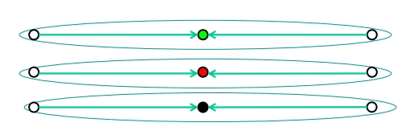
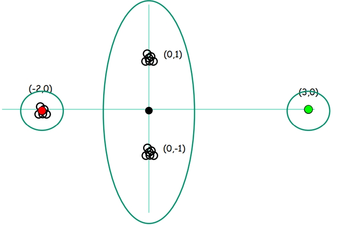
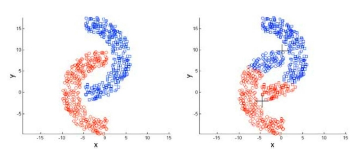
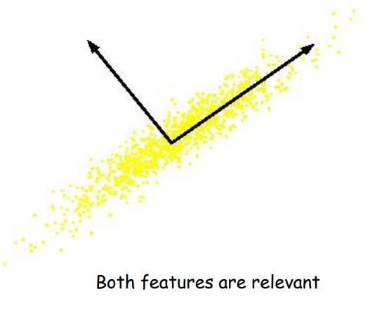
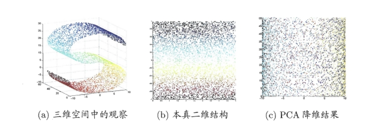

# Clustering & Dimensionality Reduction

## Clustering

聚类是一种无监督学习方法，它的目的是将一组对象根据它们之间的相似性划分到不同的组别或“簇”中。在聚类过程中，算法会尝试使得同一个簇内的对象之间相似度尽可能高，而不同簇之间的对象相似度尽可能低。

聚类的关键在于定义一个合适的“相似度”或“距离”度量方法，它可以是欧氏距离、曼哈顿距离、余弦相似度等，这取决于数据的类型和分析的目的。然后，算法使用这个度量来组织数据点，以便发现数据中的自然分组或模式。

聚类广泛应用于各种领域，比如市场细分、社交网络分析、组织计算化学数据、图像分割、信息检索等。在不同的应用中，聚类可以帮助理解数据的内在结构，揭示数据中的潜在关系或者进行数据预处理等。

### Objective based clustering

基于对象的聚类是一种单层次聚类，每个样本仅能属于一个聚类。

**输入**：由 $n$ 个点组成的集合 $S$，以及一个距离/不相似度度量，用于定义点对 $(x,y)$ 之间的距离 $d(x,y)$ 。

**目标**：输出数据的一个分区。

**不同的聚类算法**：
    
- **k-均值（k-means）**：找到中心点 $c_1, c_2, \cdots, c_k$，以最小化每个数据点 $x_i$ 到其最近中心点 $c_j$ 的距离的平方和。这是最常用的聚类方法之一，它适用于各种数据集和各种领域。

$$
\text{minimize:  } \sum_{i=1}^n \min_{j\in\{1,\cdots,k\} }d^2(x^i,c_j)
$$

- **k-中位数（k-median）**：找到中心点 $c_1, c_2, \cdots, c_k$，以最小化每个数据点 $x_i$ 到其最近中心点 $c_j$ 的距离的总和。与k-均值类似，但区别在于不再是欧几里得距离，而变成曼哈顿距离，对异常值更鲁棒。

$$
\text{minimize:  } \sum_{i=1}^n \min_{j\in\{1,\cdots,k\} }d (x^i,c_j)
$$

- **k-中心点（k-center）**：找到一个分区，以最小化最大半径。这种方法试图确保任何点到其分配的簇中心的最大距离尽可能小。

#### Euclidean k-means Clustering

我们首先来介绍基于欧几里得距离的 k-means 聚类算法。

**输入**：一个在 $d$ 维空间中的 $n$ 个数据点的集合 $x_1, x_2, \cdots, x_n$ 和预期的簇数 $k$。

**输出**：$k$ 个代表性数据点 $c_1, c_2, ..., c_k$，它们在 $d$ 维空间 $\mathbb{R}^d$ 中。

**目标**：选择 $c_1, c_2, ..., c_k$ 来最小化所有数据点到其最近中心点的距离平方和，数学表达式为：

$$
\sum_{i=1}^{n} \min_{j \in \{1,...,k\}} ||x^i - c_j||^2
$$

这个目标是k-means 聚类的核心，即找到簇中心使得数据点到其簇中心的距离总和最小。通过这种方法，我们找到了一种划分，每个点都归属于距离它最近的聚类中心点并且满足总距离最小、

事实上，这个式子可以被重写为：

$$
\min_{r,c}\sum_{i=1}^n\sum_{j=1}^kr_{ij}||x_i-C_j||^2 \\
\text{s.t.} r_{ij}\in\{0,1\}, \forall i,j
$$

在这里，$r_{ij}$ 是一个指示函数，表明第 $i$ 个数据点 $x_i$ 是否属于 $C_j$。如果是则取值为 $1$。

我们可以进一步将其改写为矩阵形式：

$$
\min_{R,C}||X-RC||_F^2
$$

其中，$X$ 表示数据矩阵，$R\in\{0,1\}^{n\times k}$，$C\in \mathbb R^{k\times d}$

> $F$ 通常表示弗罗贝尼乌斯范数（Frobenius norm），它是矩阵元素的平方和的平方根，类似于向量的欧几里得范数，但应用于矩阵。对于矩阵 $A$ ，其弗罗贝尼乌斯范数定义为：$||A||_F = \sqrt{\sum_{i,j} |a_{ij}|^2}=\sqrt{\text{Tr}(A_TA)}$

我们知道 $R$ 矩阵表示了每个数据点 $x_i$ 所属的聚类类别，并且 $C_j$ 是聚类的平均中心点，因此，$C$ 矩阵还可以通过 $R$ 和 $X$ 矩阵计算得到。

$$
C=DR^TX
$$

这里，$D\in \mathbb R^{k\times k}$，是一个对角矩阵，用于实现类别中含的点的个数的均值，$D_{kk}=\frac{1}{\sum_{i=1}^nr_{ik}}$

那么，我们如何来进行最佳中心点的选取？

由于聚类问题是一个非凸的问题，我们无法在多项式时间内求得准确解。因此，我们通常采用迭代的方法来进行问题的求解。

一种常见的启发式方法是 **Lloyd 算法**。

**输入**：一个在 $d$ 维空间中的 $n$ 个数据点的集合 $x_1, x_2, \cdots x_n$。

**初始化**：在 $d$ 维空间 $\mathbb{R}^d$ 中初始化 $k$ 个中心 $c_1, c_2, \cdots, c_k$，并以任意方式初始化簇 $C_1, C_2, ..., C_k$。

**重复以下步骤**，直到总的距离平方和结果不再改变：

  - 固定所有中心点，对每个 $j$，将集合 $S$ 中最接近中心 $c_j$ 的点分配给簇 $C_j$。

  - 固定所有簇（也就是所有数据点的类别），对每个 $j$，更新中心 $c_j$ 为簇 $C_j$ 的均值。

Lloyd 算法于是通过交替执行分配和更新步骤来不断优化簇中心，直到达到稳定状态，即簇中心不再显著变化，或者簇分配不再改变。它总能收敛到局部最优解，并且总距离开销 cost 总是下降。

对于 Lloyd 算法而言，初始化至关重要。不同的初始中心点的选取可能会导致收敛速度的不同以及最终聚类结果的不同。

我们有几种常见的初始化方法。

第一种是**随机初始化**，我们从数据点中随机选择聚类中心。

然而，对于图片中的这种情况，我们发现最终迭代的结果得到的聚类并不会是最优的。我们事实上希望找到的是三个竖着的聚类。

这类随机初始化有时甚至会出现更糟糕的情况，在相互分离的高斯聚类的条件下也无法得到想要的聚类。

于是，我们设计另外一种方法进行改善，这种方法基于**最远距离**。步骤如下：

* 随意或随机选择第一个中心 $c_1$。

* 对于 $j = 2$ 到 $k$，在数据点 $x_1, x_2, \cdots, x_n$ 中选择一个点作为 $c_j$，这个点是到之前已选择的中心 $c_1, c_2, ..., c_{j-1}$ 最远的点。

这个方法可以解决由于随机初始化导致的高斯问题。选择最远的数据点作为新的中心点可以增加中心点之间的距离，这样做有助于改善聚类的质量和算法的收敛速度。

然而，如果数据集中存在离群点，这种方法可能会被离群点所影响，因为离群点可能会被选为中心点，这并不是我们想要的结果。

目前最优的初始化方法为 **K-means++** 的初始化方法。

K-means++ 算法通过一种称为 $D^2$ 采样的方法来改进初始中心点的选择。

首先，随机从数据点中选择一个点作为第一个中心点 $c_1$。

对于每个剩余的中心点 $c_j$ ($j = 2$ 到 $k$)：
- 计算每个数据点 $x$ 到最近已选择中心点的距离 $D(x)$。
- 选择新的中心点 $c_j$，使得点 $x$ 被选为新中心点的概率与 $D(x)^2$ 成正比。

$$
\text{Pr}(c_j=x_i) \propto \min_{j'<j} ||x_i-c_{j'}||^2
$$

$$
D^2(x_i)=\min_{j'<j} ||x_i-c_{j'}||^2
$$

K-means++算法在期望中提供了对最优K-means解的 $O(\log k)$ 近似。也就是说，这种方法倾向于选择彼此距离较远的中心点，从而在算法开始时就能更好地代表整个数据集的分布。

#### Kernel clustering

当我们的聚类的簇是凸集的时候，用普通的聚类方式能较好解决。然而，当数据非线性可分，特征为非凸的时候，传统的K-means算法可能无法找到一个好的解。

于是这时候，我们希望对之前的聚类方法进行核化，通过映射到高维空间来解决非凸的问题。这需要用到我们之前推到的矩阵乘积形式的 K-means 公式形式。

$$
\min_{R,C}||X-RC||_F^2
$$

$$
C=DR^TX
$$

将 $C$ 代入前面的式子，得到：

$$
\min_{R}||X-RDR^TX||_F^2 \\
=<X-RDR^TX,X-RDR^TX> \\
=<X,X>-2<X,RDR^TX>+<(RDR^T)X,RDR^TX> \\
=<X,X>-2<X,RDR^TX>+<X,(RDR^T)^TRDR^TX>
$$

由于我们有 $D=(R^TR)^{-1}$，于是我们可以得到：

$$
\min_{R}||X-RDR^TX||_F^2\\
=<X,X>-<X,RDR^TX>
$$

去掉无关部分，我们最终想要实现的就是

$$
\max_R Q(R)=\text{Tr}((RD^{\frac12})^TXX^T(RD^\frac12))
$$

观察到了 $XX^T$ 的形式，于是我们可以应用核矩阵 $K$ 来替换它，这就实现了应用核方法在高维中解决问题。

### Hierarchical clustering

层次聚类是一种广泛使用的聚类技术，它不依赖于预先指定簇的数量，与k-means这类算法不同。层次聚类通过构建一个嵌套的簇层次结构来组织数据，可以是自底向上的凝聚（agglomerative）方法或自顶向下的分裂（divisive）方法。

#### Agglomerative Hierarchical Clustering

凝聚层次聚类是自底向上的方法，它开始于将数据中的每个点视为一个单独的簇，然后逐步合并这些簇。

初始化：开始时，每个数据点是一个独立的簇。

相似度计算：计算所有簇对之间的相似度或距离。常见的距离度量方法包括单链接（最近邻）、完全链接（最远邻）和平均链接。

---

Single linkage: $\text{dist}(A,B)=\min_{x\in A,x' \in B} \text{dist}(x,x')$

Complete linkage: $\text{dist}(A,B)=\max_{x\in A,x' \in B} \text{dist}(x,x')$

Average linkage: $\text{dist}(A,B)=\text{avg}_{x\in A,x' \in B} \text{dist}(x,x')$

两个簇之间的相似度计算还有一种相比上述方法更好的方法，它被称做 Ward's Method。

**核心思想**：Ward的方法在每一步中选择合并可以最小化总内部簇方差增加量的那两个簇。这个准则被设计成可以找到紧凑且明显分离的簇。

Ward的距离度量公式为：$\text{dist}(C, C') = \frac{|C| \cdot |C'|}{|C| + |C'|} ||\text{mean}(C) - \text{mean}(C')||^2$
- 这里 $|C|$ 和 $|C'|$ 是两个簇的大小（即包含的点数），$\text{mean}(C)$ 和 $\text{mean}(C')$ 是两个簇的均值向量。
- 距离的计算基于最小化合并簇后的总方差增加量。

---

合并簇：找到距离或相似度最小（最相似）的两个簇，将它们合并为一个新簇。

更新距离矩阵：在合并后，更新距离或相似度矩阵以反映新簇的情况。

重复：重复步骤3和4，直到所有数据点最终合并为一个单独的簇。

此过程可以使用树状图（Dendrogram）来可视化，树状图揭示了数据点如何逐步合并，以及簇之间的相对距离。

---

#### Divisive Hierarchical Clustering

与凝聚方法相反，分裂层次聚类是自顶向下的方法。它从一个包含所有数据点的单一簇开始，然后逐步细分。

步骤如下：

初始化：开始时，所有数据点构成一个单一的簇。

选择簇分裂：选择一个簇进行分裂。这通常是当前具有最高不均匀性的簇。

分裂准则：根据某种准则，如距离或密度，将簇分裂为子簇。

重复：重复步骤2和3，直到每个数据点都是一个单独的簇或满足某种停止准则。

分裂方法较为复杂，计算成本通常高于凝聚方法，因此在实际应用中较少见。

---

层次聚类提供了一种灵活、直观的方式来理解和分析数据的内在结构。通过树状图，研究者可以在不同的层次上观察和解释簇的形成，这种分层的视角是层次聚类独特的优势。

## Principal Component Analysis

### PCA

主成分分析（PCA，Principal Component Analysis），是一种常用的降维（Dimensionality Reduction）方法。它在简化数据集的复杂性同时保留其主要特征。它通过减少数据集中的变量数量来实现这一目的，但同时尽量保留原始数据集中的信息。

因此，我们需要找到数据中的主要成分或方向，并将数据投影到这些成分上。主成分是数据中变异性最大的方向，它们彼此正交（即不相关）。通过 PCA 降维处理，我们最终得到一个维度更低但同时原始信息得到极大保留的数据集。

如图就是一个最简单的主成分分析例子。对于所有的数据点，我们能观察到它们基本处在一条直线上。然而，对于 x 轴向量和 y 轴向量，这条直线都有相关性。因此，当我们进行降维的时候，我们希望得到的是一个与 xy 轴均相关的新的方向向量，这条新向量能最大程度反应数据的特征分布。把所有数据点投影到这条向量方向上，我们就会把原有的两个特征映射到一个特征上。

更多情况下，我们是将 $n$ 维的数据映射到一个新的 $p$ 维的数据空间中，最大程度保留原始特征。

翻译一下这个原始特征，主成分分析，实际上就是寻找多个使得方差最大的方向，并在这些方向上投影。

于是，此时的问题可以被理解为，构造一个 $A$，$b$，使得：

$$
Y=AX+b
$$

其中，$Y$ 是 $M\times 1$ 的目标投影空间矩阵，$M$ 代表降低后的维度，$A$ 是投影矩阵，维度为 $M\times N$，$N$ 表示原始空间的维度。$X$ 是$N \times p$ 的数据集，$p$ 为数据点个数。$b$ 是偏置项。

为了去除偏置项 $b$，我们对 $X$ 进行中心化，得到：

$$
Y=A(X-\bar X)
$$

其中，$\bar X=E(X)$

对于 $A$ 矩阵，我们可以展开得到：

$$
A=\begin{bmatrix}
-a_1- \\
-a_2- \\
\vdots \\
-a_M- \\
\end{bmatrix}
$$

其中，$a_i$ 代表了每个目标投影空间矩阵上的投影方向。

根据 $A$ 矩阵的展开，我们同样可以得到 $Y$ 矩阵的形式为：

$$
Y=\begin{bmatrix}
a_1(X-\bar X) \\
a_2(X-\bar X) \\
\vdots \\
a_M(X-\bar X) \\
\end{bmatrix}
$$

于是，对于所有的点 $x_i$，我们可以得到投影后的 $y_i$ 值（$i=1\sim p$）：

$$
y_i=\begin{bmatrix}
a_1(x_i-\bar X) \\
a_2(x_i-\bar X) \\
\vdots \\
a_M(x_i-\bar X) \\
\end{bmatrix}
$$

现在，我们希望最大化投影后的所有数据点的方差。我们先对第一个投影分量 $a_1$ 处得到的方差最大：

$$
\text{To max: Var}(y_i)=\sum_{i=1}^p(y_{i1}-\bar y_{i1})^2
=\sum_{i=1}^p y_{i1}^2=\sum_{i=1}^p[a_1(x_i-\bar x)]^2
$$

$$
\text{Var}(y_i) = \sum_{i=1}^N a_1 (x_i - \overline{x})(x_i - \overline{x})^T a_1^T
$$

展开上述公式，并利用协方差矩阵 $\Sigma$ 的定义：

$$
\text{Var}(y_i) = a_1 \left[ \sum_{i=1}^N (x_i - \overline{x})(x_i - \overline{x})^T \right] a_1^T
$$

$$
= a_1 \Sigma a_1^T
$$

到这里，我们的优化问题变成了最大化：$a_1 \Sigma a_1^T$。我们还需要对 $a_i$ 的模进行限制，因为这个值是我们可以任意给定的。通常情况下我们假设 $a_ia_i^T=||a_i||^2=1$

通过拉格朗日乘子法，我们得到：

$$
E(a_1)=a_1 \Sigma a_1^T-\lambda(a_1a_1^T-1)
$$

$$
\frac{\partial E}{\partial a_1}=(\Sigma a_1^T-\lambda a_1^T)^T=0
$$

> 这一步的计算过程参考矩阵求导，中间略去了一个常数 $2$

于是我们可以得到一个非常好的结论：

$$
\Sigma a_1^T=\lambda a_1^T
$$

这也就意味着，$a_1^T$ 是 $\Sigma$ 的特征向量，$\lambda$ 是 $\Sigma$ 的特征值。最大化的结果$a_1 \Sigma a_1^T=a_1(\lambda a_1^T)=\lambda$

于是，$\lambda$ 是 $\Sigma$ 最大特征值。$a_1$ 是 $\Sigma$ 最大特征值对应的特征向量，且 $a_1a_1^T=1$

---

接下来，我们需要求得 $a_2$，也就是第二个方向上的投影向量。这相当于，我们在 $a_1$ 的基础优化问题上新增了一个限制条件，即 $a_1a_2^T=0$

改写拉格朗日乘子法公式，我们得到：

$$
E(a_2)=a_2 \Sigma a_2^T-\lambda_2(a_2a_2^T-1)-\beta a_1a_2^T
$$

对 $a_2$ 求偏导得到：

$$
\Sigma a_2^T-\lambda_2 a_2^T-\beta a_1^T=0
$$

接下来我们可以证明 $\beta=0$。这个证明只需要对式子转置后两边同乘 $a_1^T$ 并利用协方差矩阵的对称性质即可得到。

由此，我们可以得到 $\lambda_2$ 是 $\Sigma$ 的第二大特征值，并且 $a_2$ 是其特征向量。

因此，我们可以得到结论：新的降维后的空间的轴是数据样本协方差矩阵的特征向量。

$$
\Sigma A=\lambda A 
$$

其中，$\lambda$ 为 $\Sigma$ 的一系列特征值，$A$ 为 $\Sigma$ 的特征值对应的特征向量组成的矩阵。

---

事实上，主成分分析（PCA）除了用于降低数据维度和减少计算量外，还有很多重要用途：

1. **数据可视化**：在处理高维数据时，PCA可以用来降维到二维或三维，这样可以通过图形的方式直观地展示数据，帮助识别模式、群体或异常值。

2. **噪声过滤**：通过保留数据中的主要成分，PCA可以去除或减少数据中的噪声。在许多情况下，噪声被认为是分布在较小的成分上，而信号则集中在主要成分上。

3. **特征提取和工程**：PCA可以帮助识别哪些变量对数据变化贡献最大，这对于特征工程非常有用，尤其是在建模和预测时。

4. **探索性数据分析**：通过分析主成分，研究人员可以发现数据集中的潜在结构和关系，这对于初步理解复杂数据集非常有帮助。

5. **去相关和正交化**：PCA通过转换原始变量到一组新的正交变量（主成分），可以用于消除变量间的相关性，这在某些统计分析和机器学习模型中非常有用。

6. **压缩数据**：PCA可以有效地减少数据的存储空间和传输带宽需求，因为只需要存储较少数量的主成分和相应的转换矩阵。

7. **在模式识别和机器学习中的应用**：PCA经常用于预处理步骤，以提高算法的性能和结果的准确性，尤其是在处理高维数据时。

8. **多变量数据分析**：在处理具有多个变量的复杂数据集时，PCA有助于理解变量间的相互关系。

因而，主成分分析是一种强大的工具，不仅仅局限于降维，它在数据分析和处理中扮演着多种角色。

### Kernel PCA

如图所示，对于这种数据，我们直接进行 PCA 降维处理会丢失原本的三维空间中的结构。因此，我们需要非线性的映射才能找到恰当的低维嵌入。

这就是为什么，我们需要基于核技巧，对线性降维方法引入核函数。

现在我们假设对所有的数据 $x_i$ 隐藏的投影到了高维空间，于是我们可以将之前的式子改写为：

$$
(\sum_{i=1}^{m}\phi(x_i)\phi(x_i)^T)A = \lambda A
$$

观察发现，我们可以 用核矩阵 $K$ 来替代 $\sum \phi(x_i)\phi(x_i)^T$。那么公式就变为：

$$
KA = \lambda A
$$

于是，$\lambda_i$ 就变成了核矩阵的特征值，$a_i$ 就变成了对应的特征向量。
