# Basis of Deep Learning

**写在前面：**

通常在学习网络算法时，更多的关注点往往放在网络结构的设计和理解上，而不是权重更新过程的具体细节。网络结构（包括网络的层次、层中的节点数、使用的激活函数类型等）决定了模型的基本功能和能力，以及模型针对特定任务的适应性和效率。而权重更新过程可以视为一个标准化的过程，很多深度学习框架（如 TensorFlow 和 PyTorch）都提供了自动化的梯度计算和权重更新的功能。

关注网络模型和任务流程构建本身，然后迅速进入代码实践过程中去。

## Convolutional Neural Network

在进行图像识别任务的时候，我们需要识别不同类型的图像并将其对应到不同的标签。CNN 的好处在于利用卷积核提取到了图像的一系列不同的空间特征，能实现物体的空间不变性（即物体特征与物体所属位置无关），再进行全连接神经网络的训练，能够减少训练时间与训练所需的参数量和样本量，并有效提高图像识别的准确性。

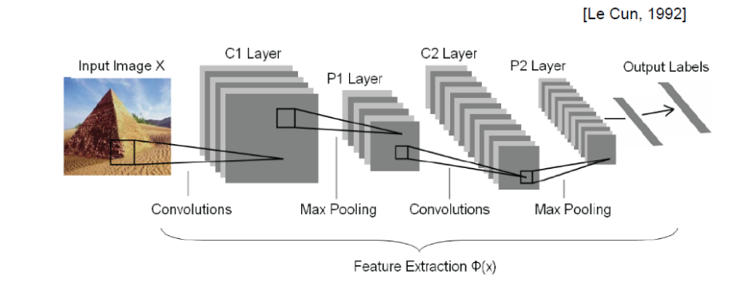

如上图所示，CNN 的网络结构在卷积处理部分，对于一个输入的图片，将原始图像进行预处理，如归一化、去均值、PCA降维等后，使用卷积核对图像进行特征提取，使用池化层进行图像缩小。

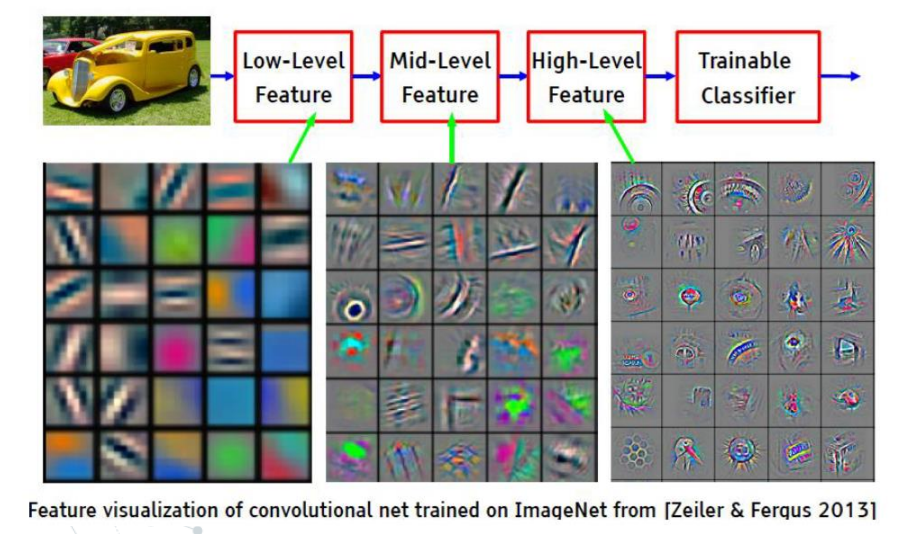

卷积核的卷积操作可以看作是对图像的每一块区域进行权重求和。为了保证卷积核操作后的图像大小保持不变，我们会在图像周围补充一系列 $0$ 来弥补由卷积核大小导致的图像不足的部分。卷积核通常有不同的大小如 $3\times 3$ $5\times 5$ 等，并且根据卷积核内部权重的不同也被设计用于提取不同的空间特征信息。

经过卷积采样后先应用激活函数引入非线性，下一步进入池化层，这一步通常进行下采样或平均采样过程，用于减小图像大小。

再经历过几次这样的卷积采样/池化层池化过程后，图像最后被分解为了一系列的复杂和抽象的特征。得到的高级特征图将被“展平”成一个一维向量，然后送入一个或多个全连接层。全连接层负责将高级特征综合起来，进行最终的分类或回归任务。在我们的图像分类任务中，最后一个全连接层的输出维度通常等于类别的数量，经过softmax 激活函数处理后，输出每个类别的预测概率，即得到我们想要的预测类别。

这一步和最基础的利用 MNIST 分类手写数字的想法是一致的，将图像展开成列向量输入神经网络后得到结果。

在训练过程中，反向传播不仅调整全连接层部分的网络权重，也会调整卷积核内部的权重值。这些都可以通过损失函数得到。

卷积核的反向传播需要计算损失函数相对于每个卷积核权重的梯度。这通过对输入特征图的每个区域应用与前向传播中相同大小的卷积核进行“全卷积”操作来完成，但使用的是损失相对于输出特征图的梯度。这实质上是一个卷积操作，但与前向传播的方向相反。得到的梯度表明了每个权重如何影响总损失，从而可以用于更新权重。

总结来看，卷积神经网络有三个阶段：

* 卷积层 Convolution Layer(s)

* 池化层 Pooling Layer(s)

* 分类-全连接层 Classification - Fully Connected Layer

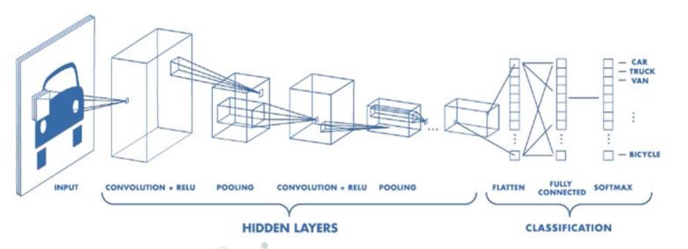

### Resnet

在ResNet（残差网络）提出之前，深度学习研究者们已经尝试了多种方法来改进卷积神经网络（CNN）的性能，特别是在图像分类等任务上。这些尝试主要集中在网络架构、激活函数、正则化方法和优化技术等方面。

在网络架构方面，研究者们试图通过增加网络的深度（层数）和宽度（每层的神经元或卷积核数量）来增强模型的学习能力。例如，VGG网络通过使用多个连续的卷积层来增加网络深度，从而提高了特征的抽象层次。但这种方法会增加模型的参数数量，导致更高的计算成本和过拟合风险。

除了传统的卷积层和全连接层，研究者们还尝试引入新的网络结构，如Inception模块（在GoogLeNet中使用）。Inception模块通过并行的不同尺寸的卷积操作和池化操作，允许网络自动学习最适合数据的特征组合。

---

然而，在已有的所有网络中，随着网络深度的增加，更深的网络并没有带来更好的效果。在 ResNet 提出之前，研究者关注的重点主要在于梯度消失以及梯度爆炸的现象，并且事实上已经很大程度上得到了解决。然而，即使解决了梯度消失爆炸的问题，网络的效果也没有变好。

我们发现，直接增加网络深度的网络在训练集上会有更高的错误率，意味着更深的网络并没有到达过拟合的程度，也就是网络并没有被训练好。

事实上，神经网络越来越深的时候，反传回来的梯度之间的相关性会越来越差，最后接近白噪声。因为我们知道图像是具备局部相关性的，那其实可以认为梯度也应该具备类似的相关性，这样更新的梯度才有意义，如果梯度接近白噪声，那梯度更新可能根本就是在做随机扰动。

具体而言，由于非线性激活函数 Relu 的存在，每次输入到输出的过程都是不可逆的，存在信息丢失，因而我们很难从输出反推回完整的输入。

ResNet 的出现解决了这个问题，让梯度信息丢失的情况大幅度减小，导致网络可以轻易达到几十倍于之前的深度，从而产生了更大的模型以及更好的训练效果。另一方面，ResNet 的 shortcut 能够很好的解决梯度的弥散化问题，并且给模型提供了自主选择是否进行更多卷积和线性变换操作。这样子或许能维持浅层网络自身结构。

> 事实上，深度学习是玄学，这里的解释也更多是感性层面的理解和解释。

---

ResNet 的核心在于残差块的设计。

**残差块的结构**：

残差块通常由两层或三层卷积层组成，这些卷积层负责提取特征。然后，输入通过一个快捷连接跳过这些卷积层，直接加到卷积层的输出上。如果输入和输出的维度不匹配，可以通过一个线性映射（如卷积操作或池化操作）调整输入以匹配输出。

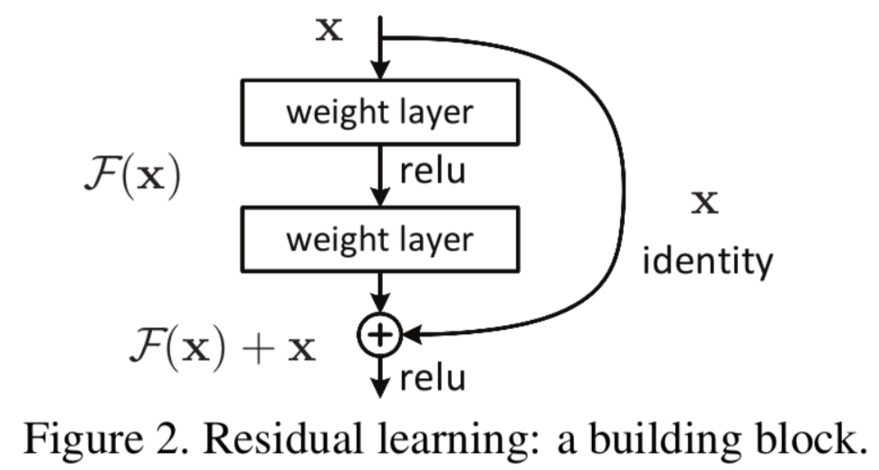

图中右侧的曲线叫做跳接（shortcut connection），通过跳接在激活函数前，将上一层（或几层）之前的输出与本层计算的输出相加，将求和的结果输入到激活函数中做为本层的输出。

用数学语言描述，假设 Residual Block 的输入为 $x$，则输出为 $y$ 为：

$$
y = F(x, \{W_i\}) + x
$$

其中 $F(x, \{W_i\})$ 是我们学习的目标函数，即输出输入的残差 $y - x$。以上图为例，残差部分是中间有一个 Relu 激活的双层权重，即：

$$
F = W_2 \sigma(W_1 x)
$$

其中 $\sigma$ 代表 ReLU, 而 $W_1, W_2$ 代表两层权重。

这里一个 Block 中必须含有至少两个层，否则就会出现无效的情况：

$$
y = F(x, \{W_i\}) + x = (W_1 x) + x = (W_1 + 1)x
$$

下面是 ResNet18 的网络架构图。

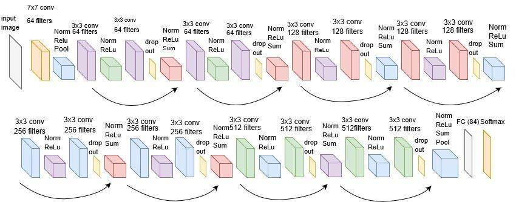

可以看出，网络增加了一些 dropout 以及其他用于正则化的层，并最终回归到全连接层进行操作，使用 softmax 最后预测标签。

---

## Autoencoder

自编码器（Autoencoder） 在深度学习的分类中属于无监督学习，可以类比为非线性的 PCA。

Autoencoder 的主要思想是用于提取数据特征，并希望通过提取到的特征能还原出原有的数据，并不丢失主要的信息。

如下图所示，Autoencoder 主要分为 Encoder 部分和 Decoder 部分。

在 Encoder 部分，编码器的任务是将输入数据压缩成一个低维的特征向量，也称为编码或潜在表示（latent representation）。这个过程涉及数据维度的减少，可以看作是数据压缩的过程。

随后通过 Decoder 将特征重建成输入数据。解码器的任务是从潜在表示中重构原始输入数据。这个过程可以被视为数据解压缩的过程，解码器试图根据压缩的信息重建原始数据。

编码器和解码器的网络结构通常为镜像关系，并且有多层的神经网络构成，逐层减少/增加数据的维度。

最后通过 L2 损失函数，来计算重建数据和原有数据的损失值，反向传播调整 Encoder 和 Decoder 的网络参数，达到更好的 压缩-重建 效果，输出与输入更加接近。

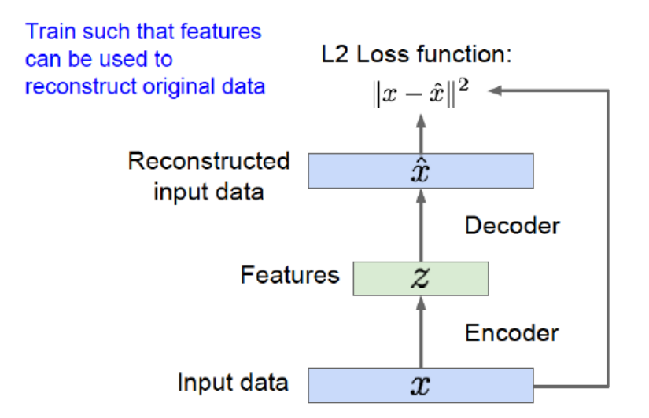

---

**网络整体作用和应用**

* **特征提取**: 如前所述，自编码器可以有效地将数据压缩成有用的低维特征表示，这些特征可以用于训练其他机器学习模型，提高模型的性能。此外，自编码器能够学习到数据的高层次、有用的表示，这些表示可能比原始数据更适合于下游任务。

* **数据压缩:** 自编码器可以用于数据压缩，尤其是当数据具有高度冗余时。与传统的压缩算法不同，自动编码器学习的是数据特定的压缩方式。

* **去噪**: 自编码器可以用于去除输入数据中的噪声。训练一个去噪自编码器（Denoising Autoencoder）时，网络学习如何从损坏的输入中重构原始的、未损坏的输入，可以用作一种强大的去噪工具。

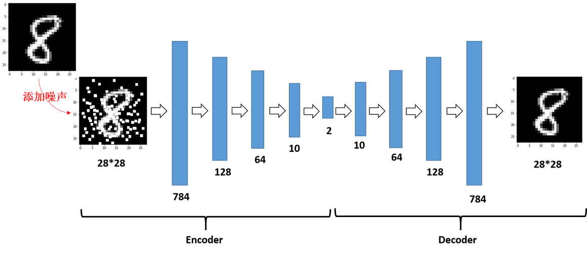

* **异常检测**: 自编码器还可以用于识别异常或离群值。在正常数据上训练自编码器，然后使用它来重构新的数据样本。如果新样本的重构误差异常地高，那么这可能表明样本是异常的。

---

**神经网络自编码器特点**

* 自编码器是数据相关的（data-specific 或 data-dependent），这意味着自编码器只能压缩那些与训练数据类似的数据。比如，使用人脸训练出来的自编码器在压缩别的图片，比如树木时性能很差，因为它学习到的特征是与人脸相关的。

* 自编码器是有损的，意思是解压缩的输出与原来的输入相比是退化的，MP3，JPEG等压缩算法也是如此。这与无损压缩算法不同。

在一些情况下，当我们训练完成自编码器之后，我们会仅仅采用 Encoder 的部分作为我们某些深度学习任务的数据处理方式。换言之，Encoder 可以用来初始化一个有监督的模型的训练。

### VAE

变分自编码器（VAE），是基于 Autoencoder（AE）的思想而产生的一种生成模型。它保留了自动编码器特征学习的能力，并引入了潜在空间的先验分布来正则化编码器的输出，使用了变分推断来优化潜在表示的概率分布，使其接近先验分布。这种变分框架使得VAE不仅能够进行高效的特征表示，还能够作为生成模型来创建新的、多样化的数据样本。

[机器学习方法—优雅的模型（一）：变分自编码器（VAE） - 苗思奇的文章](https://zhuanlan.zhihu.com/p/348498294)

> 这个作者的几篇文章写的是真的好，可以详细看看，信息熵，KL 散度这块讲的都很不错。

---

## Recurrent Neural Network

循环神经网络（RNN）是为了解决序列数据类型而专门设计的一种神经网络。例如，对于一串文字，我们现在想要对其进行翻译操作。在这种情况下，我们不仅需要考虑所有文字作为整体，也要考虑文字的先后顺序以及相互之间的连接关系。

在传统的翻译工作中，我们通常会把一个句子视为一条马尔科夫链，下一个单词的概率为前面所有单词的条件概率的乘积。表现为数学公式为：

$$
p(s)=p(w_1,\cdots,w_T)=p(w_1)\cdot p(w_2|w_1) \cdots p(w_T|w_1\cdots w_{T-1})
$$

> 其中，句子由单词 $w_1,\cdots,w_T$ 组成，而输出的翻译为 $s$

在神经网络中，为了识别这种特殊的关系，循环神经网络将网络每次循环的输出都作为下一次的输入，方便识别序列前后之间的关系，达到记忆的效果。也就是说，每次神经网络的前向传播，都需要将前一次前向传播得到的结果与新输入的一个单词共同作为输入。

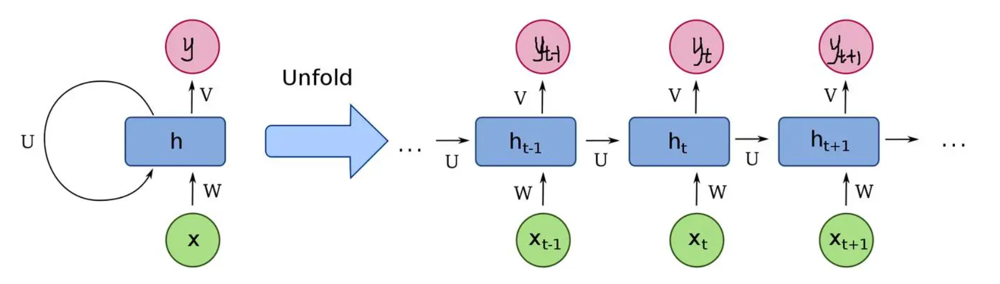

例如，对于这幅图，对于每一个输入 $x_t$，我们不仅得到了每次前向传播的输出 $y_t$，还将隐藏层权重 $h_{t}$ 传递到下一个时间点作为 $h_{t+1}$ 的部分输入。

这种输入输出的关系也可以体现为下图中一对多，多对多等情况。可以根据我们的需要选择输出的形式。

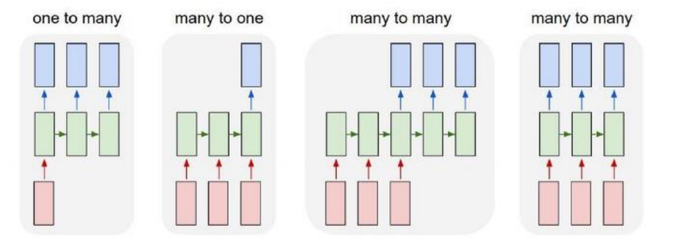

在最基本的RNN结构中，隐藏层通常包含一个激活函数，最常见的是 tanh 或 ReLU 函数。对于每个时间步 $t$，隐藏层的状态 $h_t$ 是基于当前时间步的输入 $x_t$ 和前一个时间步的隐藏状态 $h_{t-1}$ 计算得到的。这个过程可以通过下面的公式表示：

$$
h_t = f(W_{hh}h_{t-1} + W_{xh}x_t + b_h)
$$

其中：
- $f$ 是激活函数，如tanh或ReLU。

- $W_{hh}$ 是隐藏层自身权重，用于前一时间步的隐藏状态$h_{t-1}$。

- $W_{xh}$ 是输入到隐藏层的权重。

- $b_h$ 是隐藏层的偏置项。

- $h_t$ 是当前时间步的隐藏状态。

- $x_t$ 是当前时间步的输入。

在这个框架中，RNN的“记忆”体现在隐藏状态 $h_t$ 中，它通过时间序列传递信息。网络的主要权重在于：

- **隐藏层自身权重**$W_{hh}$：这些权重控制了如何将前一时间步的隐藏状态信息整合到当前时间步中。

- **输入到隐藏层的权重**$W_{xh}$：这些权重控制了当前输入如何影响隐藏层的状态。

因此，可以说RNN的关键在于这两组权重，它们共同决定了网络如何在时间序列中传递和更新信息。

需要注意的是，每一步使用的参数 $U$、$W$、$b$ 在整个网络中都是固定不变的，对于所有时间步都是同一个权重矩阵。也就是说，每个步骤的参数都是共享的，这是 RNN 相当重要的一个特征。

---

相比于多层感知机类型的主要关注于网络层数的神经网络方法（如 CNN，ResNet 等），在 RNN 中，我们主要关注于网络的单元之间的关系。

**什么是网络的单元？**

在 MLP 中，对于每个输入，前向传播过程只发生一次，每次输出的结果都不会受到前一个时代输入的影响，并且也未影响后一个时代。这种现象，被称为“无记忆”（No-Memory），即每一次输出只和当前时代的输入有关。

显然，原有通过分层（Layer）来对神经网络过程区分的方式，是不足以描述 RNN 在时间上的复杂过程的。而从时序角度来看，每次前向传播的过程，都可以被抽象为重复且工程独立的计算模块。于是， RNN 中，我们将单个传统层级神经网络（NN）在时刻  $t$  的一次完整计算，称为位于  $t$  的 RNN 单元（Cell）。

从单元的视角来看，我们的 RNN 可以通过下图进行表示。

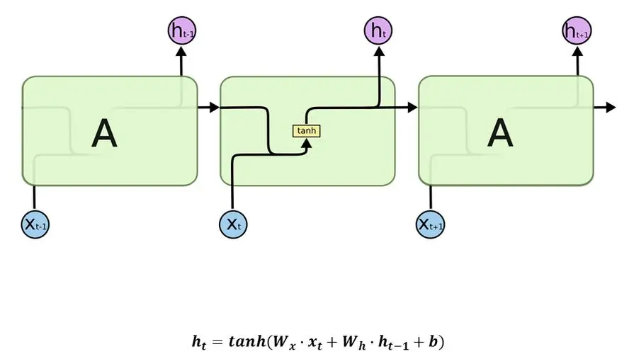

---

在训练RNN时，我们主要训练的是网络中的权重，包括：

* 输入到隐藏层的权重：这些权重控制从输入层到隐藏层的信息流。

* 隐藏层到输出层的权重：这些权重控制从隐藏层到输出层的信息流。

* **隐藏层自身的权重**（即隐藏层内部的循环权重）：这是 RNN 特有的一组权重，它们控制从前一个时间步的隐藏层到当前时间步的隐藏层的信息流。这些权重允许网络“记住”前一个时间步的状态，并将这些信息传递到当前时间步，是实现序列数据处理能力的关键。

训练工程中，我们通过时间反向传播（BPTT）算法对这些权重进行更新。BPTT 实际上是将整个输入序列视为一个大的反向传播网络，其中包括多个时间步。在这个过程中，网络会根据损失函数相对于每个权重的梯度来更新权重。这意味着隐藏层自身的权重（循环权重）也会根据它们对输出误差的贡献程度进行更新。

### Long Short-Term Memory

传统 RNN 面临的问题是梯度消失和记忆性过短。其通过引入一个复杂的结构——称为“单元”（cell），以及几个控制信息流动的“门”（gates）机制，从而有效处理这些问题。

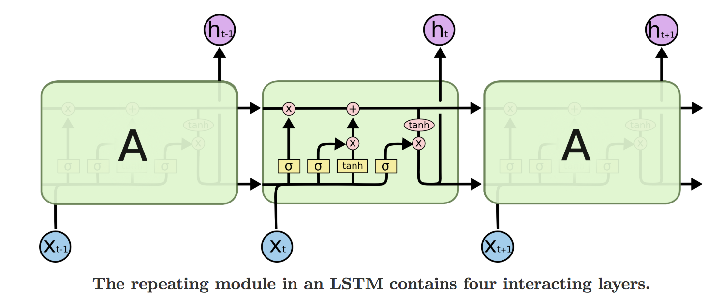

一个LSTM单元包含三种类型的门：

* **遗忘门**（Forget Gate）：该门决定从前一状态保留或遗弃什么信息。它查看前一状态 $h_{t-1}$ 和当前输入 $x_t$，为单元状态 $C_{t-1}$ 中的每个数字输出一个0到1之间的数。1表示“完全保留这个信息”，而0表示“完全丢弃这个信息”。

* **输入门**（Input Gate）：此门更新单元状态以加入新的信息。它决定哪些值将被更新，并且一个tanh层创建一个可能加入到状态中的新候选值向量 $\tilde{C}_t$。

* **输出门**（Output Gate）：输出门决定下一个隐藏状态 $h_t$ 应该是什么。隐藏状态包含了关于之前输入的信息。隐藏状态也用于预测。

LSTM 的遗忘门、输入门以及输出门都可以被看作是独立的神经网络层，每个门控制特定的信息流。这些门在 LSTM 单元内部通过不同的权重矩阵和偏置来控制信息的流动，例如决定保留多少旧信息、加入多少新信息到单元状态，以及从单元状态中输出多少信息到下一个隐藏状态。每个门背后的操作都依赖于特定的权重矩阵和偏置向量。

---

**LSTM的工作原理**

- **第一步**：遗忘门查看 $h_{t-1}$ 和 $x_t$，为单元状态 $C_{t-1}$ 中的每个数字输出一个 $0$ 到 $1$ 之间的数，这个数决定了每个组件有多少应该被记住。

- **第二步**：输入门决定哪些值将在单元状态中被更新，然后一个 tanh 层创建一个新的候选值向量，这些值可能会被加到状态中。

- **第三步**：状态被更新为新的状态 $C_t$，这是通过忘记我们之前决定忘记的事物，并加入新的候选值（这些候选值由我们决定更新每个状态值的程度来缩放）的组合得到的。

- **第四步**：最后，输出门决定下一个隐藏状态 $h_t$ 应该是什么。通过 tanh 函数（将值推至 $-1$ 到 $1$ 之间）处理单元状态，然后将其乘以输出门的输出，这样我们只输出我们决定输出的部分。

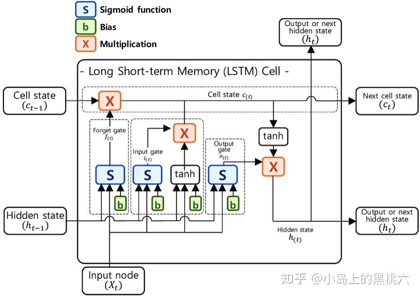

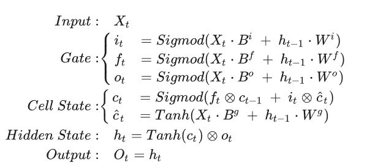

LSTM特别适用于学习长期依赖性，因为门控机制允许信息在许多时间步中流动，而不会消失或爆炸。这使得LSTM适合于广泛的序列学习任务，如语言建模、机器翻译、语音识别等。

LSTM通过为捕获序列数据中的长期依赖性提供了一个更加健壮的架构，代表了相对于传统 RNN 的显著进步。它们能够有选择地记住和忘记信息，使其在处理涉及复杂时间序列数据的任务时表现出色，解决了早期 RNN 模型中存在的核心挑战。

---

在进行 LSTM 的反向传播的时候，我们发现梯度一样具有高速的传播方式，很好的避免了梯度消失爆炸。这点类似于 ResNet。

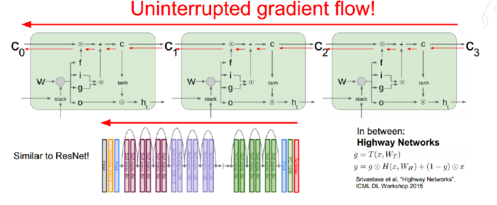

详细的 BPTT 推导，可以参考 [反向传播(BP)及随时间反向传播(BPTT)推导解析 - 阿北的文章 - 知乎](https://zhuanlan.zhihu.com/p/129336512)

> 随着 LLM 的出现，LSTM 已死。现在已经是 transformer 的天下了。力大砖飞时代正式到来。

### Attention Model

注意力模型（Attention Model），是目前火热的 Transformer 模型的网络基础。Attention 严格意义上讲是一种 idea，而不是某一个 model 的具体实现。

Seq2Seq模型，也叫 Encoder-Decoder 模型，是 RNN 可以解决的问题中最重要的一个变种。前文提到，RNN 有多对多的形式。这类问题就是多对多的 RNN 类型。通常，我们需要解决诸如机器翻译的问题。

在 RNN 中，在解决这类问题时，我们会先压缩输入序列到一个向量 $\mathbf c$ 中，然后再进行解码还原出翻译后序列。如下图所示：

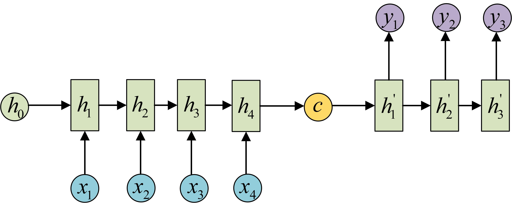

有些时候，我们也会将 $\mathbf c$ 所谓解码的每一步的输入：

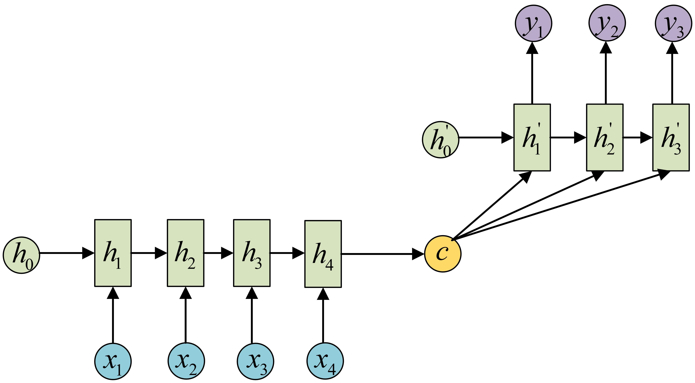

---

显而易见，上述模型的缺陷在于语义特征向量能存储的信息相当有限，它的长度成为了限制模型性能的瓶颈。当翻译句子过长的时候，存储信息就很难得到完整保留，会造成翻译精度的下降。

事实上，当我们的输入文本在一开始已知的情况下，我们的模型完全可以在 Decoder 阶段利用输入文本的全部信息，而不仅仅是最后的语义特征向量。并且，对于翻译产生的每个单词，都与输入文本的部分单词有很强的相关性。Attention Model 基于这种想法，引入了注意力机制，在 Decoder 阶段加入了输入文本的结构信息，在每个解码阶段关注于不同位置的文本内容。

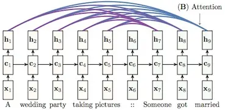

在大部分的实现中，Attention 是一个权重vector（通常是 softmax 的输出），其维度等于 context 的长度。越大的权重代表对应位置的 context 越重要。

在 Decoder 的每个 state，所有的 输入产生的隐状态向量都会被当作输入。

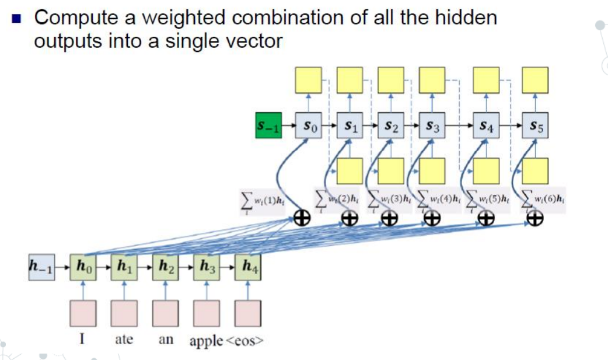

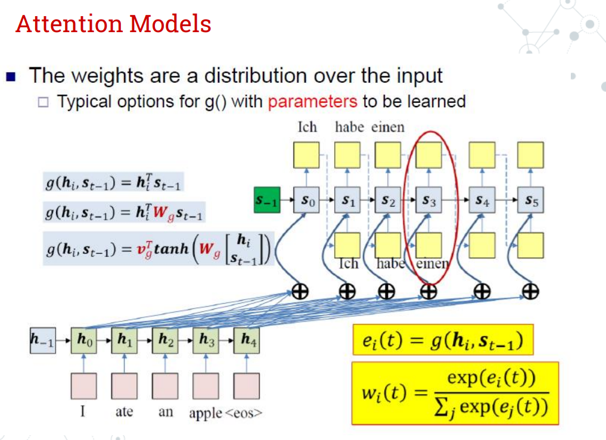

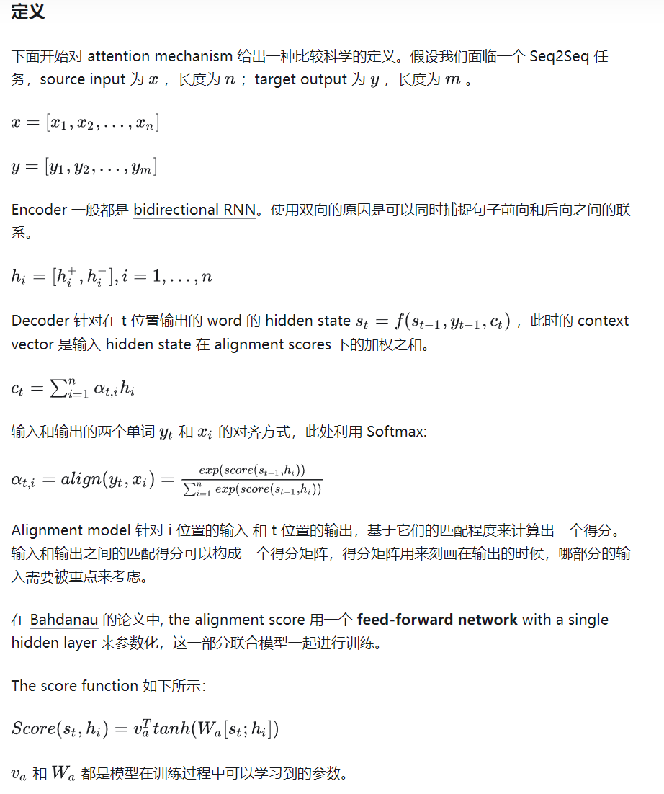

### References

[Attention based model 是什么，它解决了什么问题？ - Tao Lei的回答 - 知乎](https://www.zhihu.com/question/36591394/answer/69124544)

[完全图解RNN、RNN变体、Seq2Seq、Attention机制 - 何之源的文章 - 知乎](https://zhuanlan.zhihu.com/p/28054589)

[当我们在聊Attention的时候，我们实际在聊什么？ - 简枫的文章 - 知乎](https://zhuanlan.zhihu.com/p/48424395)

## GAN

生成对抗网络（generative adversarial network, GAN）。简单来说，GAN 的思想就是左右互搏。我们有一个生成器和一个打分器，打分器来检测生成器生成的是虚假样本还是真实样本的概率，通过定义 Loss 来让生成器调整生成的方式，并能骗过打分器。在这过程中，打分器也会根据生成器的情况进行调整，提高检测的精度。

GAN 训练过程中最大的问题在于生成器和打分器之间的能力不能相差太多，两者需要时刻保持平衡，否则调整的梯度将会不足以支持模型的进步。

[通俗理解生成对抗网络GAN - 陈诚的文章 - 知乎](https://zhuanlan.zhihu.com/p/33752313)

[李宏毅 Introduction of Generative Adversarial Network](https://www.bilibili.com/video/av17412504/?from=search&seid=12003526139493552118&vd_source=9470ae57cc3c4cf5b049c428a2fe56e6)

